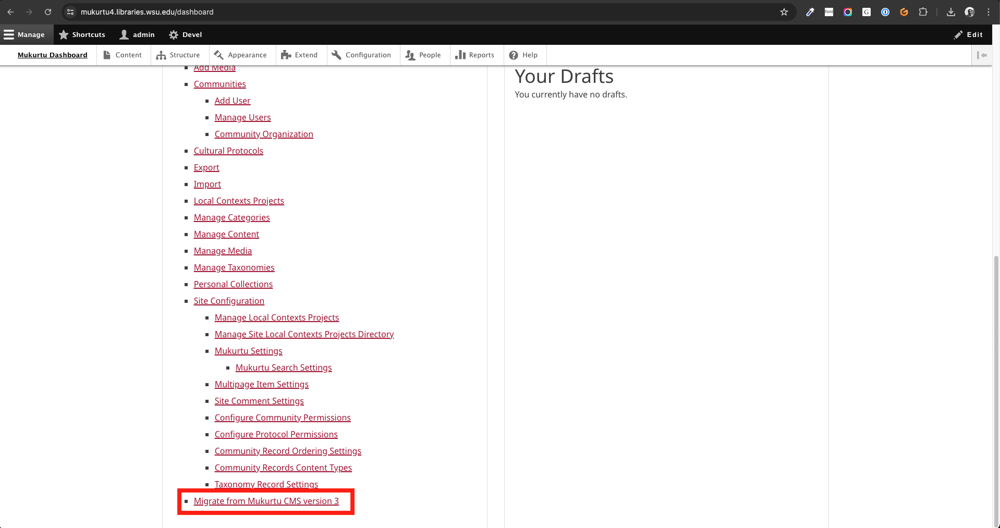
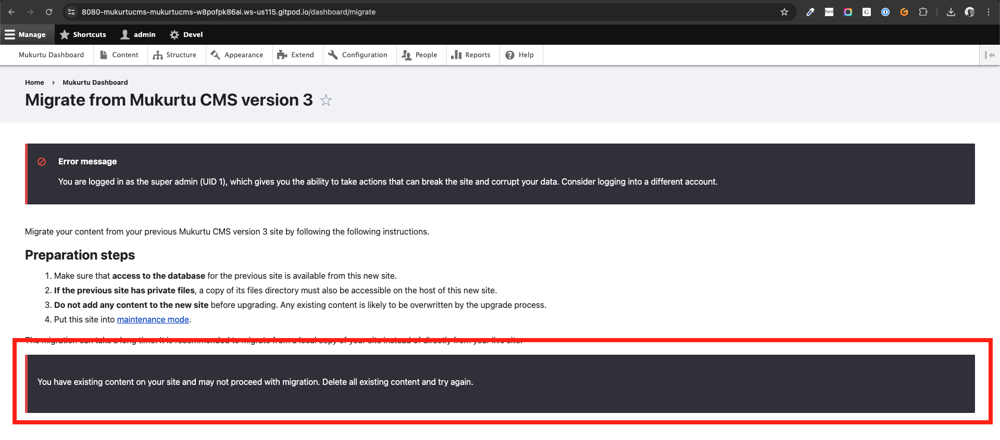
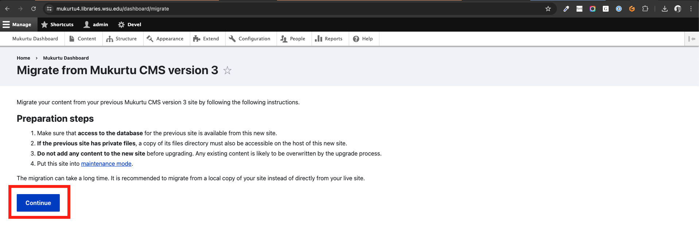
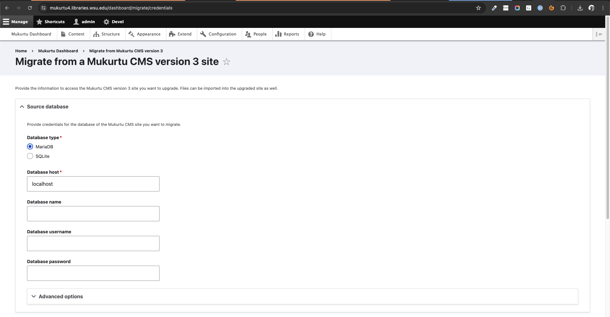
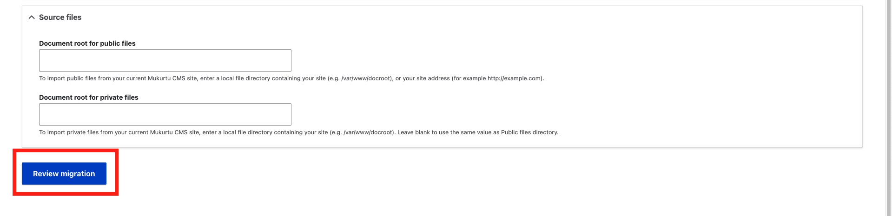
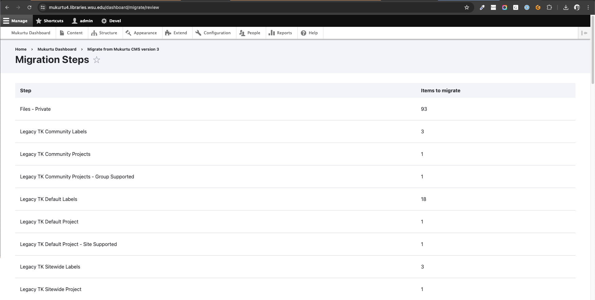
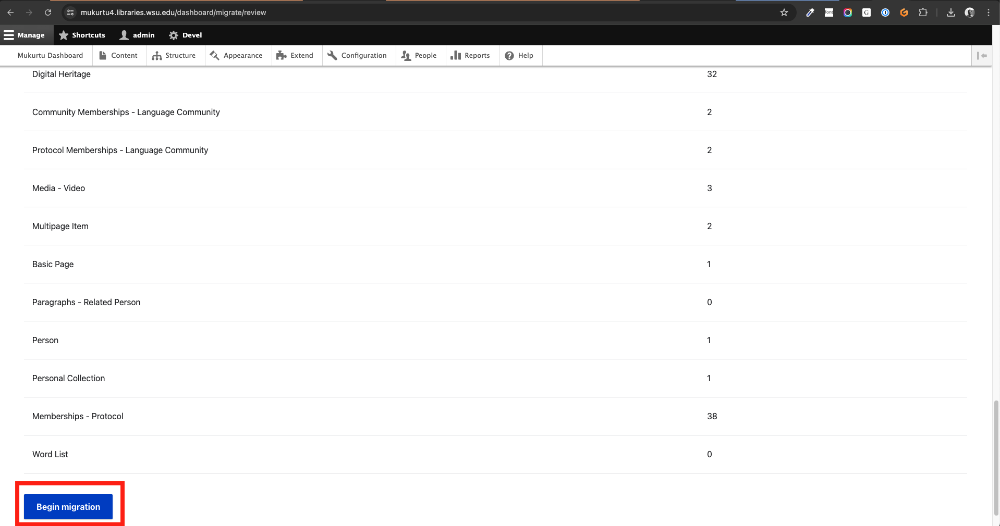
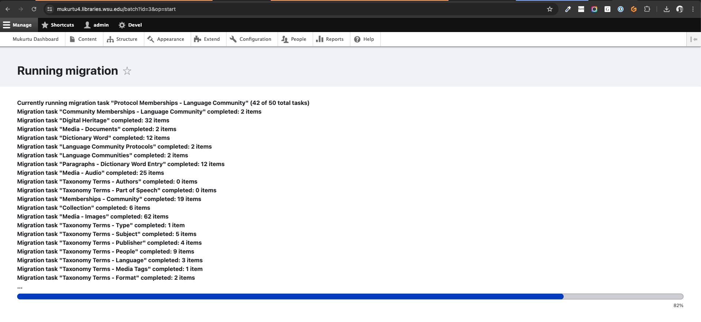
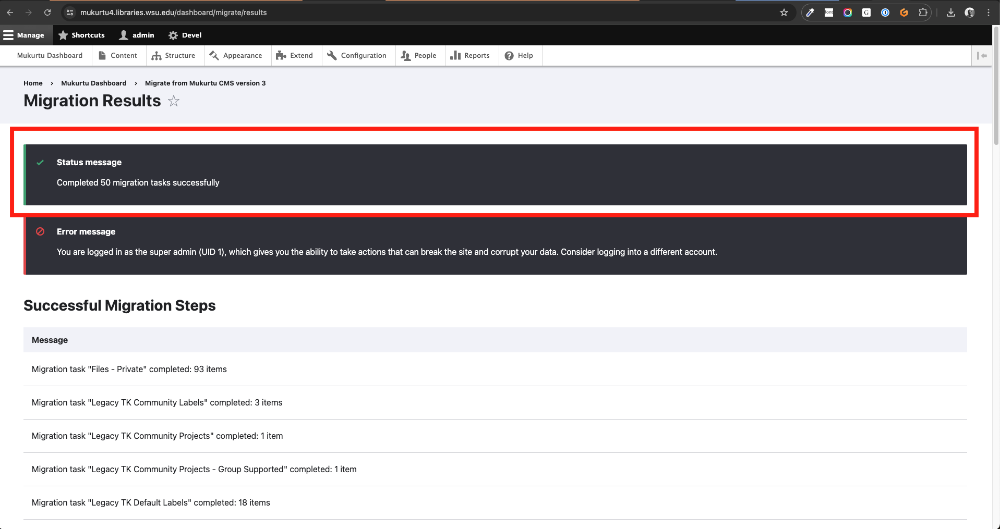

# Running the Mukurtu 3 to Mukurtu 4 Migration

!!! warning
    This documentation assumes that you are installing your new Mukurtu 4 site on the same server as your current Mukurtu 3 site. If you are installing your new Mukurtu 4 site on a different server, please contact us at [support@mukurtu.org](mailto:support@mukurtu.org?subject=Mukurtu%204%20migration%20support)

Go to `/dashboard/migrate` or from the dashboard, select "Migrate from Mukurtu CMS version 3"

!!! warning
    You will NOT be able to run a migration if there is any content in your new Mukurtu 4 site. A migration can only be attempted on a freshly-built Mukurtu 4 site that has not been used at all.

Review the preparation steps and select "Continue" when ready.

Enter the Mukurtu 3 database credentials you identified earlier

- **Database Type**: Likely MySQL or MariaDB.
- **Database Host**: 
- **Database Name**: 
- **Database Username**: 
- **Database Password**: 
- **Document root for public files**: Likely `/var/www/html/your_site/sites/default/files`.
- **Document root for private files**: Likely unused.

Select "Review migration".

The migration steps will be displayed. You likely do not need to review these in depth, but the item counts should match your Mukurtu 3 site (eg: number of media assets by type, number of DH items). You may want to take note of these to compare with the migration results.
When ready, select "Begin migration".

The migration will run, showing the progress as it goes. 
DO NOT reload, refresh, close, or navigate away from this page until it is complete.

A confirmation message will be displayed. You may choose to compare the results of the migration to the migration steps earlier.
The content migration is now complete!

