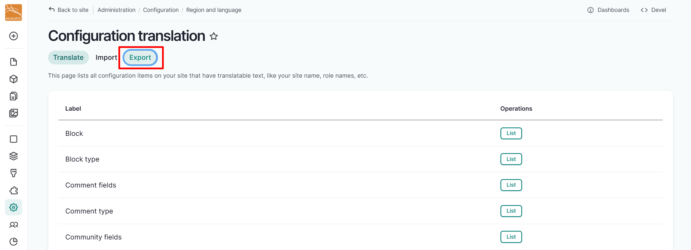
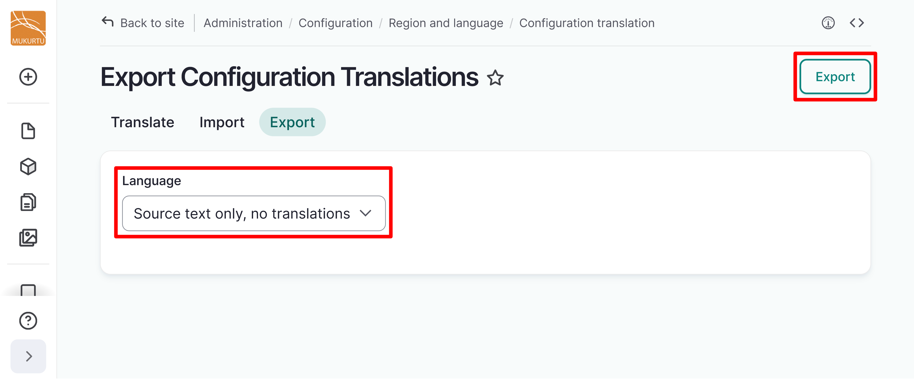
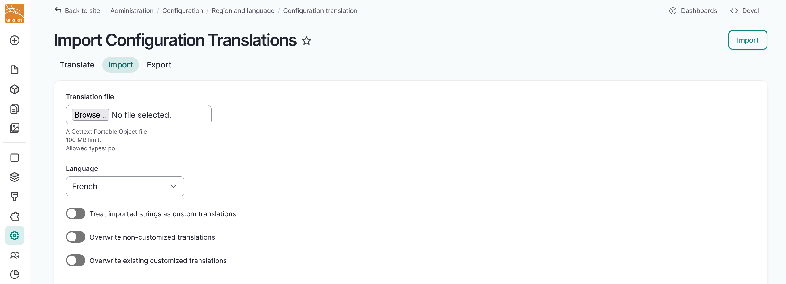

---
tags:
    - multilingual
---

# Configuration Translation

!!! roles "User role"
    Mukurtu manager

Mukurtu managers can translate all the configuration items on their site that have translatable text, such as the site name, role names, and other structural blocks. Depending on the language, some of the blocks may already be translated. 

Because translation tasks involve many strings, configuration translation allows translators to export strings as a .po file for offline editing in a desktop Gettext translation editor. Users can then import the translated strings.

To begin translating these configuration items, navigate to Configuration > Region and Language > Configuration Translation, or go directly to `/admin/config/regional/config-translation`.

## Batch edit translatable strings

To streamline your translation workflow, we recommend batch editing translatable strings by exporting them as a .po file for offline editing in a desktop Gettext translation editor, then importing the translated strings. Some examples of Gettext translation editors include:

   - [Poedit](https://poedit.net/) is a downloadable Gettext translation editor that includes both a free and a paid version.
   - [PO File: Free PO Editor](https://pofile.net/free-po-editor) is a free in-browser Gettext translation editor.
   - You can also open and edit .po files in your text editor.

Start batch editing your translatable strings by following the instructions below.

1. From the Configuration translation page, select the **Export** tab.

    

2. From the **Language** dropdown, select *Source text only, no translations*.
3.  Select the "Export" button in the top right-hand corner.

    

4. Open your .po file in your chosen Gettext or text editor. Make any desired changes, then save your file where you can find it easily.
5. Navigate to your configuration translation page by going to Configuration > Region and Language > Configuration Translation, or go directly to `/admin/config/regional/config-translation` and select the **Import** tab.
6. In the *Translation file* field, select the "Choose File" or "Browse" button to upload your translation file.

    !!! tip
	    The text of the button may vary depending on your browser.

7. Select the language you have translated your configuration components into.
8. Select the slider beside each option to determine whether to 'Treat imported strings as custom translation', 'Overwrite non-customized translations', or 'Overwrite existing translations'. This can determine whether translations that already exist on the site will be deleted and how imported strings will be treated.

    

9. Select the Import button to import your configuration translations.
10. You will receive a status message regarding how many configuration translation objects were added or updated.

## Edit translatable strings

For smaller edits, you can edit strings individually on the Configuration translation page. 

1. Select the "List" button to the right of the label that contains the blocks you want to translate.

    

2. Select the "Translate" button to the right of the specific block title you want to translate. Use the *Search* field to search for specific blocks. 

    

3. If your block is not yet translated, select the "Add" button to add a translation. If it is already translated, select the "Edit" button to edit the translation.

    
    
4. Enter your preferred translation in the modal, then select "Save translation".

    

## Translation priorities

To further streamline your translation workflow, we have identified strings that we feel would most benefit from being prioritized for translation. Depending on your language, some strings may have already been translated by Drupal, but this may be limited for configuration translation strings as they reflect Mukurtu-specific fields. 

Users with specific types of user roles will require different fields to be translated. To reflect this, the priorities have been sorted into the following columns:

- Admin Roles - Users with Administrator and Mukurtu Manager roles
- Content Roles - Users with the Community manager, Language community manager, Protocol steward, Contributor, Community record steward, Curator, Language steward, and Language contributor roles.
- End User - Any other authenticated user roles as well as visitors to your site.
- From Mukurtu - Strings that are specific to Mukurtu's platform, including field titles and descriptions.

We recommend starting with Mukurtu specific fields that are seen by end users. 

Select [Download Configuration Translation Priorities](../_embeds/configtranslationpriorities.xlsx) to download our recommended configuration translation priorities.