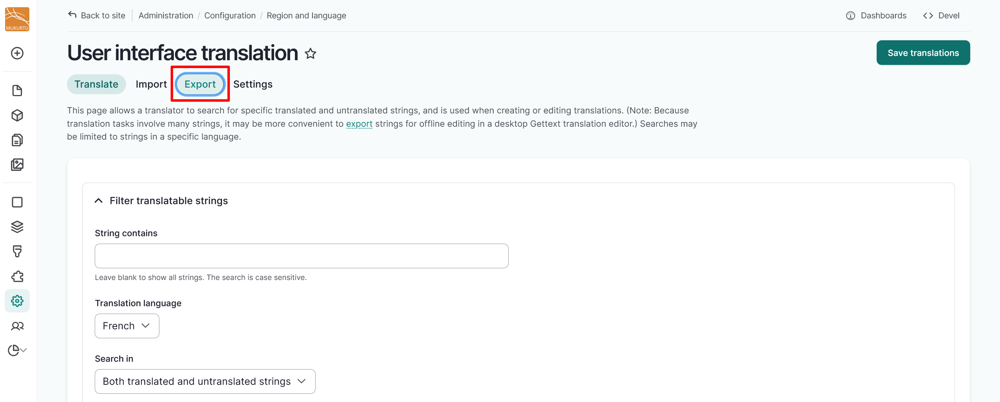
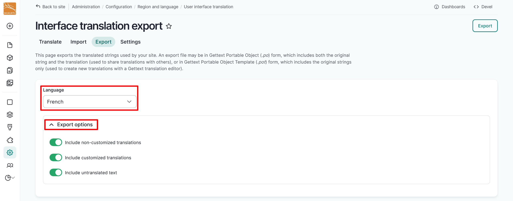
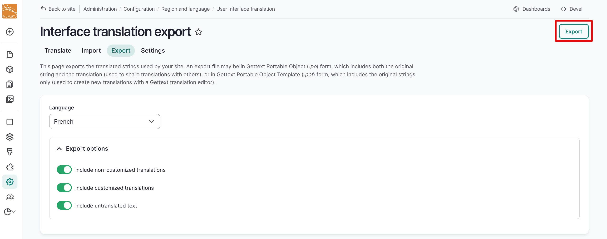
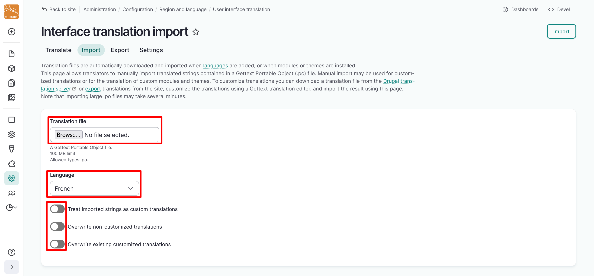
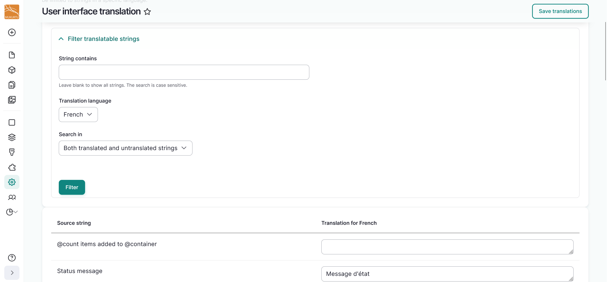

---
tags:
    - multilingual
---

# User Interface Translation

!!! roles "User role"
    Mukurtu manager

Mukurtu 4 CMS allows users to translate their user interface. Depending on the language, some user interface strings may be translated by Drupal. To translate remaining user interface strings in your Mukurtu site, you must have translation configured and have added at least one language. For instructions on how to configure translation, refer to [Configure Translation](ConfigureTranslation.md#configure-translation). For instructions on adding a language to your site, refer to [Add Languages](ConfigureTranslation.md#add-a-language).

User interface translation allows a translator to search for specific translated and untranslated strings, and is used when creating or editing translations. Because translation tasks involve many strings, user interface allows translators to export strings as a .po file for offline editing in a desktop Gettext translation editor and then import the translated strings.

To translate the Mukurtu user interface, navigate to Configuration > Region and Language > User interface translation, or go directly to `/admin/config/regional/translate`.

## Batch edit translatable strings

To streamline your translation workflow, we recommend batch editing translatable strings by exporting them as a .po file for offline editing in a desktop Gettext translation editor, then importing the translated strings. Some examples of Gettext translation editors include:

   - [Poedit](https://poedit.net/) is a downloadable Gettext translation editor that includes both a free and a paid version.
   - [PO File: Free PO Editor](https://pofile.net/free-po-editor) is a free in-browser Gettext translation editor.
   - You can also open and edit .po files in your text editor.

Start batch editing your translatable strings by following the instructions below.

1. Select the "Export" button.

    

2. Select your language and export options from the dropdown menus. You can export non-customized translations, customized translations, untranslated text, or any combination of those options.

    

3. Select the "Export" button in the top right-hand corner.
4. Open your .po file in your chosen Gettext or text editor. Make any desired changes, then save your file where you can find it easily.
5. Navigate to your User interface translation page by going to Configuration > Region and Language > User interface translation, or directly to `/admin/config/regional/translate`and select the **Import** tab.

    

6. In the *Translation file* field, select the "Choose File" or "Browse" button to upload your translation file.

    !!! tip
	    The text of the button may vary depending on your browser.

7. Select the language you have translated your user interface components into.
8. Select the slider beside each option to determine whether to 'Treat imported strings as custom translation', 'Overwrite non-customized translations', or 'Overwrite existing translations'. This can determine whether translations that already exist on the site will be deleted and how imported strings will be treated.

    

9. Select the Import button to import your user interface translations.
10. You will receive a status message regarding how many user interface strings were successfully updated.

## Edit translatable strings

For smaller edits, you can edit strings individually on the User interface translation page. 

1. Filter translatable strings by entering part of the string in the *String contains* field. You can leave this field blank to show all strings. 

    !!! tip
        The search is case sensitive. 
    
2. Select your *Translation language* from the dropdown menu.
3. Use the *Search in* field to filter by only translated strings, only untranslated strings, or both translated and untranslated strings.

4. Enter your translation in the text box to the right of the string you want to translate.
5. Select "Save translations" to save your translated strings.

## Translation priorities

To further streamline your translation workflow, we have identified strings that we feel would most benefit from being prioritized for translation. Depending on your language, some strings may have already been translated by Drupal. 

Users with specific types of user roles will require different fields to be translated. To reflect this, the priorities have been sorted into the following columns:

- Admin Roles - Users with Administrator and Mukurtu Manager roles
- Content Roles - Users with the Community manager, Language community manager, Protocol steward, Contributor, Community record steward, Curator, Language steward, and Language contributor roles.
- End User - Any other authenticated user roles as well as visitors to your site.
- From Mukurtu - Strings that are specific to Mukurtu's platform, including field titles and descriptions.

We recommend starting with Mukurtu specific fields that are seen by end users. 

Select [Download UI Translation Priorities](../_embeds/uitranslationpriorities.csv) to download our recommended UI translation priorities as a CSV file.