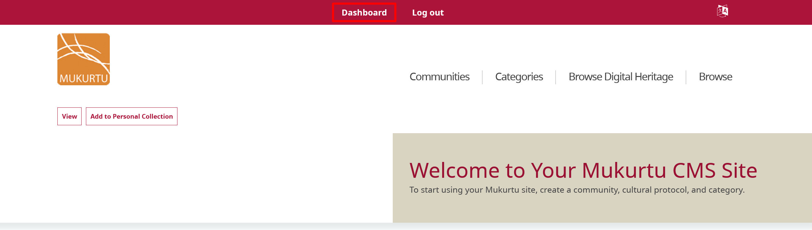
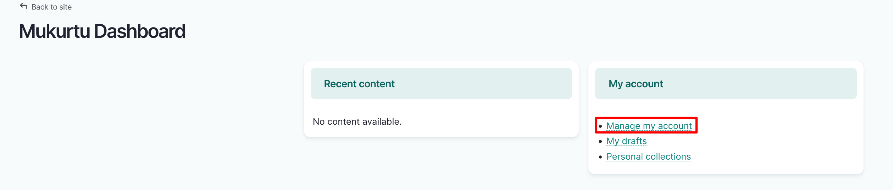
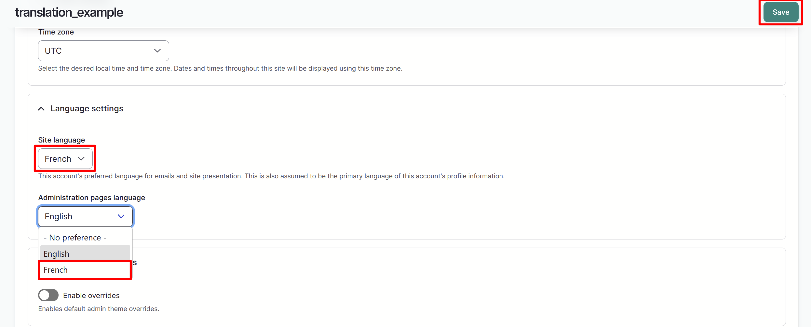
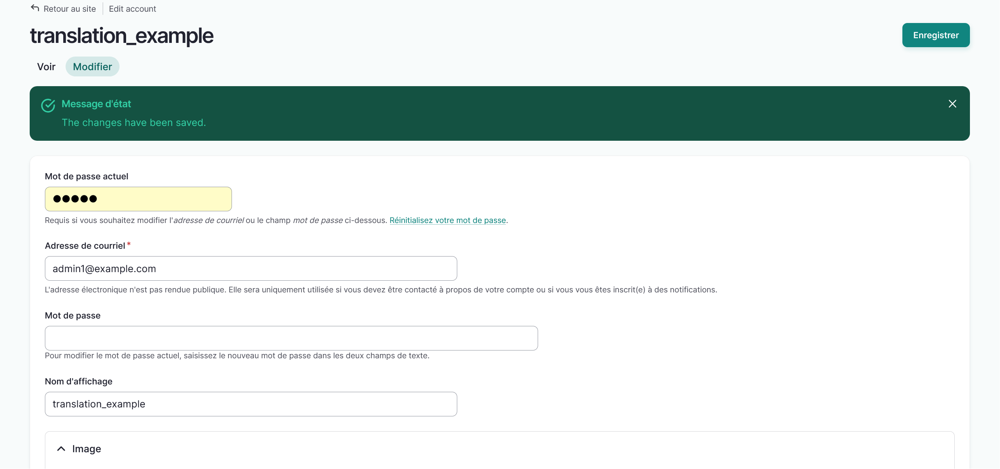
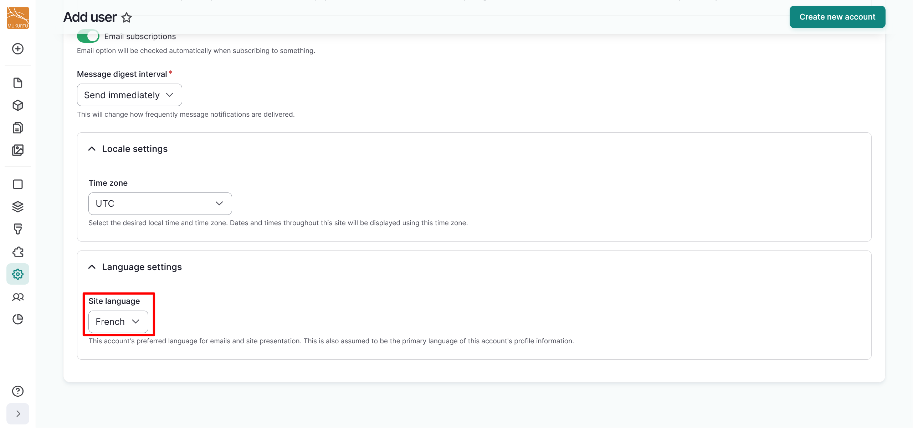
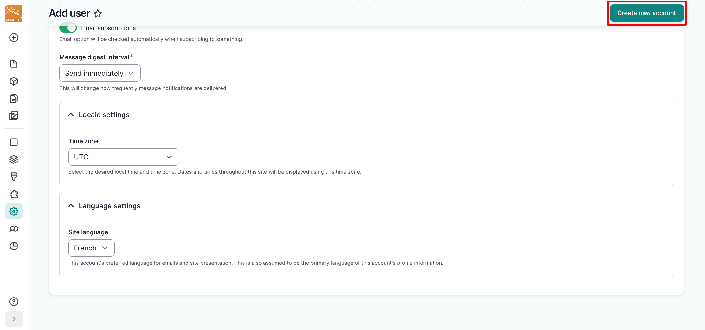
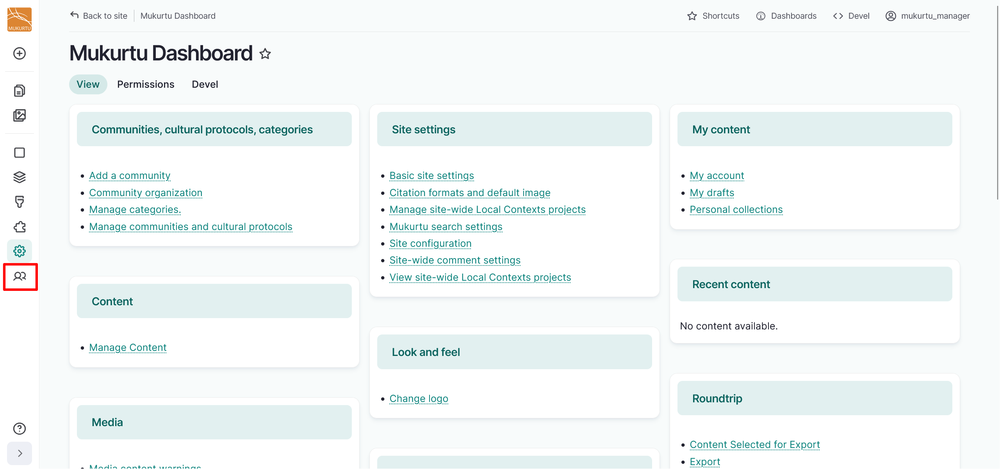
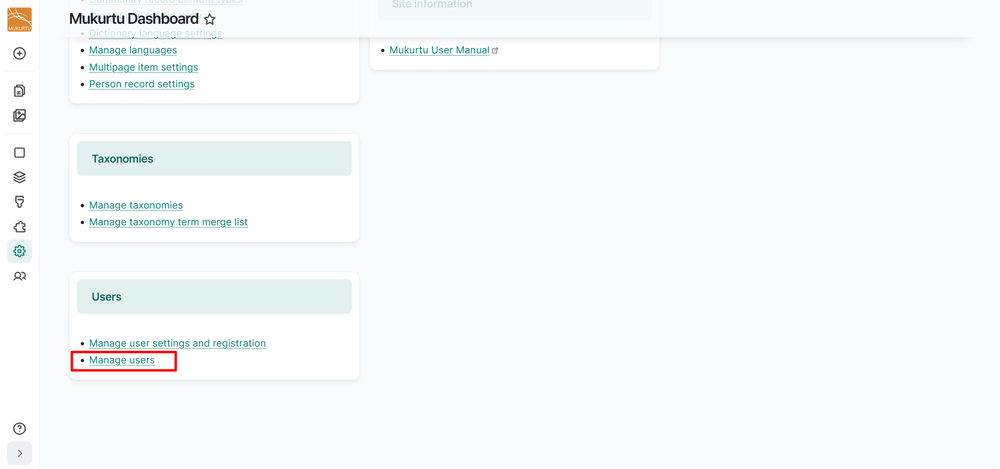
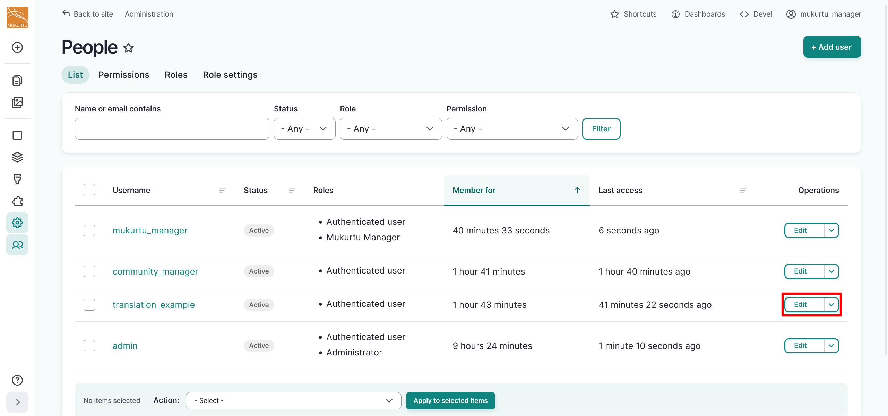

---
tags:
    - multilingual
    - users
    - account management
---

# Set User Account Language 

!!! roles "User roles"
    Mukurtu manager, authenticated users

If your site has more than one language enabled, authenticated users may choose which which of those languages they use to view and navigate the site. Authenticated users can select from the list of enabled languages, or Mukurtu managers can assign a user's account language when they approve their account registration.

!!! requirement
    Multiple languages must be enabled for this option to be available. Users can only choose from languages that are already enabled on the site. For more information on how to configure Mukurtu Multilingual and translate your site, refer to our [Translation Workflow](TranslationWorkflow.md) article. For more information on creating user accounts, refer to our [Creating User Accounts](../users/creating-account-site-wide.md) article. 

## Set your account language

1. Log in to your account. For more information about how to log in to your user account, refer to our [Log In](../users/log-in.md) article.
2. From the **Dashboard** select **Manage my account**.

    
    

4. Navigate to the **Language settings** section of the user account page. In the *Site language* and *Administration pages language* fields, select your preferred language from the dropdown menu. 

    - The *Site language* refers to this account's preferred language for the interface and default site language. This is also assumed to be the primary language of this account's profile information. 
    - The *Administration pages language* field refers to this account's preferred language for admin pages, including the forms to create and edit content.

5. Select the "Save" button to save your preferences. 

    

6. You will receive a confirmation message in your chosen language.

    

## Assign a user account language

Mukurtu managers and administrators can assign languages to authenticated users, which can be helpful when creating accounts for community members who only might not speak one of the site's languages. Languages can be assigned when creating new user accounts or when editing user accounts. For more information on creating new user accounts, refer to [Creating User Accounts](../users/creating-account-site-wide.md). To assign a language during this process, follow the instructions below.

1. When creating a new user account, navigate to the **Language Settings** section of the user registration page.
2. From the *Site language* field, select a language from the dropdown menu.

    

3. Select the "Create new account" button to save the new user account.

    

## Edit a user account language

1. To edit a user account language, select the **Manage Users** link from the left-hand **Admin menu** or from the **Users** section of the **Dashboard**.

    
    

2. Navigate to the user account and select the "Edit" button. 

    

3. Navigate to the **Language settings** section and select the language you want to assign from the *Site language* and *Administration pages language* fields. 
4. Select the "Save" button to save the assigned language settings.

    
