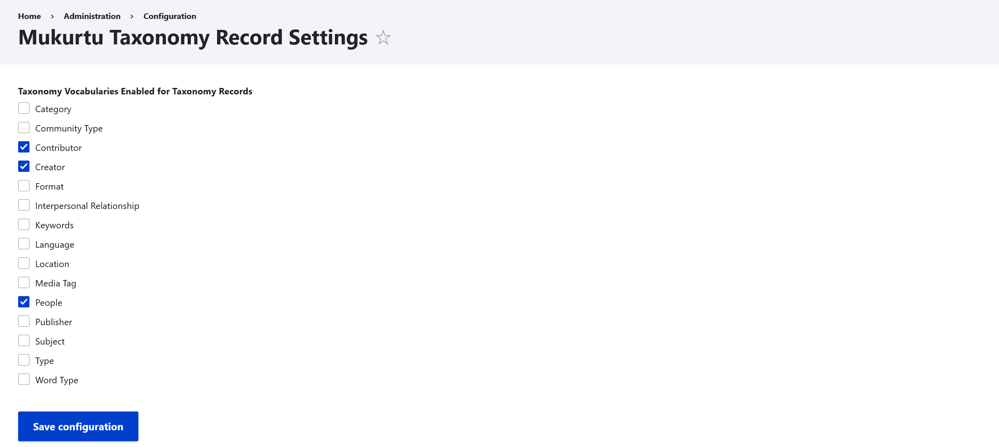
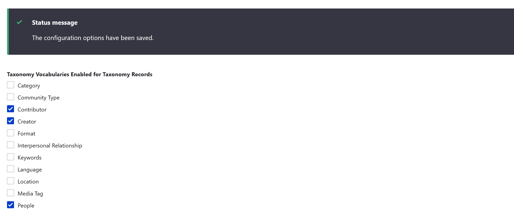

---
tags:
    - content
    - person records
    - taxonomy
---
# Configure Person Record Settings

!!! roles "User role"
    Mukurtu administrator

Before you can create a person record, the relevant taxonomies must be enabled. Using established taxonomy fields allows person records to be linked to other content when the individual is listed in different fields, such as *person*, *contributor*, or *creator*. Follow the instructions to enable the taxonomies.

1. Navigate to your **Dashboard**. Under **Additional content settings**, select the **Taxonomy record settings** link or go directly to '/admin/config/mukurtu/taxonomy/records'. 

2. Select the checkboxes beside the taxonomies you want to enable. For person records to function optimally, you should enable the *Contributor*, *Creator*, and *People* taxonomies. 

    

3. Select the "Save configuration" button to enable these taxonomies. You will recieve a status message informing you that the configuration options have been saved. 

    

For more information and instructions on how to create a person record, visit the [Create Person Records](PersonRecords.md) article.