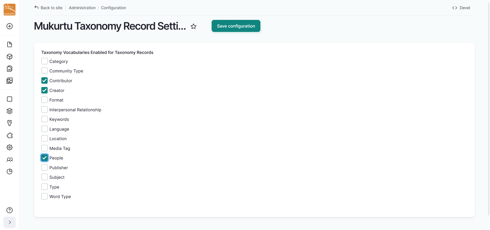
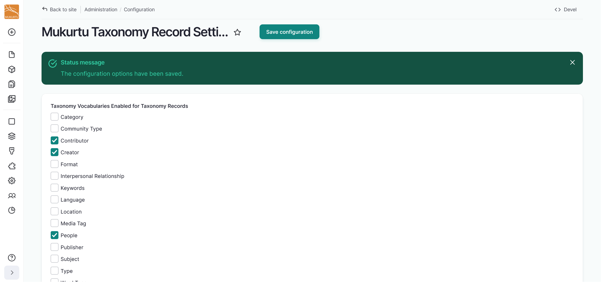

---
tags:
    - content
    - person records
    - taxonomy
---
# Configure Person Record Settings

!!! roles "User role"
    Mukurtu manager

Relevant taxonomies must be enabled before you can create a person record. To streamline this process, the *person*, *contributor*, and *creator* fields are enabled by default, but you may choose to use additional taxonomy fields. Follow the instructions to enable the taxonomies.

1. Navigate to your **Dashboard**. Under **Additional content settings**, select the **Person Record Settings** link or go directly to `/admin/config/mukurtu/person-records`. 

2. Select the checkboxes to the left of the taxonomies you want to enable. The *Contributor*, *Creator*, and *People* taxonomies are enabled automatically. For person records to function optimally, these should remain selected.

    

3. Select the "Save configuration" button to enable these taxonomies. You will recieve a status message informing you that the configuration options have been saved. 

    
