---
tags:
    - content
    - person records
    - taxonomy
---
# Create Person Records

!!! roles "User roles"
    Protocol steward, contributor

Person Records allow for rich biographical records to be integrated into Mukurtu CMS. Person records can include birth and death dates as well as custom text and media sections. They can identify relationships between people, and aggregate all digital heritage items where a person is referenced. They can also act as authority records, referencing all the names that a person is known by. Follow the instructions below to create a person record.

From your **Dashboard** or **Create Content** link, select **Person Record**.

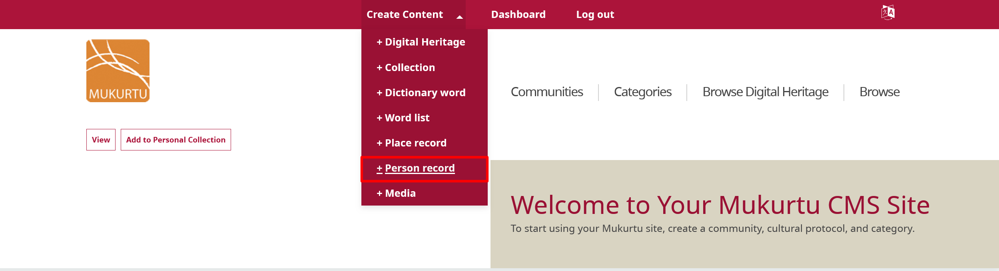

## Mukurtu Essentials

### Name

Enter the person's name as they should be primarily identified in the *Name* field. Names can be formatted as `Last, First, Middle`, `Last, First (Nickname)`, `Family name, Given name`, or any other format that is appropriate for the person.

- This is a required field.

### Cultural protocols

Use the toggle(s) to apply cultural protocols to your person record. 

- This is a required field.

### Sharing settings

Select a **Sharing setting**. Sharing setting has two options: you can select **Any** or **All**. 

- Any is the less restrictive setting as it means that the content can be shared with people belonging to any one or more of the protocols selected. 
- All is more restrictive as users must belong to all the selected protocols to view the place record. 
- This is a required field.

### Other names

People may be identified by multiple names, monikers, identities, and with inconsistent spellings across different content. This field is used to aggregate and display all content where the person is identified by connecting those disparate names. 

1. In the *Other Names* field, use the text box to select existing terms or add new ones. New names will be added to the People taxonomy.

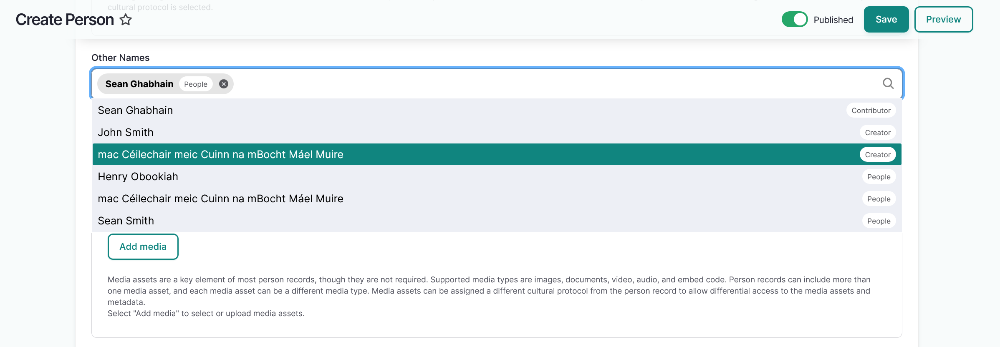

2. You can rearrange or delete terms in the field by dragging them into your preferred order or selecting the **X** icon to the right of each term.

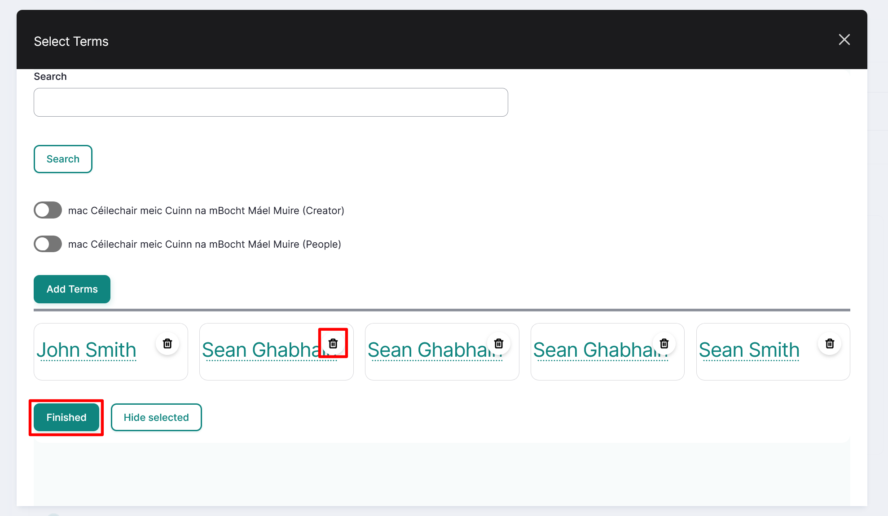

### Media assets

Media assets are a key element of most person records, though they are not required. Supported media types are images, documents, video, audio, and embed code. Person records can include more than one media asset, and each media asset can be a different media type. Media assets can be assigned a different cultural protocol from the person record to allow differential access to the media assets and metadata. For instructions on how to add a media asset, refer to the [Create Media Assets](../media/CreateMediaAssets.md) article.

- You can add multiple media assets by selecting more than one media asset from the media modal. 
- To reorder your media assets, select your media assets and drag them into the order you prefer.

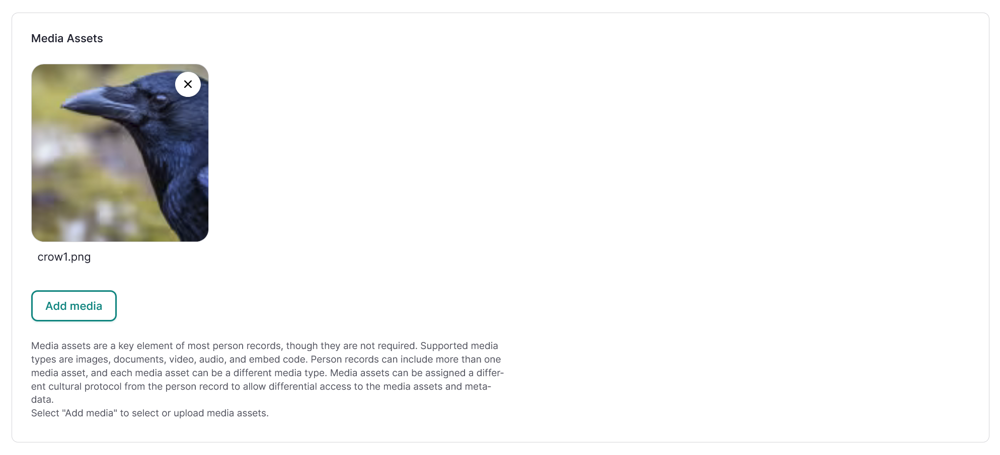

### Date fields

1.  In the **Date Born** section enter the date the person was born. Enter the year and, if known, select the month and day.
2. In the **Date Died** section enter the date the person died. Enter the year and, if known, select the month and day.
3. Use the slider to indicate whether the person is **Deceased**. This field informs the deceased person media content warning. For more information on this and other media content warnings, please see the [Media Content Warnings](../media/MediaContentWarnings.md) article.

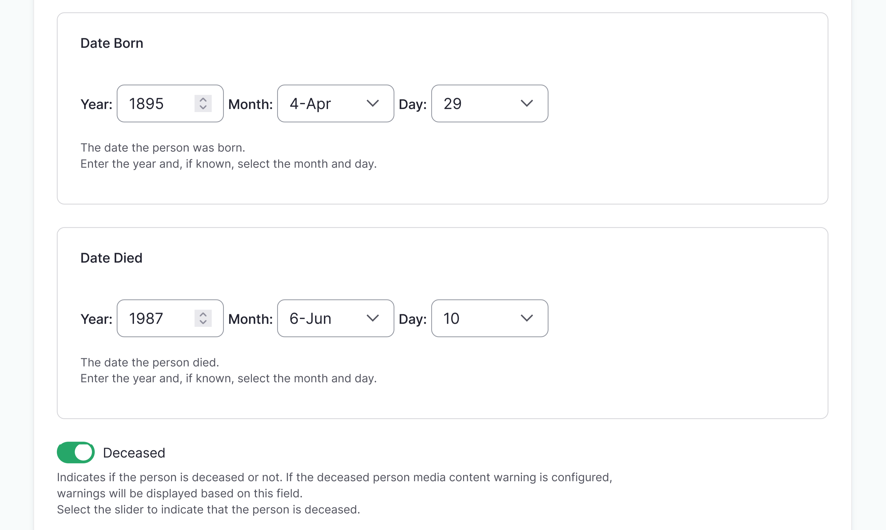

### Place of birth

In the *Place of Birth* field enter the location the person was born. You can select an existing term or add a new one.

### Place of death

In the *Place of Death* field enter the location the person died. You can select an existing term or add a new one.

## Biography

### Related people

!!! requirement
    Interpersonal relationships are not automatically bi-directional, and must be added to both person records. 

You can add a related person to a person record by adding an extant person record or by creating one on the fly. Related people is used to reflect real-world relationships between people. Examples include family, professional, cultural, educational, or any other kind of interpersonal relationships. 

To add a related person, navigate to the **Related People** section and select the "Add Related Person" button. For information on creating a related person record on the fly, refer to the [Create a person record on the fly](#create-a-person-record-on-the-fly) section of this article. 

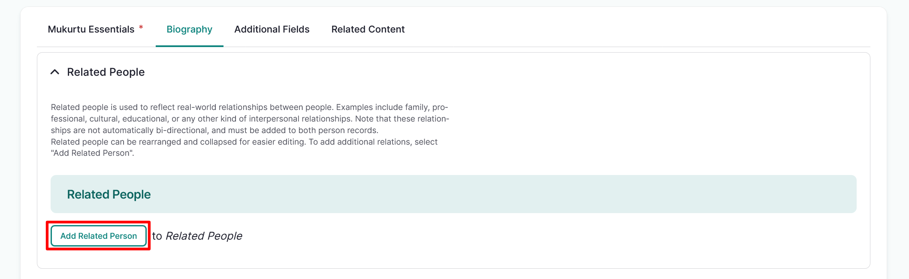

#### Add an extant person record

1. Select the "Select person" button. 

    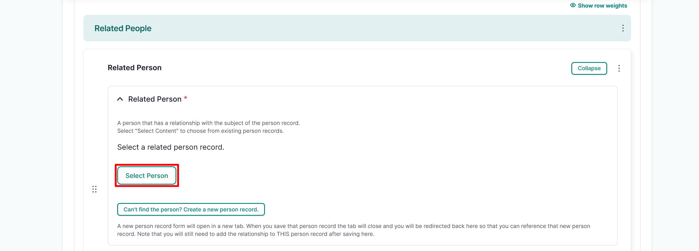

    !!! tip 
        You can use the search field to search for other person records by name.

2. Select the checkbox beside the person record you wish to add as a related person, then scroll down and select "Add Content". You can only add one related person at a time.

    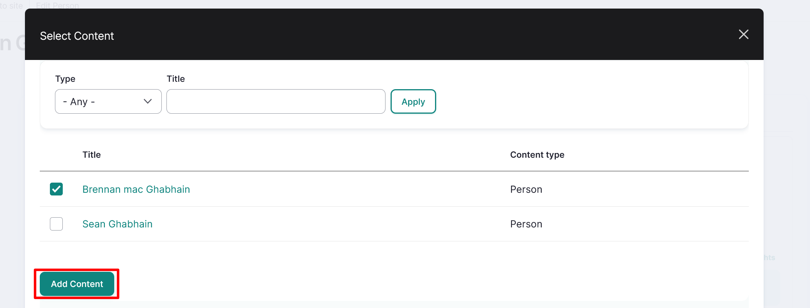

3. In the *Relationship Type* field enter the type of relationship between the related person and the subject of the person record. This is tied to the **Interpersonal Relationship** taxonomy. 
    
    - As you type, existing relationship types will be displayed. Select an existing relationship type or enter a new one. 
    - For more information on managing taxonomy terms, navigate to [Managing Taxonomies](../taxonomies/ManagingTaxonomies.md).

    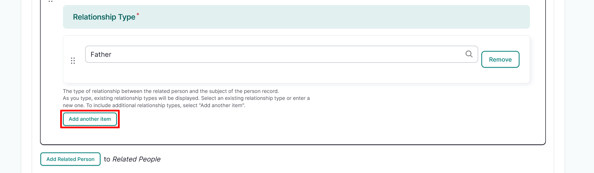

4. Select and drag the arrows to reorder your related people if necessary. To remove a related person, select the "Remove" button.

#### Create a person record on the fly

To create a person record on the fly, select the "Can't find the person? Create a new person record." button. 

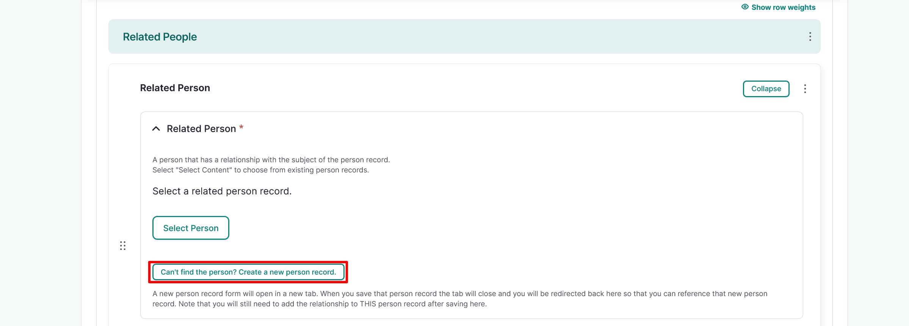

This opens a new tab in your browser where you can create a person record. 

- Create a person record as outlined in this article, then select the "Save" button. 
- The tab will close and your page will open on the Select Person modal, where you can select the person record you just created and add the *Relationship type* information as outlined in the [Add an extant person record](#add-an-extant-person-record) section of this article.

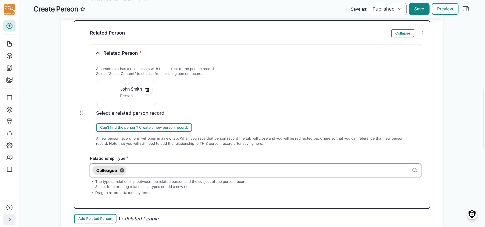

### Biography sections

The biography is an account of the person's life, whether written or compiled by others, an autobiography, or both. While they are primarily written, they may include media assets as well. Biography sections can be rearranged and collapsed for easier editing. To add additional biography sections, select "Add Biography section".

1. Enter the title of the biographical information in the *Title* field. Examples include "Early life", "Education", or "Professional career".
2. Use the *Body* field to provide a longer biographical sketch for your person record. This field enables a broader narrative that can include a written biography, audio recordings, video recordings, images, or any other supportive information for your person record. This HTML field can support rich text and embedded media assets using the editing toolbar.
3. Select the "Add Biography section" button to add an additional biography section. 

    !!! tip
        Biographies can be composed in sections to more clearly structure the person's life events, story, accomplishments, and relationships. 

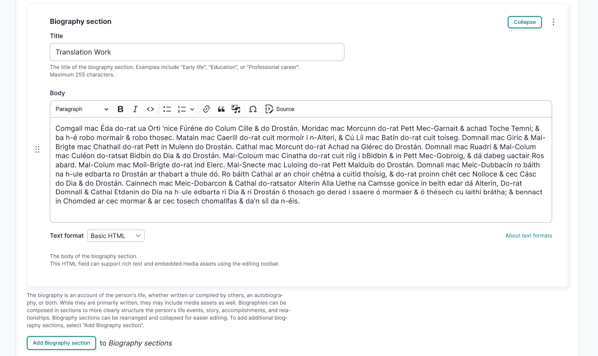

## Additional Fields

### Keywords

*Keywords* are used to tag person records to ensure that they are discoverable when searching or browsing. Examples include significant life events or organizations which the person was involved with. You can select existing terms and add new ones. 

- Consider adding 3-5 keywords to your person record.
- This field feeds into the keywords taxonomy.

### Map points

Mukurtu allows users to create and manage map points and areas using the embedded Leaflet maps. For detailed instructions on how to include *Map Points*, visit [Create Map Points](../location-data/CreateMapPoints.md).

!!! tip
    Note that this mapping data will be shared with the same users or visitors as the rest of the person record. If the location is sensitive, carefully consider using this field.

### Location description

Use the *Location description* field to provide additional context and depth to the location(s) connected to the person record. Location description can be used independently of other location fields and is a full HTML field that supports text, audio, images, and video.

### Location

Enter a *Location*. This is a named place, or places, that are closely connected to the person record. Examples include the places a person was born, lived, died, or sites of important life events. This field feeds into the location taxonomy and informs Place Records.

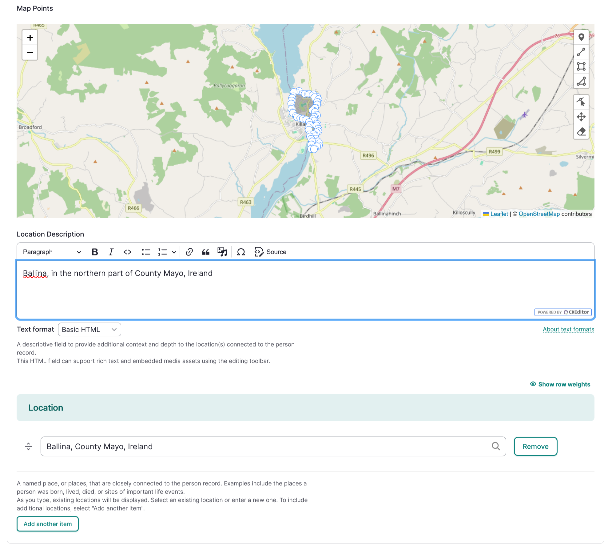

### Local Contexts Projects

Use the **Local Contexts** field to apply Traditional Knowledge labels to your person record. To start a project or for more information refer to [Understanding the Local Contexts Hub](../local-contexts/UnderstandingTheLocalContextsHub.md) or visit [Local Contexts](https://localcontexts.org/).

Select your Local Contexts project from the list. This field will apply all of the Labels from the selected Local Contexts Project(s) to the person record.

### Local Contexts Labels and Notices

Select one or more Labels from the appropriate Local Contexts Project. 

!!! tip
    If a complete project has already been selected, do not also select individual Labels from the same project. 

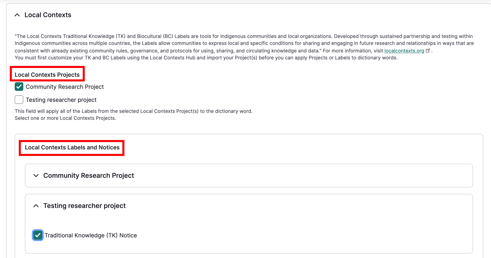

## Related content

### Related content

!!! tip
    If properly configured, the site will auto-aggregate content related to this person. In most cases this field will not be used.

Person records can be related to any other site content when there is a connection between those items that is important to show. In the **Related Content** section, select "Select Content" to choose from existing site content.