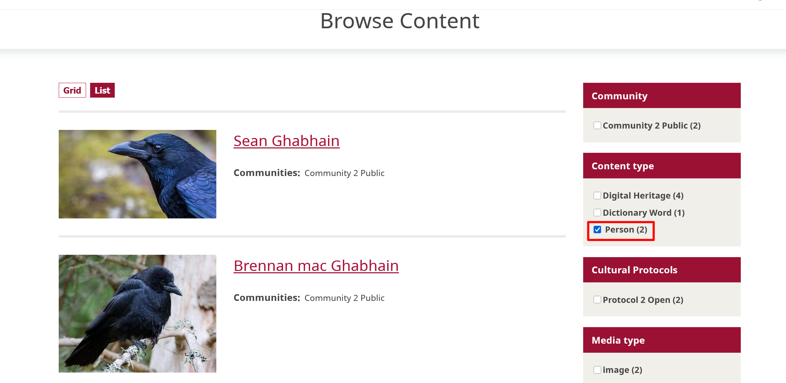

---
tags:
    - person records
    - taxonomies
    - content
---
# Understanding Person Records

!!! roles "User role"
    Mukurtu manager, protocol steward, contributor

Person records are a content type that allows for rich, in-depth biographical records to be integrated into Mukurtu. Many different types of information can be integrated into person records. Some features include:

- The dates of an individual's birth and death.
- Custom text and media sections enable multiple, focused, text-based or multi-media biographic sketches for an individual.
- Identification of relationships between the individual in the person record and other individuals. Users can use the interpersonal relationship taxonomy to provide terms naming the type of the relationship.
- Other names a person has been known by throughout their life can be linked to the individual in the person record. This allows the individual to be properly identified by the name or names they are known by in their community, and can help to remove confusion caused by misnamings, misspellings, or mistaken attributions. 
- When properly configured, person records automatically aggregate all the digitial heritage items and other content in which an individual is referenced.

For more information about how to create person records, see [Create Person Records](PersonRecords.md).

To browse person records, navigate to **Browse** or go directly to `/browse`. To filter by person records, navigate to the **Content type** header on the right-hand side of the page and select the checkbox beside *Person*. 

