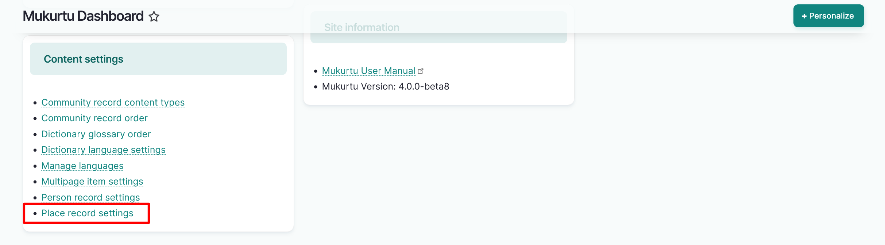
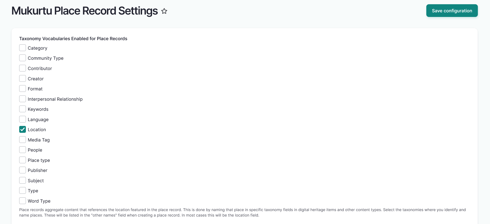

---
tags:
    - content
    - place records
    - taxonomy
---
# Configure Place Record Settings

!!! roles "User role"
    Mukurtu manager

Relevant taxonomies must be enabled before you can create a place record. To streamline this process, the *location* field is enabled by default, but you may choose to use additional taxonomy fields. Follow the instructions to enable the taxonomies.

1. Navigate to your **Dashboard**. Under **Content settings**, select the **Place Record Settings** link or go directly to `/admin/config/mukurtu/place-records`.

    

2. Select the checkboxes to the left of the taxonomies you want to enable. The *Location* taxonomy is enabled automatically. For place records to function optimally, this should remain selected.

    

3. Select the "Save configuration" button to enable these taxonomies. You will recieve a status message informing you that the configuration options have been saved. 
