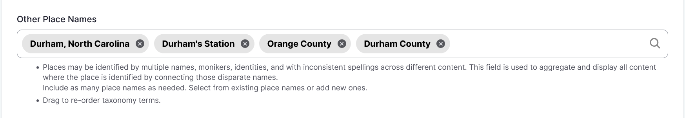
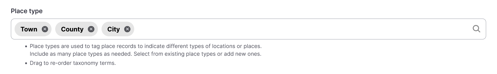
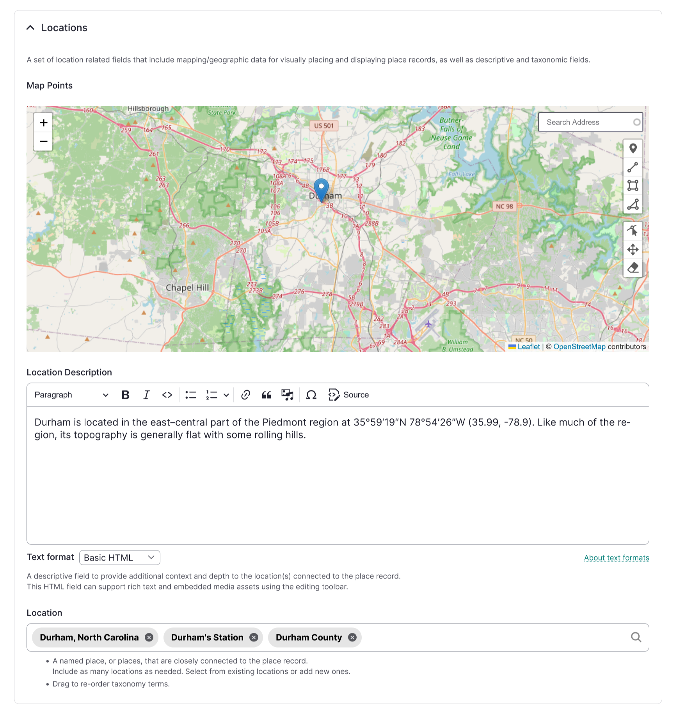
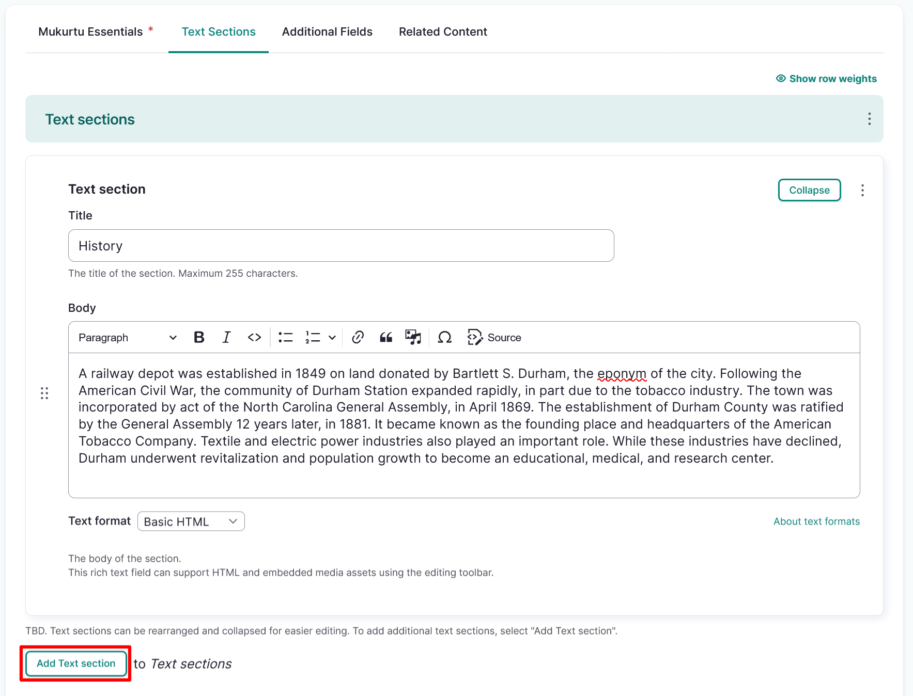

---
tags:
    - content
    - place records
    - taxonomy
---
# Create Place Records

!!! roles "User roles"
    Protocol steward, contributor

Place Records allow for rich biographical records to be integrated into Mukurtu CMS. Place records can include maps, custom text, and media sections. They can aggregate all content where a location is referenced. They can also act as authority records, referencing all the names that a location has been known by. Follow the instructions below to create a place record.

From any of your **Dashboard** or **Add Content** links, select **Place Record**.

## Mukurtu Essentials

### Name

Enter the place's name as it should be primarily identified in the *Name* field.

- This is a required field.

### Cultural protocols

Use the toggle(s) to apply cultural protocols to your place record. 

- This is a required field.

### Sharing settings

Select a **Sharing setting**. Sharing setting has two options: you can select **Any** or **All**. 

- Any is the less restrictive setting as it means that the content can be shared with people belonging to any one or more of the protocols selected. 
- All is more restrictive as users must belong to all the selected protocols to view the place record. 
- This is a required field.

### Other place names

Places may be identified by multiple names, monikers, identities, and with inconsistent spellings across different content. This field is used to aggregate and display all content where the place is identified by connecting those disparate names. 

1. In the *Other Place Names* field, select one or more terms from the dropdown or use the text field to either add new terms or search for specific terms.

    

2. You can rearrange or delete terms in the field by dragging them into your preferred order or selecting the **X** icon to the right of each term.

### Media assets

Media assets can be a key element of most place records, though they are not required. Supported media types are images, documents, video, audio, and embed code. Place records can include more than one media asset, and each media asset can be a different media type. Media assets can be assigned a different cultural protocol from the place record to allow differential access to the media assets and metadata. For instructions on how to add a media asset, refer to the [Create Media Assets](../media/CreateMediaAssets.md) article.

- You can add multiple media assets by selecting more than one media asset from the media modal. 
- To reorder your media assets, select your media assets and drag them into the order you prefer.

### Place type

Place types are used to tag place records to indicate different types of locations or places. Include as many place types as needed.

1. In the *Place type* field, select one or more terms from the dropdown or use the text field to search for specific terms.

    

2. You can rearrange or delete terms in the field by dragging them into your preferred order or selecting the **X** icon to the right of each term.

### Map points

Mukurtu allows users to create and manage map points and areas using the embedded Leaflet maps. For detailed instructions on how to include *Map Points*, visit [Create Map Points](../location-data/CreateMapPoints.md).

!!! tip
    Note that this mapping data will be shared with the same users or visitors as the rest of the place record. If the location is sensitive, carefully consider using this field.

### Location description

Use the *Location description* field to provide additional context and depth to the location(s) connected to the person record. Location description can be used independently of other location fields and is a full HTML field that supports text, audio, images, and video. This field may be redundant due to the place record-specific fields.

### Location

Enter a *Location*. This is a named place, or places, that are closely connected to the place record. Include as many locations as needed. Select from existing locations or add new ones. This field may be redundant due to the place record-specific fields.

## Text Sections

Text sections are an account of the history of a location. They may include historical information, narratives that are set in that particular place, the cultural significance of the location, or other information. While they are primarily written, they may include media assets as well. Text sections can be rearranged and collapsed for easier editing. To add additional text sections, select "Add Text section".

1. Enter the title of the text section in the *Title* field. Examples could include "History", "Folklore", or "Modern Era".
2. Use the *Body* field to provide a longer narrative for your place record. This field enables a broader narrative that can include a written history, audio recordings, video recordings, images, or any other supportive information for your place record. This HTML field can support rich text and embedded media assets using the editing toolbar.
3. Select the "Add Text section" button to add an additional text section. 

## Additional Fields

### Keywords

*Keywords* are used to tag place records to ensure that they are discoverable when searching or browsing. You can select existing terms and add new ones. 

### Local Contexts Projects

Use the **Local Contexts** field to apply Traditional Knowledge labels to your place record. To start a project or for more information refer to [Understanding the Local Contexts Hub](../local-contexts/UnderstandingTheLocalContextsHub.md) or visit [Local Contexts](https://localcontexts.org/).

Select your Local Contexts project from the list. This field will apply all of the Labels from the selected Local Contexts Project(s) to the place record.

### Local Contexts Labels and Notices

Select one or more Labels from the appropriate Local Contexts Project. 

!!! tip
    If a complete project has already been selected, do not also select individual Labels from the same project. 

## Related content

### Related content

!!! tip
    If properly configured, the site will auto-aggregate content related to this place. In most cases this field will not be used.

Place records can be related to any other site content when there is a connection between those items that is important to show. In the **Related Content** section, select "Select Content" to choose from existing site content.