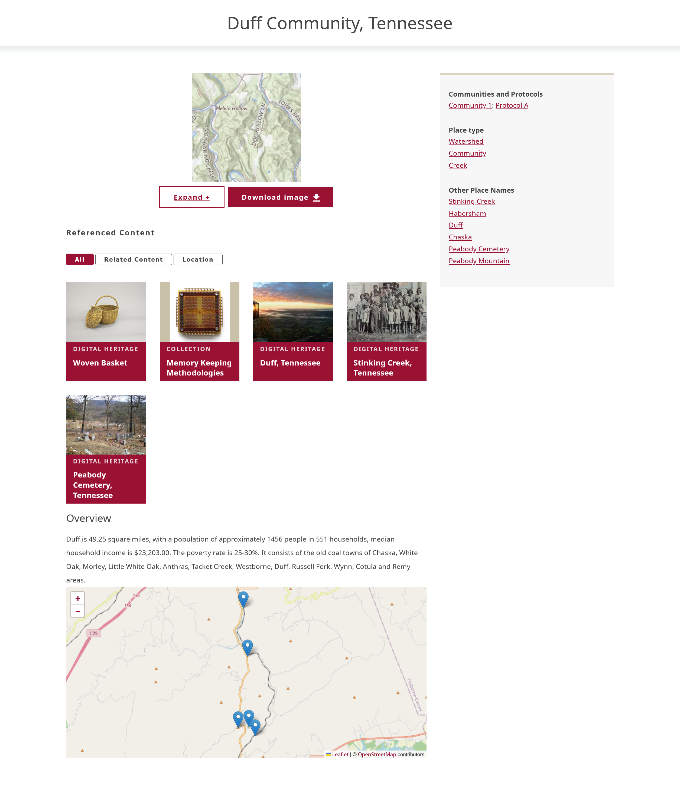

---
tags:
    - place records
    - taxonomies
    - content
---
# Understanding Place Records

!!! roles "User roles"
    Mukurtu manager, protocol steward, contributor

Place records are a content type that allows for rich, in-depth location records to be integrated into Mukurtu. Many different types of information can be integrated into place records. Some features include:

- Custom text, mapping, and media sections enable multiple, focused, text-based or multi-media geographic sketches for a location.
- Other names a location has been known by throughout its history can be linked to the location in the place record. This allows the location to be properly identified by the name or names it is known by in its community, and can help to remove confusion caused by misnamings, misspellings, or mistaken attributions. 
- When properly configured, place records automatically aggregate all the digitial heritage items and other content in which a location is referenced. 
- Referenced content can be filtered by All, Related Content, or Location. 

For more information about how to create person records, see [Create Place Records](CreatePlaceRecord.md).

To browse place records, navigate to **Browse** or go directly to `/browse`. To filter by place records, navigate to the **Content type** header on the right-hand side of the page and select the checkbox beside *Place*. 

