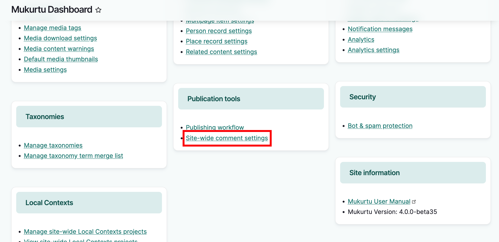
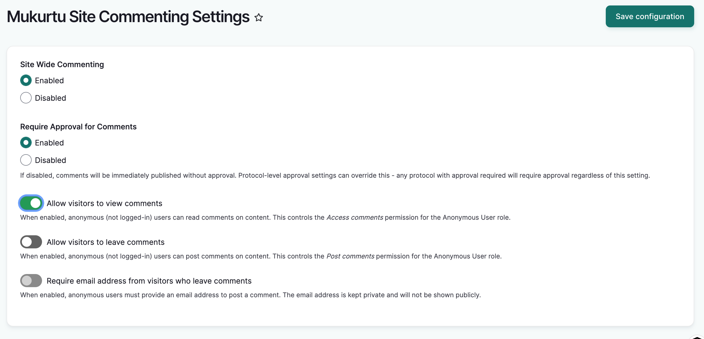
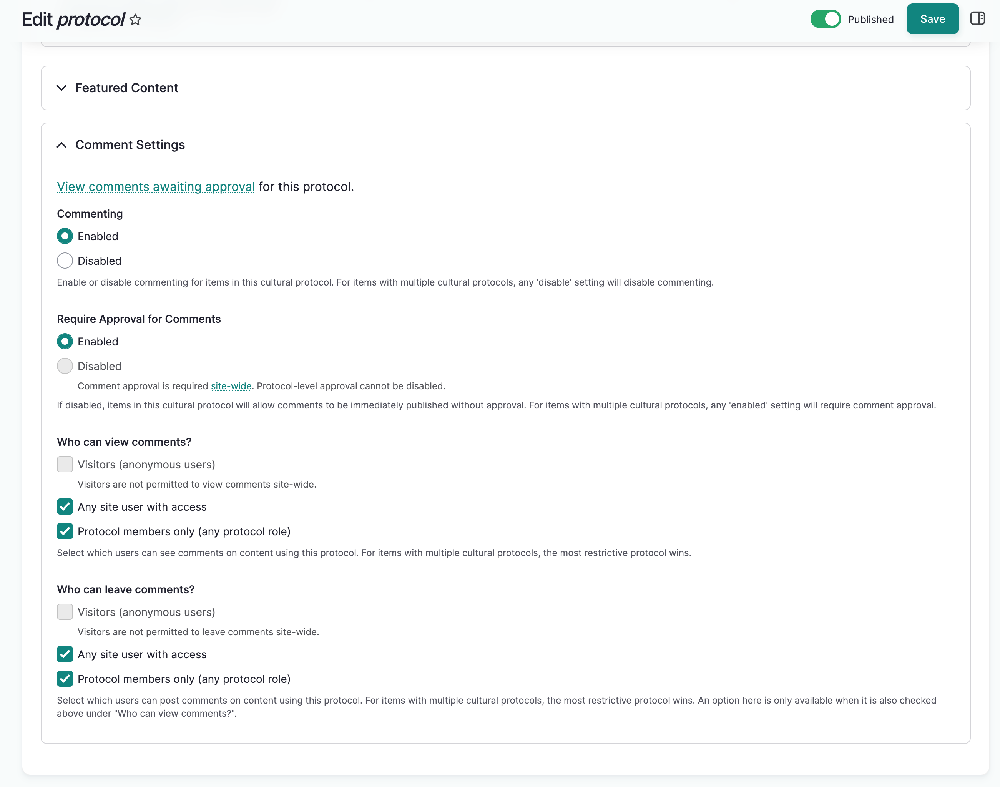

---
tags:
    - comments
    - site settings
---
# Comment Settings

!!! Roles "User roles" 
    Administrator, Mukurtu manager, Protocol steward

Comments settings are controlled on two levels: Site-wide, and per protocol. This article covers site-wide and protocols settings, and how they interact.

Site-wide comment settings can be found in the dashboard in the Publication Tools section. These settings enable/disable comments site-wide, determine whether comments require approval, and determine visitor ability to view and leave comments.

Protocol comment settings are found in a protocolʻs edit form and apply to content to which the protocol has been assigned. These settings enable/disable comments for content in the protocol, determine whether comments made on content within the protocol require approval, and provide more granular control over who can view and leave comments (visitors, site users, or protocol members only)

## Site-wide comment settings

To adjust site-wide comment settings, from the dashboard, scroll to the **Publication tools** section and select 
**Site-wide comment settings**.

The site-wide comment settings are as follows:

!!! Tip
	If a site-wide comment setting is set to the more restrictive option, it cannot be overridden within protocols. 

**Enable or disable commenting** - Select "enable" or "disable". By default comments are disabled, and must be enabled here before they can be used anywhere on the site. If disabled, protocol comment settings will not take effect.

**Require approval for comments** - Select "enable" or "disable". By default comment approval is required. When enabled, protocol stewards cannot disable this setting in protocols.

**Allow visitors to view comments** - This is enabled by default and allows anonymous (not logged-in) users to read comments on content. When disabled, protocol stewards cannot enable this setting in protocols.

**Allow visitors to leave comments** - This is disabled by default. When enabled, anonymous (not-logged-in) users can leave comments on content. When disabled, protocol stewards cannot enable this setting in protocols. This option is only available if anonymous users are allowed to view comments.

**Require email address from visitors who leave comments** -  This is disabled by default and can only be enabled when anonymous users are allowed to leave comments. When enabled, anonymous users must provide an email address to post a comment. The email address is kept private and will not be shown publicly.

## Protocol comment settings

!!! Requirement
    If comments are not enabled site-wide, a message will indicate that comments are not enabled. An administrator or Mukurtu manager will first need to enable them for protocol settings to take effect.

To adjust protocol comment settings, from the protocol page, select "Edit" and scroll down to comment settings, and expand the section.

If a content item has more than one protocol assigned, and there are conflicts in comment settings between protocols (i.e. one protocol requires comment approval and the other does not), the more restrictive setting will win.

Protocol comment settings are as follows:

**Commenting** - Select "enable" or "disable". For items with multiple cultural protocols, any 'disable' setting will disable commenting. If this is disabled in site-wide settings, it cannot be enabled in protocols.

**Require Approval for Comments** - Select "enable" or "disable". If enabled site-wide, it cannot be disabled in protocols. For items with multiple cultural protocols, any 'enabled' setting will require comment approval. 

**Who can view comments?** - Visitors, site users with access, and protocol members only. If any user group is deselected in site-wide settings, they cannot be selected in protocols. For items with multiple cultural protocols, the most restrictive protocol wins. 

**Who can leave comments?** - Visitors, site users with access, and protocol members only. If any user group is deselected in site-wide settings, they cannot be selected in protocols. For items with multiple cultural protocols, the most restrictive protocol wins. Available options will depend on who can view comments (i.e. if visitors can't view comments, they won't be allowed to leave comments.) 

