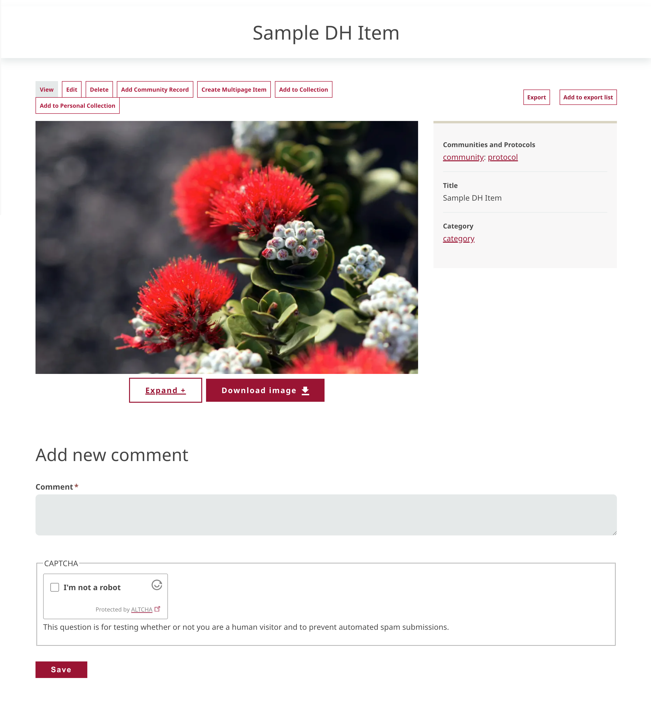
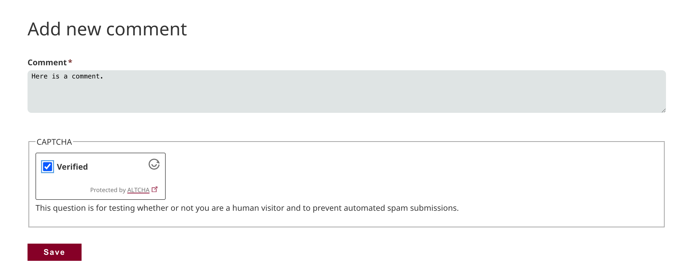
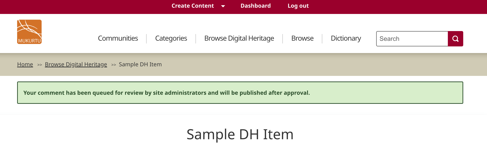
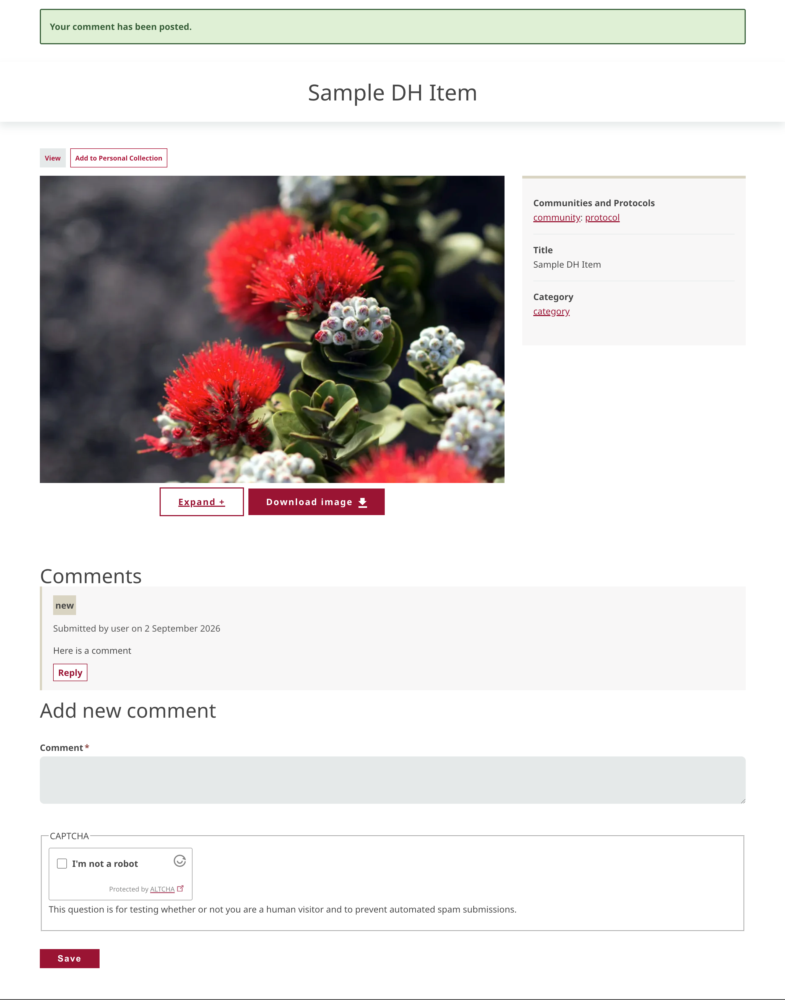
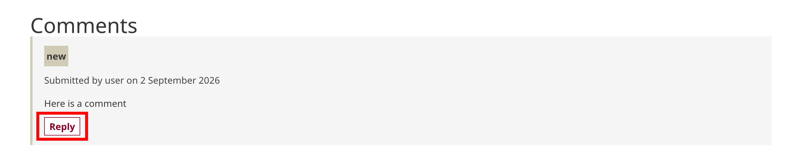
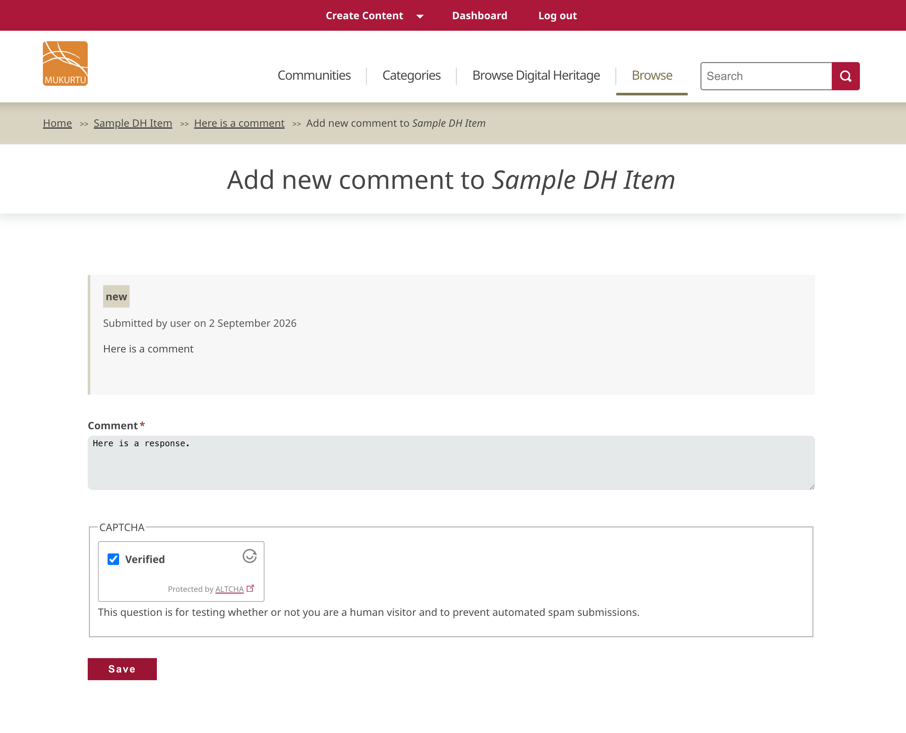
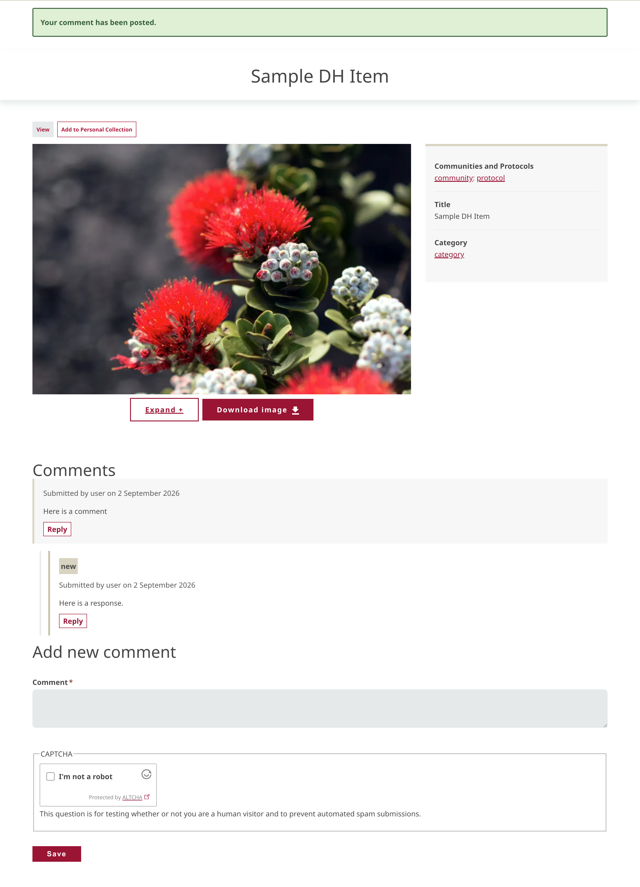

---
tags:
    - comments
---
# Leave Comments

!!! Roles "User roles" 
    Authenticated user, visitor

## Leave a comment
Comments are managed at the site and protocol levels. This means that some content items will allow commenting, and others will not. 

A user with permission to leave comments will see a comment box at the bottom of a content page.

If a comment box is not present, it may mean that commenting has been disabled in that protocol, or that the user does not have permission to leave comments (i.e. only protocol members can leave comments and they are not a member.)

For more on how comment settings work, see [Comment Settings](../publication/CommentSettings.md)

To leave a comment, simply add a comment to the comment box. If bot filters are enabled, follow the prompt and select "Save."

If comment approval is required, the content page will reload with a success message indicating that the comment has been submitted for review. Your comment will post when it has been approved.

If comment approval is not required, the content page will reload and the comment will appear below the content. The comment box will reset and additional comments can be added.

## Reply to a comment
Any user who can leave a comment can also reply to existing comments. 

To do so, under an existing comment, select "Reply."

A page displays the existing comment and an empty comment box. Add a response to the comment box. Respond to any bot filter prompts and select "Save."

As before, if a comment requires approval it will be added to a review queue for approval. It will post automatically after approval.

If approval is not required, the content page will reload and a success message will display. The new comment will display beneath the existing comment in a comment thread.

