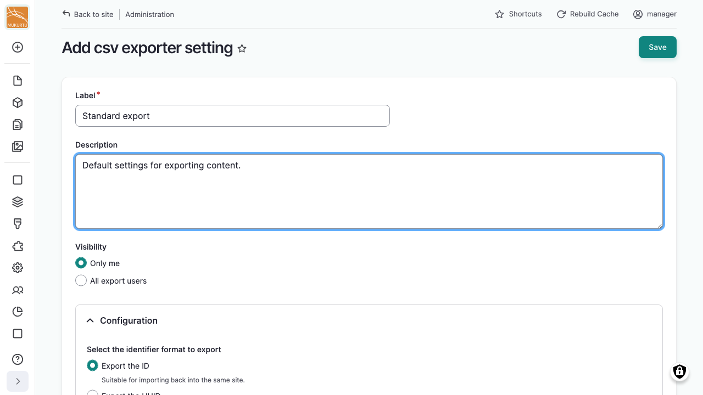
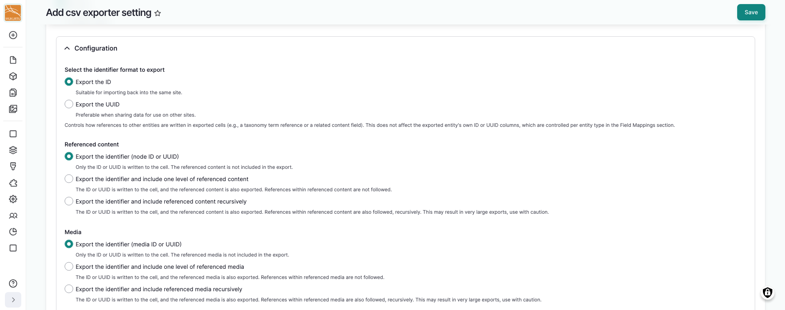
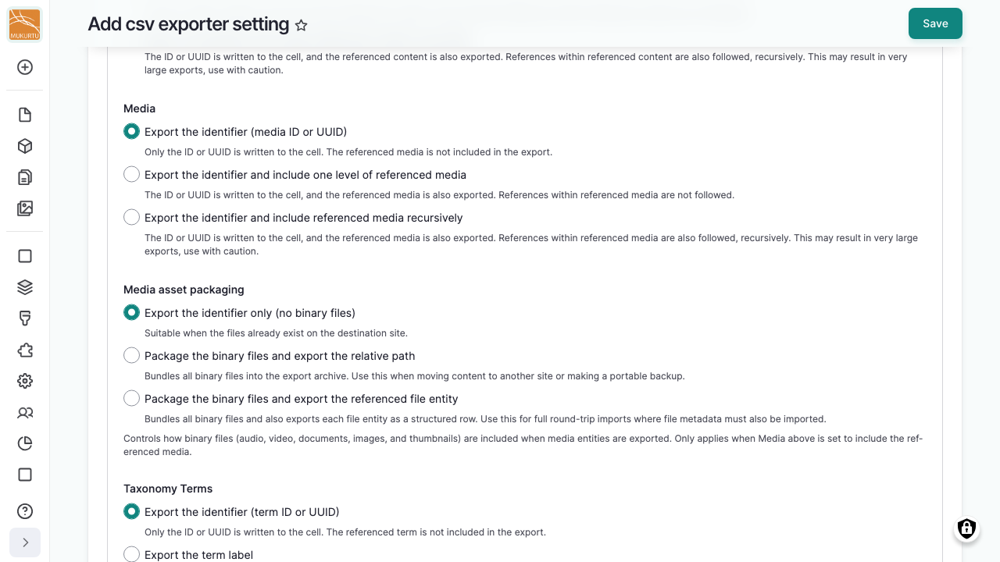
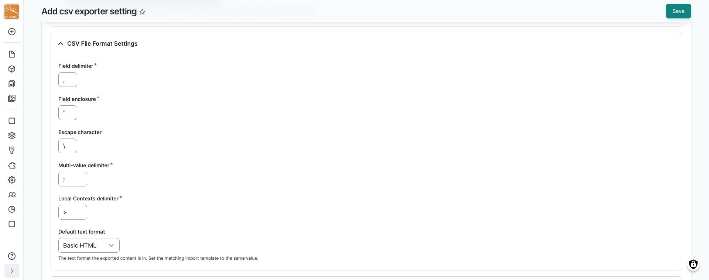
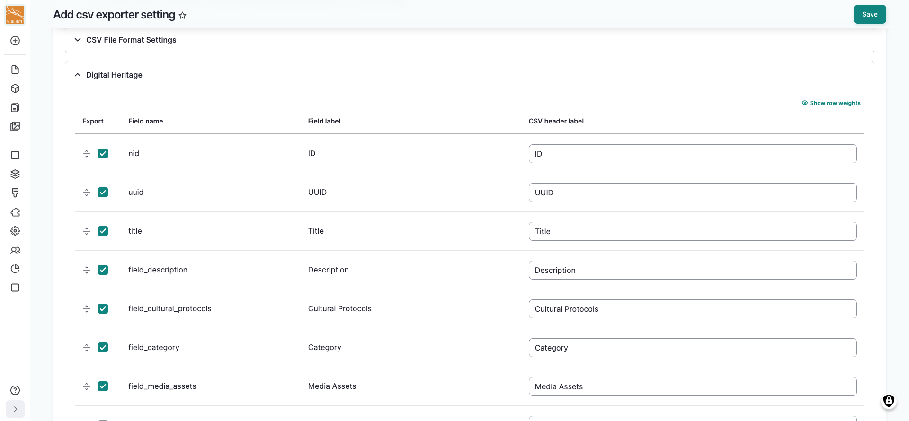
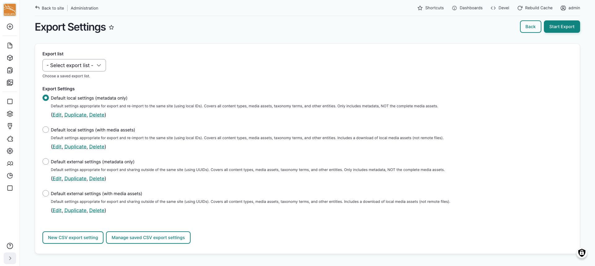

---
tags:
    - roundtrip
---

# Export Settings

!!! roles "User roles"
    Administrator, Mukurtu manager, Roundtrip manager

A CSV export setting is a saved, reusable configuration that controls exactly which fields are included in an export and how the resulting CSV file is formatted. You can save several settings for different purposes, for example one for updating your own site and another for sharing a limited set of fields with an outside institution.

## Default export settings

Mukurtu ships with four ready-to-use CSV export settings, shared with **All export users** so anyone with export access can use them right away. Each combines one of the two *identifier format* choices with one of the two *media asset packaging* choices described under [Configuration](#configuration) below:

| Setting | Identifiers | Media assets | Use it for |
|---|---|---|---|
| Default local settings (metadata only) | ID | Not included | Re-importing to the same site, metadata only |
| Default local settings (with media assets) | ID | Packaged | Re-importing to the same site, including media |
| Default external settings (metadata only) | UUID | Not included | Sharing metadata with an outside institution, no media |
| Default external settings (with media assets) | UUID | Packaged | Sharing with another site or organization, including media |

All four cover every content type, media type, taxonomy term, and other supported entity, so they're a good starting point to duplicate rather than build a setting from scratch.

## Create a CSV export setting

The four default settings export every field for every content type, using a fixed set of choices for how references are exported. Create a custom setting instead when you need something different, for example:

- Exporting only a curated subset of fields, rather than everything.
- Renaming CSV headers to match a specific partner's or tool's expected format.
- Changing how deeply a particular reference type is followed, such as exporting media as just an identifier instead of packaging the full asset.
- Using different CSV formatting, such as a different delimiter, for a specific downstream tool.
- Keeping the setting visible to only you, rather than sharing it with all export users.

From your **Dashboard**, under **Roundtrip**, select **Export Settings**, then select "New CSV export setting".

!!! tip
    You can also duplicate an existing setting as a starting point. Select "Duplicate" next to the setting you want to copy.

### General settings

- **Label**: the name shown when choosing between saved settings.
- **Description**: optional text shown alongside the name.
- **Visibility**: share the setting with all users who have roundtrip permissions, or keep it visible to "Only me".

### Configuration

These settings control how references to other content are written in exported cells (for example, a taxonomy term or related content field). They don't affect the exported item's own ID or UUID columns, which are controlled per content type in *Field mappings* below.

- **Select the identifier format to export**: export the **ID** (suitable for importing back into the same site) or the **UUID** (preferable when sharing data with other sites).
- **Referenced content**, **Media**, **Taxonomy Terms**, **Users**, **Paragraphs**, and **Multipage Items** each control how that kind of reference is written to its cell. **Referenced content**, **Media**, and **Paragraphs** share the same three depth options:
    - **Export the identifier only**: only the ID or UUID is written to the cell. The referenced item itself is not included in the export.
    - **Export the identifier and include one level of referenced items**: the ID or UUID is written to the cell, and the referenced item is also exported. References within that item are not followed further.
    - **Export the identifier and include referenced items recursively**: the ID or UUID is written to the cell, and the referenced item is also exported, following its own references in turn.

    **Taxonomy Terms** offer those same three depth options, plus a fourth: exporting the term's **label** instead of its identifier, useful when sharing data across sites where IDs may differ. **Users** only offer two choices, with no depth option: the identifier, or the **username**. **Multipage Items** also only offer two choices: the identifier, or the identifier with the referenced item included as a separate row (there's no recursive option, since multipage items don't reference each other).

!!! warning
    Following references recursively can produce very large exports. Use it with caution.

- **Media asset packaging**: controls how binary files (audio, video, documents, images, and thumbnails) are included when media entities are exported. Only applies when **Media** above is set to include the referenced media.
    - **Export the identifier only (no binary files)**: suitable when the files already exist on the destination site.
    - **Package the binary files and export the relative path**: bundles all binary files into the export archive. Use this when moving content to another site or making a portable backup.
    - **Package the binary files and export the referenced file entity**: bundles all binary files and also exports each file entity as a structured row. Use this for full round-trip imports where file metadata must also be imported.

### CSV file format settings

- **Field delimiter**: separates columns. Defaults to a comma (`,`).
- **Field enclosure**: wraps field values. Defaults to a double quote (`"`).
- **Escape character**: escapes the enclosure character within a value. Defaults to a backslash (`\`).
- **Multi-value delimiter**: separates multiple values within a single field. Defaults to a semicolon (`;`).
- **Local Contexts delimiter**: separates parts of an exported Local Contexts label or notice value. Defaults to `>`.
- **Default text format**: the text format exported content is written in. Set the matching import template to the same value.

### Field mappings

Fields are grouped by content and media type (Digital Heritage, Dictionary Word, Person, Place, Collection, Word List, Media, Users, Taxonomy Terms, and others). Open a group to see its fields, each with:

- An **Export** checkbox to include or exclude that field.
- Its **CSV header label**, which you can edit to rename the column in the exported file.

You can drag-and-drop the field order to reorder columns.

Only fields with **Export** checked are included in the CSV for that content or media type.

Select "Save" when done.

## Manage saved CSV export settings

Every saved setting appears directly on the export page, each with **Edit**, **Duplicate**, and **Delete** actions. Users with the *Administer Import Templates* permission can also select "Manage saved CSV export settings" from the export page to see every saved setting, its visibility, and description in one place.

