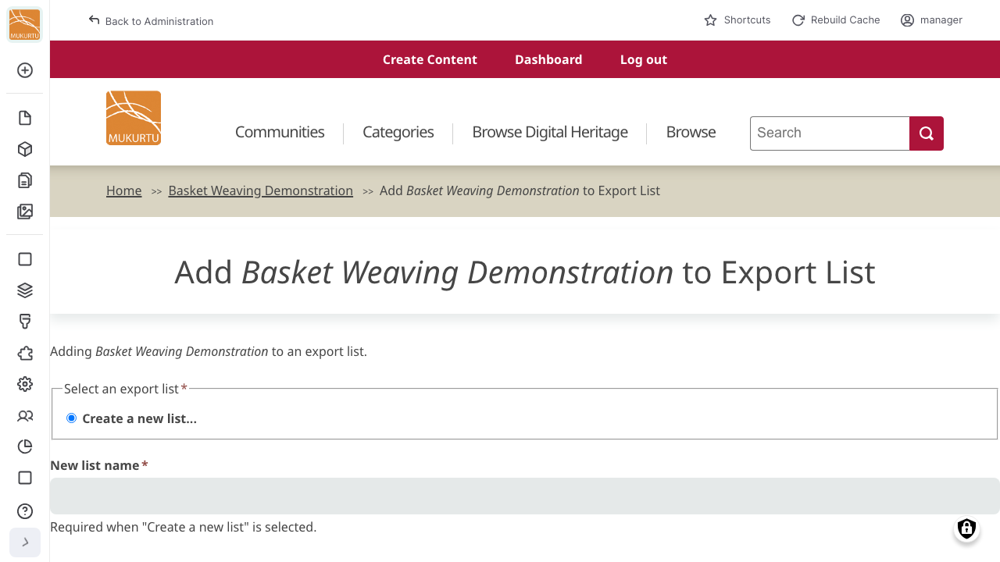
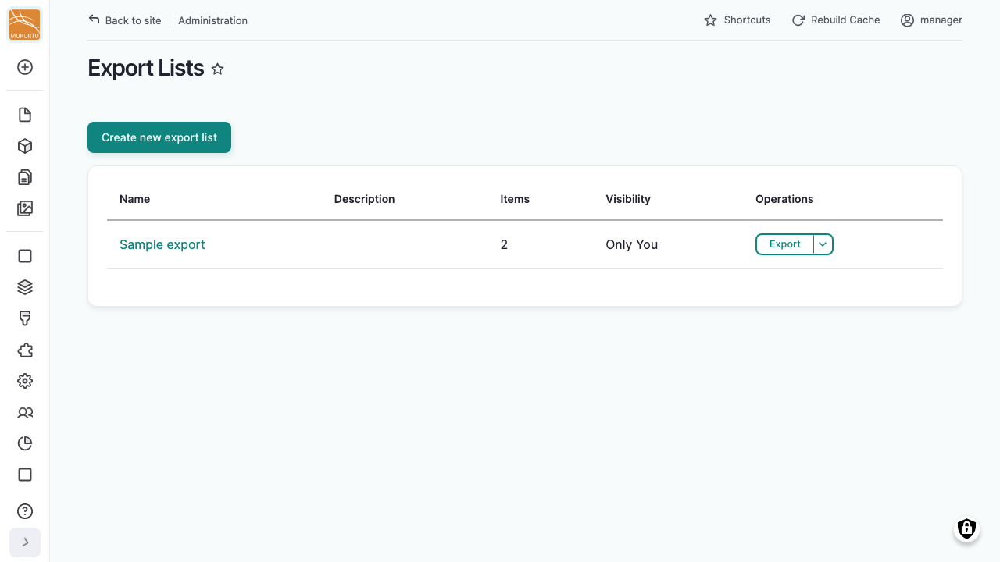

---
tags:
    - roundtrip
---

# Exporting Content

!!! roles "User roles"
    Administrator, Mukurtu manager, Roundtrip manager

Exporting content is a two-step process: first you gather the items you want into an export list, then you run the export using an export setting that controls exactly which fields are included. This article walks through both steps. For how to configure what an export includes, see [Export Settings](ExportSettings.md).

!!! requirement
    Users must be an Administrator, Mukurtu manager, or Roundtrip manager to access export tools. See [Manage User from a Site-wide role](../users/manage-user-accounts-site-wide.md) for more information.

## Add content to an export list

Content is gathered into a named export list before you export it, similar to a shopping cart. You can add items one at a time from a content page, or select multiple items at once while browsing.

### Add a single item

1. Open the content item you want to export.
2. Select "Add to Export List".
3. Under *Select an export list*, choose an existing list, or select "Create a new list..." and enter a *New list name*.
4. Select "Add to List".

!!! tip
    Depending on the item, you may see additional options here, such as including the other items in a collection or word list, related community records, an original record, or other pages of a multipage item.

### Add multiple items

While browsing or searching content, select the items you want, then choose "Add to Export List" from the bulk actions menu.

## Manage your export lists

From your **Dashboard**, under **Roundtrip**, select **Export Lists**.

This page lists every export list you own or that's been shared with you, showing its *Name*, *Description*, number of *Items*, and *Visibility*. Select "Create new export list" to start a new one directly, or use the actions menu next to a list to edit or delete it.

!!! tip
    Setting a list's visibility to "All Export Users" shares it with other users who have export access. Otherwise it's visible to "Only You".

## Run an export

There are two ways to start an export:

- From **Export Lists**, select "Export" next to the list you want to export.
- From your **Dashboard**, under **Roundtrip**, select **Export Settings**, then choose a list from the *Export list* dropdown.

Either way, you'll land on the same export page. From here:

1. Under *Export Settings*, choose which saved CSV export setting to use for this export. See [Export Settings](ExportSettings.md) for what these control. If you don't have one yet, select "New CSV export setting" to create one.
2. If your list includes a collection or word list, you can select the checkbox to also include everything inside it.
3. Select "Start Export".

## Download your export

Once the export finishes, the Export Results page lists how many items of each type were exported and provides a "Download Export" link. Select "Back to Settings" to run another export with the same list, or "New Export" to start over with a different one.

## Related articles

- [Export Settings](ExportSettings.md)
- [Roundtrip Overview](RoundtripOverview.md)
