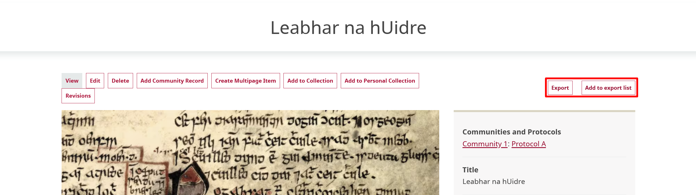
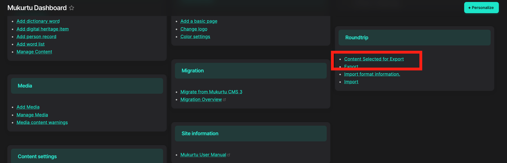
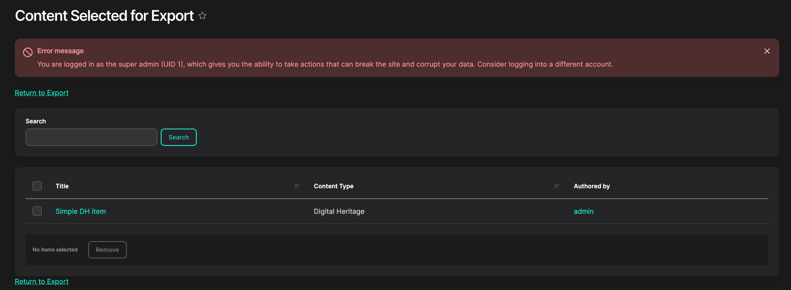
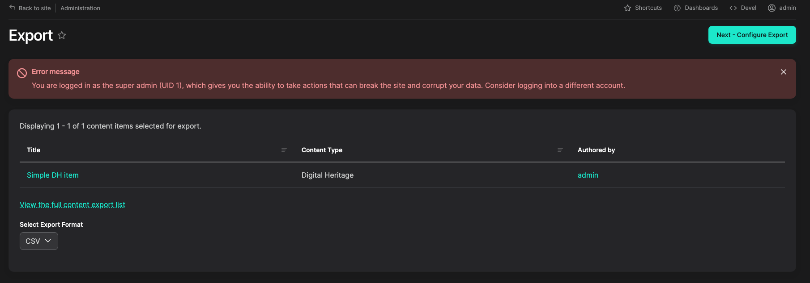
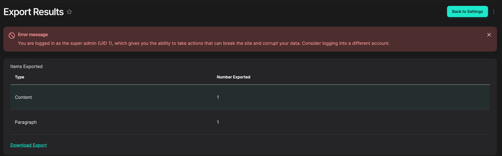

---
tags:
    - roundtrip
---

# ExportingContent

!!! Roles "User roles" 
    TBD

## Export "shopping cart"

- Users can mark any content for export while browsing the site. We've been calling this the "shopping cart" method of collecting content for export.
- There is a currently unstyled "add to/remove from export list" link at the bottom of the metadata sidebar on all (most?) content pages.

- The list of selected content is available at `/admin//export/content` (also linked on the dashboard).

- Ideally multiple carts or at least per-user carts could be supported.

## Running an export

- The export tool is available at `/admin/export`.

- Ideally there could be additional selection of available content here, but not currently.
- Only CSV export is targeted now, but we are interested in other formats in the future (XML, JSON, others).
- Select "Configure Export"

- More information on export settings in [Export Settings](ExportSettings.md). For now, just run "Start Export".

- If all goes well, a report and "Download Export" link should display.