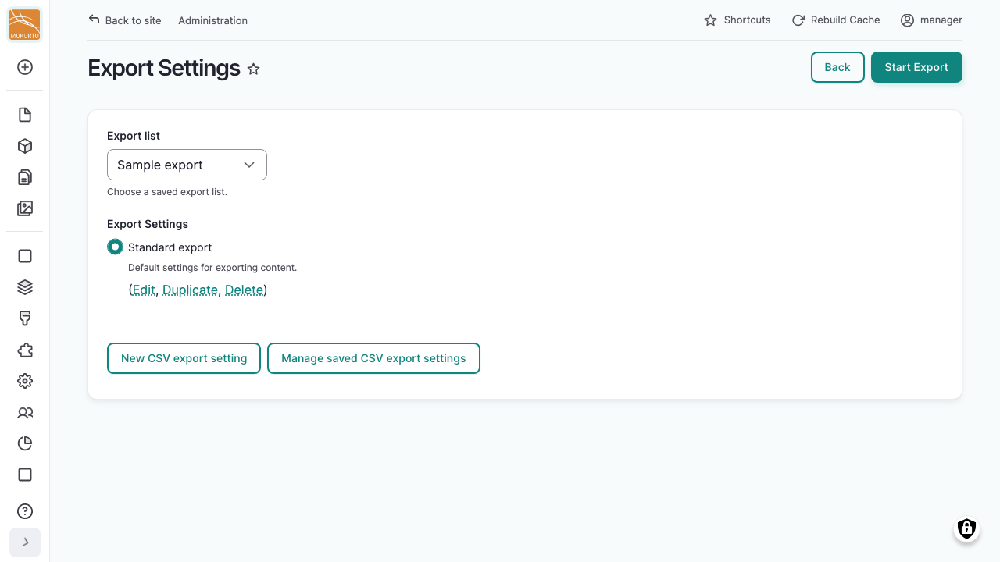
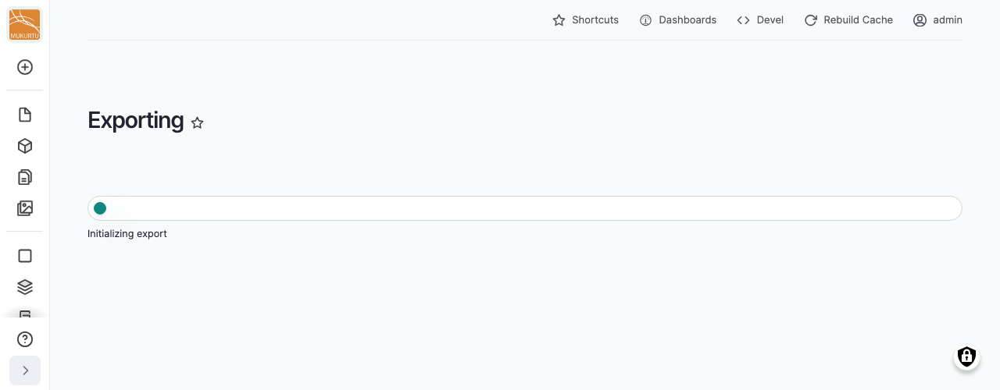
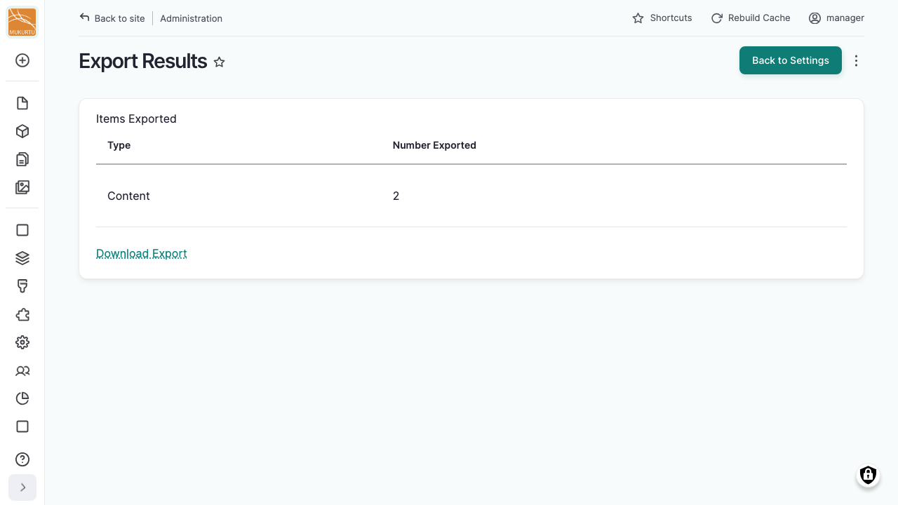

---
tags:
    - roundtrip
---

# Exporting Content

!!! roles "User roles"
    Administrator, Mukurtu manager, Roundtrip manager

There are two ways to export content. 

1. An export list lets you gather items over time into a named, reusable, and shareable group before exporting them.
2. An ad hoc export skips that step and exports one or more items right away. 

## Run an export from a list

There are two ways to start an export from a saved list:

- From **Export Lists**, select "Export" next to the list you want to export. See [Using Export Lists](UsingExportLists.md) for how to build and manage your lists.
- From your **Dashboard**, under **Roundtrip**, select **Export Settings**, then choose a list from the *Export list* dropdown.

Either way, you'll land on the same export page. From here:

1. Under *Export Settings*, choose which saved CSV export setting to use for this export. See [Export Settings](ExportSettings.md) for what these control. If you don't have one yet, select "New CSV export setting" to create one.
2. If your list or ad hoc selection includes a collection, word list, original record, community record, or multipage item, you may see additional options here for how much connected content to include. See [Exporting complex content](UsingExportLists.md#exporting-complex-content) for what these options do.
3. Select "Start Export".

    

4. Wait for the export to finish.

    

5. The Export Results page lists how many items of each type were exported. Select "Download Export" to download the file. Select "Back to Settings" to run another export with the same list, or "New Export" to start over with a different one.

## Run an ad hoc export

An ad hoc export skips export lists entirely: you export one or more items right away, without saving them anywhere first. Use this when you just need a one-off export and don't need to reuse or share the selection later.

- From a single content item, select "Export" instead of "Add to Export List".
- While browsing or searching content, select the items you want, then choose "Export" from the bulk actions menu instead of "Add to Export List".

Either way, you'll land on the same export page described above, except instead of an *Export list* dropdown you'll see a summary of the items you selected.

!!! tip
    Select "Clear Selection" on the export page to start over with a different ad hoc selection.

Select "Start Export", then wait for the export to finish. The Export Results page lists how many items of each type were exported. Select "Download Export" to download the file. Select "Back to Settings" to run another export, or "New Export" to start over with a different selection.

