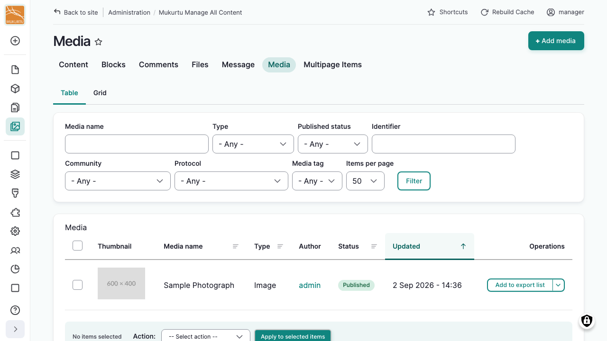
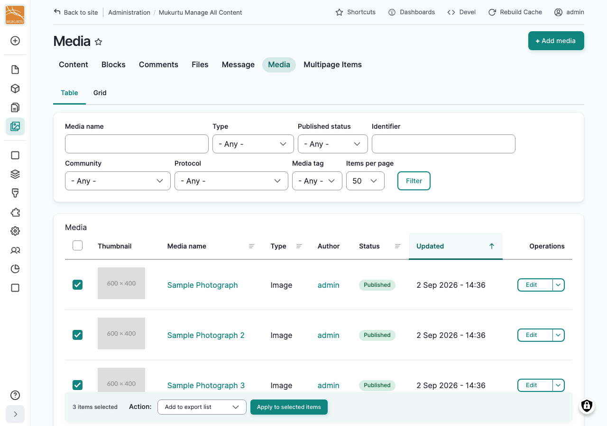
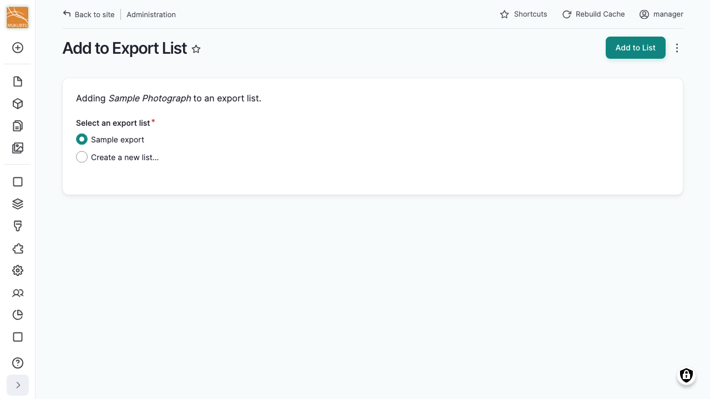

---
tags:
    - roundtrip
---

# Exporting Media

!!! roles "User roles"
    Administrator, Mukurtu manager, Roundtrip manager

Media assets can be exported on their own, or included when exporting the content they belong to. 

## Add media to an export list

Media assets don't have their own full page with an "Add to Export List" option the way content does. Instead, add media to an export list from the media library.

From your **Dashboard**, under **Media**, select **Manage Media**.

- To add a single item, select "Add to export list" from its actions menu, or, if it's shown directly on the item, select the "Add to export list" toggle.
- To add multiple items at once, select the items you want, then choose "Add to export list" from the bulk actions menu.

Next, choose an existing export list, or create a new one. See [Add a single item](UsingExportLists.md#add-a-single-item) for more information.

## Run an ad hoc export

An ad hoc export skips export lists entirely: you export one or more media items right away, without saving them anywhere first.

- Select "Export" from a media item's actions menu.
- To export multiple items at once, select the items you want, then choose "Export" from the bulk actions menu.

Either way, you'll land on the same export page, progress screen, and results page described in [Run an ad hoc export](ExportingContent.md#run-an-ad-hoc-export).

## Media included with content

When you export content whose **Media** setting (see [Configuration](ExportSettings.md#configuration)) is set to include the referenced media, that media is exported automatically along with it. It isn't folded into the content's own row: each media type exports to its own file (for example, `Media - Image.csv`), using that type's own field mapping. You don't need to separately add that media to your export list for this to happen.

## Media asset packaging

Whether the actual file is bundled with the export, or just an identifier, is controlled by **Media asset packaging** in the export setting you use (see [Configuration](ExportSettings.md#configuration)). This only matters for media types that store a local file: Image, Audio, Video, and Document. Remote Video, SoundCloud, and External Embed store a URL or embed code instead of a file, so this setting has no effect on them.

