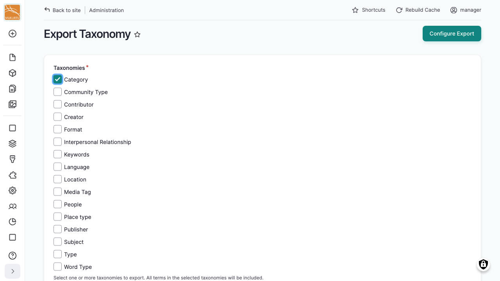
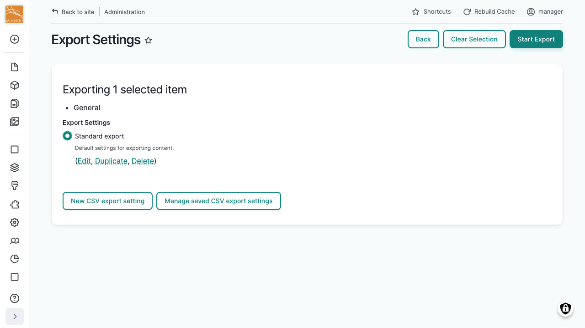

---
tags:
    - roundtrip
---

# Exporting Taxonomies

!!! roles "User roles"
    Administrator, Mukurtu manager, Roundtrip manager

Taxonomy terms, the vocabularies used for categories, languages, media tags, and other structured lists, are exported differently from content and media: there's no export list for taxonomy terms. Instead, you choose which vocabularies to export and run the export right away, similar to an [ad hoc export](ExportingContent.md#run-an-ad-hoc-export) of content or media. For what a CSV export setting controls, see [Export Settings](ExportSettings.md).

## Choose vocabularies to export

From your **Dashboard**, under **Roundtrip**, select **Export Taxonomy**.

1. Under **Taxonomies**, select the checkbox next to each vocabulary you want to export. You can select more than one.
2. Select "Configure Export".

## Run the export

You'll land on the same export page used for [ad hoc](ExportingContent.md#run-an-ad-hoc-export) content and media exports, showing a summary of the selected terms instead of an export list. Choose a saved CSV export setting and select "Start Export", then wait for the export to finish. You'll reach the same Export Results page described in [Run an ad hoc export](ExportingContent.md#run-an-ad-hoc-export).

## Field mappings for taxonomy terms

Taxonomy terms need a saved CSV export setting to run an export, the same as content and media. Each vocabulary has its own field mapping table under **Field mappings** in that setting. See [Export Settings](ExportSettings.md#field-mappings) for details.
