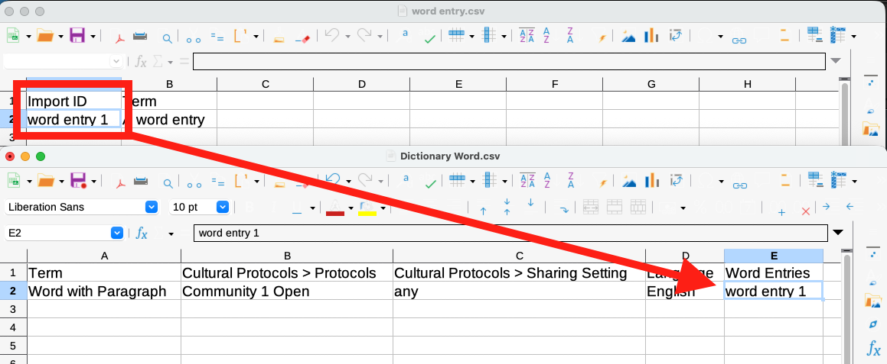
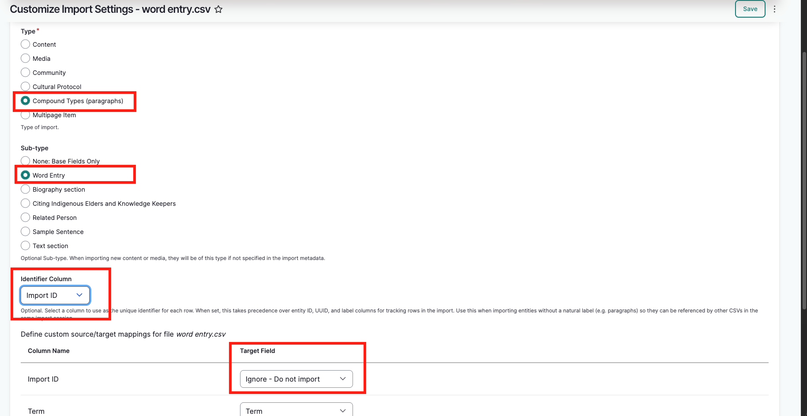
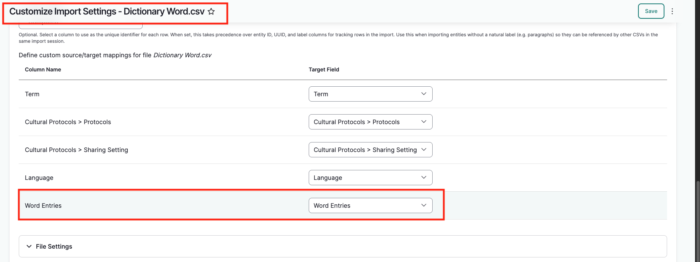
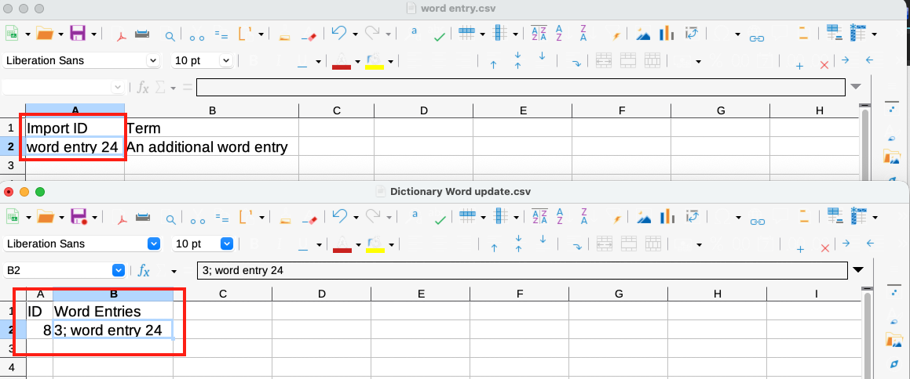

---
tags:
    - roundtrip
---

# General Import Information

!!! Roles "User roles" 
    Mukurtu manager, Roundtrip manager, Administrator

## Spreadsheet templates

Import templates can be created and downloaded from your own site at `/admin/import/format` (linked on the dashboard as "Import format information").

## Identifiers: ID, UUID, Import ID

There are three kinds of identifiers that are used in various roundtrip tasks. 

- ID: Created by the system when content, media, terms, etc, are created. These start at `1` and increase from there. They are useful for referencing existing content/entities within the same site.
- UUID: Created by the system when content, media, terms, etc, are created. These are unique strings (eg: `550e8400-e29b-41d4-a716-446655440000`) that can be used to reference and identify content when sending information between the site and other sites/systems.
- Import ID: Created by users for referencing across spreadsheets within the same import (mostly for connecting content and paragraphs).

> This is unrelated to the *Identifier* metadata field present in most content and media assets which is descriptive and not structural.

## "Authored by" field

All import sheets can include an optional *Authored by* field. This is used to indicate which user is responsible for creating the imported content. It can be useful to identify content authors and to track the revision history of content as it is changed.

- The *Authored by* field can reference any valid username.
- The user running the import MUST have correct protocol permissions for all content and protocols referenced in the sheet.
- If a user is listed as the author of content and later loses permission to access the content due to protocol membership changes, then they cannot access the content. Being the author of content does not bypass over override protocol access controls.

**If no author is provided** (if the field is empty, omitted entirely, or does not reference a valid username)

- The user running the import is listed as the author.

**If an author with correct protocol permissions is provided, AND the user running the import has correct protocol permissions**

- The user identified in the *Authored b*y field is listed as the author.

**If an author with correct protocol permissions is provided, BUT the user running the import does NOT have correct protocol permissions**

- The import will fail with a community membership error. The user running the import MUST have correct protocol permissions.

**If an author with INCORRECT protocol permissions is provided, BUT the user running the import DOES have correct protocol permissions**

- The user running the import is listed as the author.

## Draft field

At this time if draft field is present, all content must include a value in that field. 
If it is not required, omit the field entirely.

## Paragraphs

Certain Mukurtu content types reference paragraphs as part of their metadata structure. Paragraphs are groups of fields that can be repeated within content allowing for more complex or nuanced content. Each type of paragraph is imported as a separate spreadsheet from it's corresponding content.

The stock content and paragraphs are:

|Content type|Paragraph|
|---|---|
|Digital heritage items|Citing Indigenous Elders and Knowledge Keepers|
|Dictionary words|Word entries  Sample sentences|
|Word entries*|Sample sentences|
|Person records|Biography (text) sections|
|Place records|Text sections|

*Word entries are paragraphs, not content types, but they can also include sample sentence paragraphs

**Importing content and related paragraphs at the same time**

When including both a content spreadsheet and a related paragraph spreadsheet in the same import (eg: dictionary words and sample sentences):

1. In the paragraph spreadsheet, include an *Import ID* field (you can name it whatever you like). This is not the same as the regular ID or UUID field, it is a field that is ONLY used to connect the content during import and is not retained in the database.
2. Assign each paragraph an identifier in that field. These identifiers can be anything that is easy to view and reference in the corresponding content spreadsheet. 
3. In the content spreadsheet, in the appropriate paragraph field, reference the paragraphs by their *Import ID* identifiers, separating multiple paragraphs with semicolons.
4. When mapping the paragraph import settings: 
    - In the *Identifier Column* setting, select the *Import ID* field.
    - In the field mapping table, confirm that the *Import ID* field is set to "Ignore - Do not import".
5. When mapping the content spreadsheet, confirm that the paragraph reference field is mapped correctly.

This will allow the system to stage the paragraphs and then connect them to the appropriate content on import.

The screenshots below show a dictionary word and corresponding word entry as an example.

**Importing paragraphs and adding them to existing content**

The process is largely the same as importing content and related paragraphs at the same time.

- The primary difference is that the content spreadsheet ONLY needs to include the ID or UUID field, and the paragraph reference field (unless other edits are being made at the same time).
- If the content already has a paragraph referenced and more paragraphs are being added, then the ID/UUID/Import ID for ALL paragraphs must be included.

