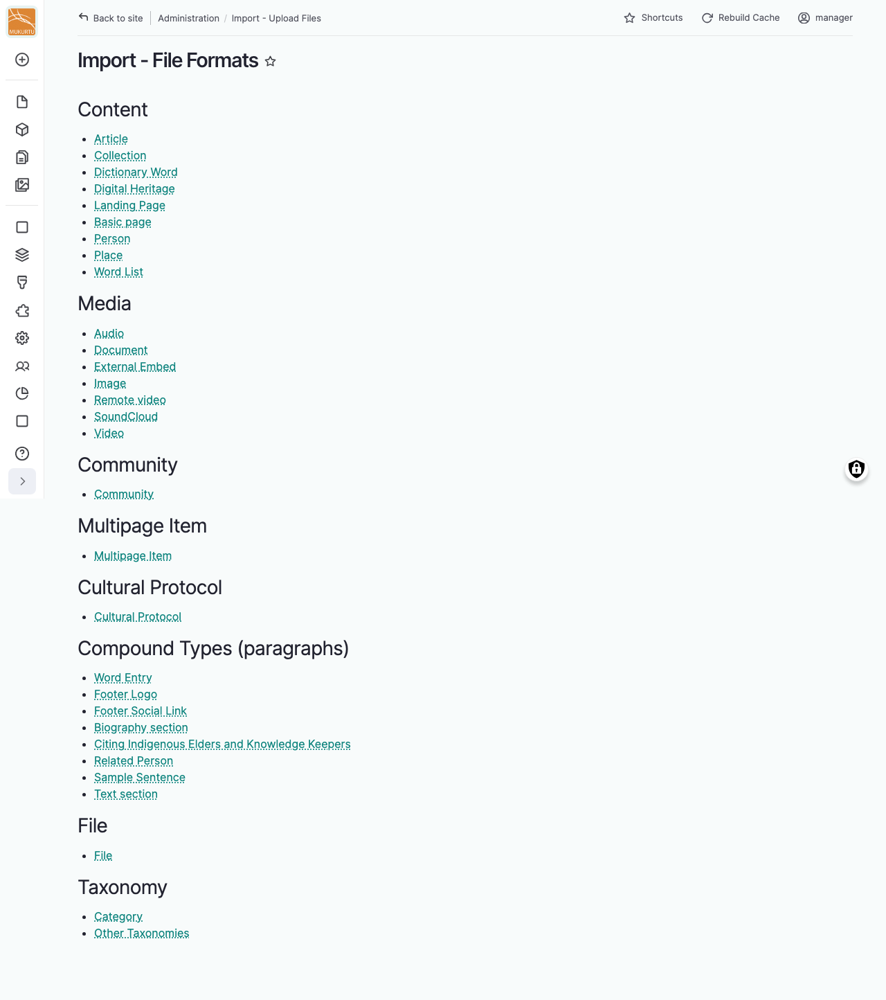
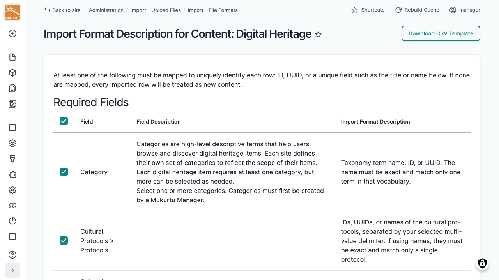

---
tags:
    - roundtrip
---

# Import Format Information

!!! roles "User roles"
    Administrator, Mukurtu manager, Roundtrip manager

Before running an import, use the import format information pages to see exactly which fields are available for the content type you're importing, and to download a ready-made CSV template.

## Find the format for a content type

From your **Dashboard**, under **Roundtrip**, select **Import format information**, or go directly to `/admin/import/format`.

Select a content type, media type, or other importable type to see its field list. Types are grouped by category, including Content, Media, Community, Multipage Item, Cultural Protocol, Compound Types (paragraphs), File, and Taxonomy. If you have permission to import user accounts, a User group is also listed.

!!! tip
    Taxonomy vocabularies are grouped into two representative entries: **Category** (which has its own thumbnail image field) and **Other Taxonomies** (covering every other vocabulary, which all share the same fields). This grouping is specific to this reference page — when configuring an actual import, you'll choose the real vocabulary. See [Importing Taxonomy Terms](ImportingTaxonomyTerms.md).

## Required and optional fields

Each type's field list is split into **Required Fields** and **Optional Fields** tables. Both list the field's name, a description of what it's for, and its expected import format (for example, a date format or a list of valid values).

!!! requirement
    At least one field must be mapped to uniquely identify each row: ID, UUID, or a unique field such as the title or name. ID and UUID always appear as optional individually, since leaving both blank means the row will be treated as new content, but you still need one of the three to identify existing rows if you're updating content.

## Download a CSV template

Every row in both tables is selected by default, so downloading immediately produces a complete template. Deselect any fields you don't need to produce a smaller, custom template instead.

Select "Download CSV Template" to download a CSV file with the correct header row for the fields you selected.
