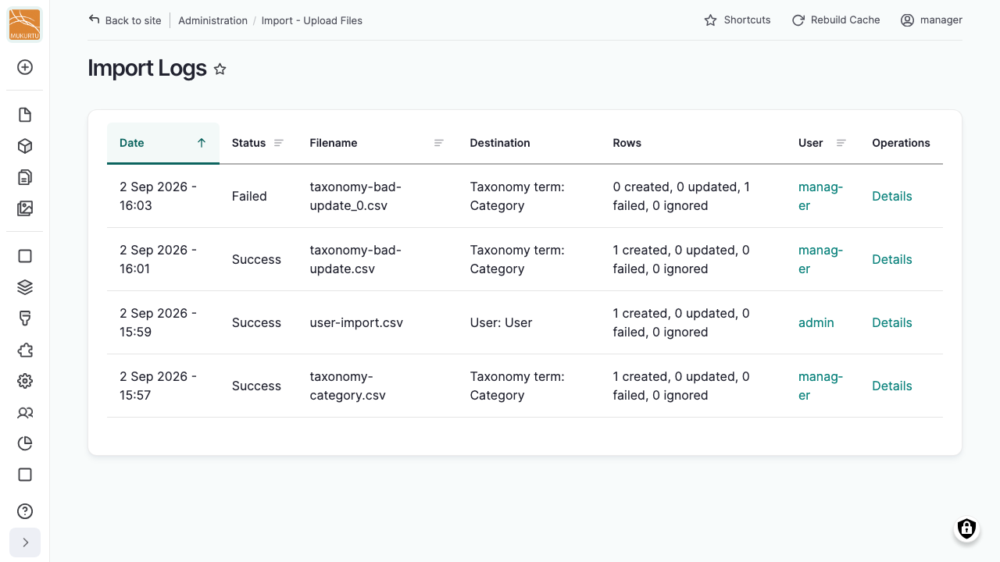
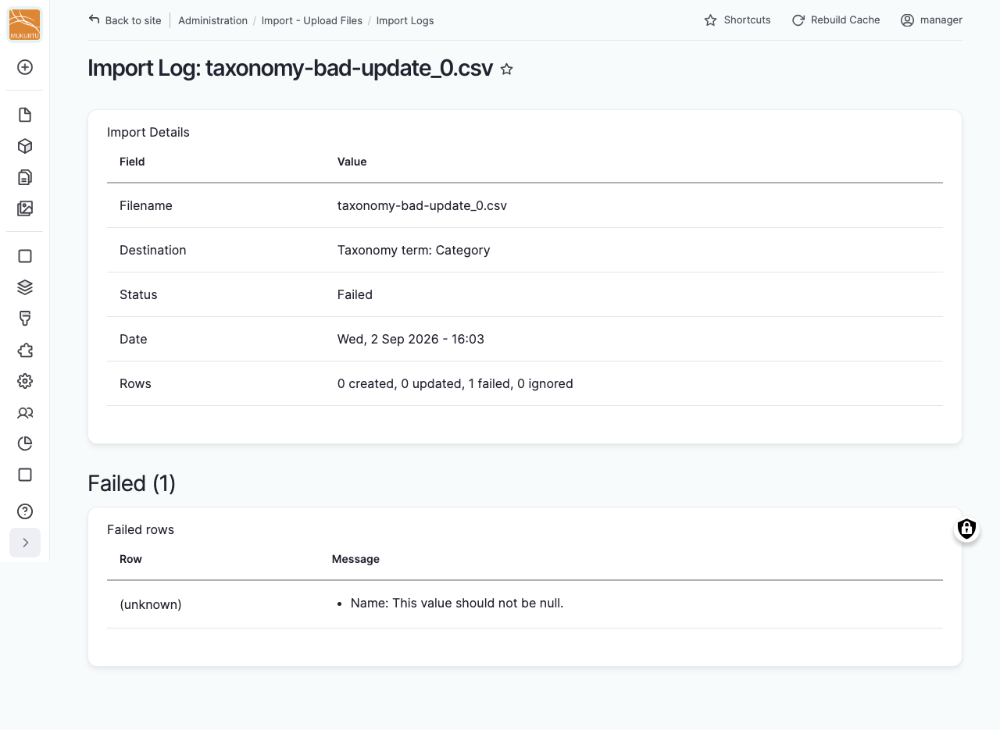

---
tags:
    - roundtrip
---

# Import Logs

!!! roles "User roles"
    Administrator, Mukurtu manager, Roundtrip manager

Every import you run is recorded permanently, so you can look back at what was imported, when, and by whom, even after the run's own results page is gone.

## Find your import history

From your **Dashboard**, under **Roundtrip**, select **Import Logs**.

The list shows, for each file processed by an import: *Date*, *Status* (Success or Failed), *Filename*, *Destination* (the content or entity type and bundle it targeted), and a summary of *Rows* (how many were created, updated, failed, or ignored).

!!! requirement
    By default you only see your own import history. Users with the *Administer Import Templates* permission can see everyone's, with an added *User* column showing who ran each import.

## Review a single import

Select "Details" next to an entry to see:

- A summary of the filename, destination, status, date, and row counts.
- A list of the items created and updated, linked to each one where possible.
- For a failed run, a table of the failed rows, with the row identifier and the error message for each.

