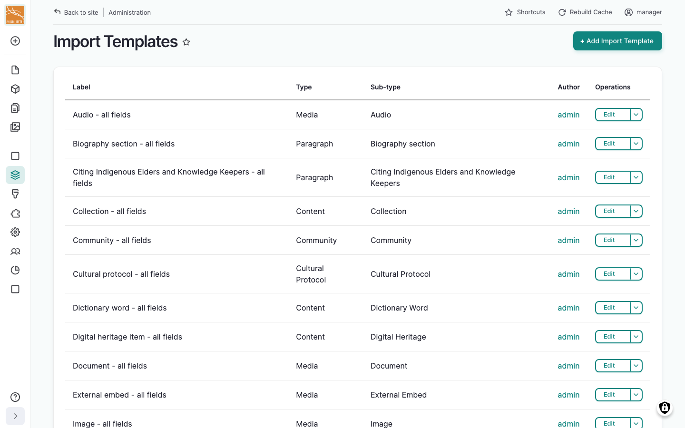
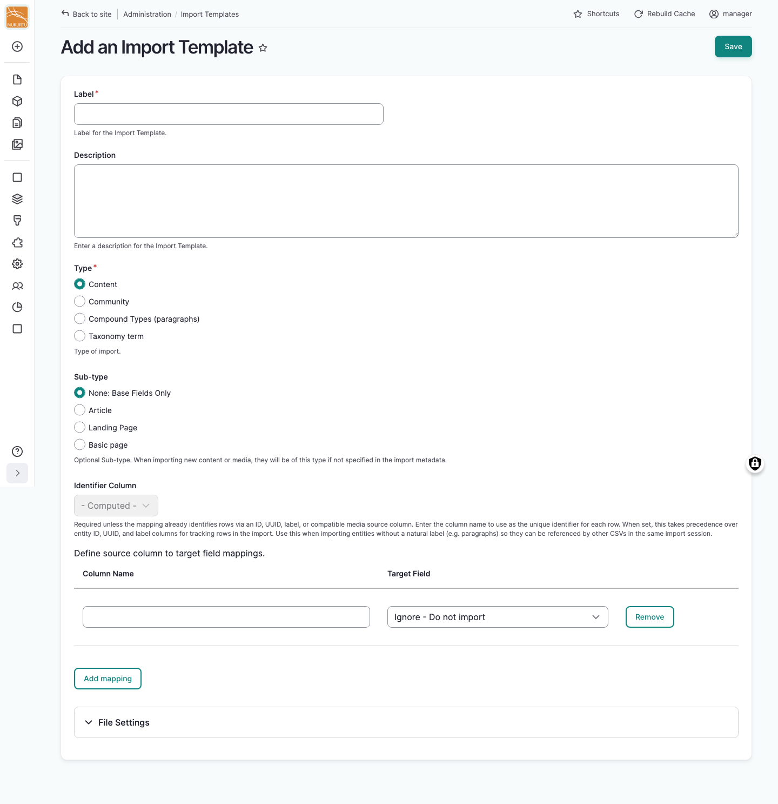
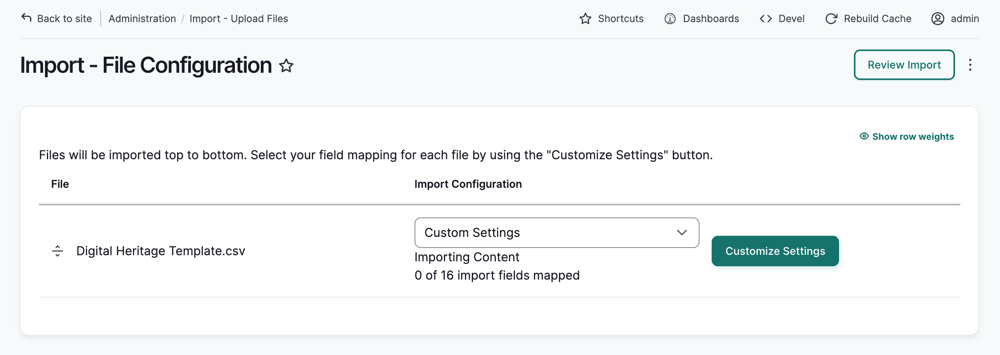
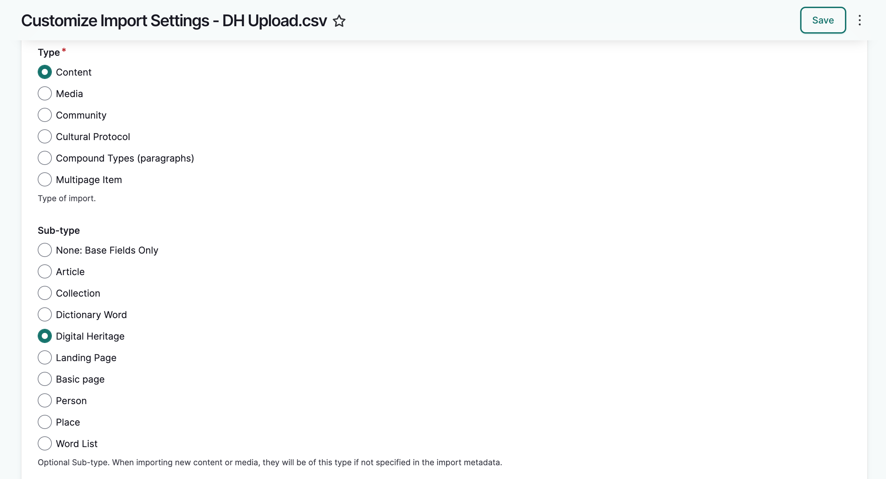
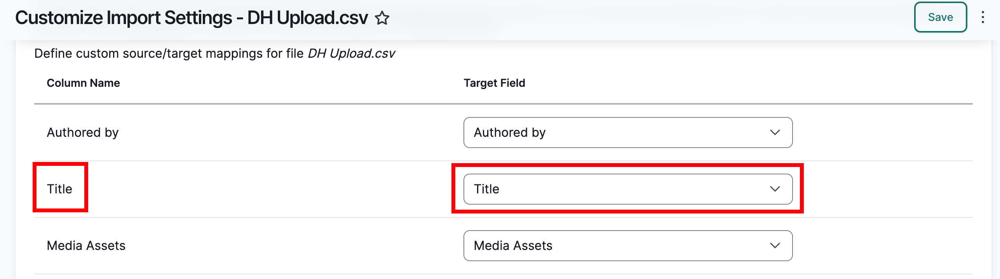
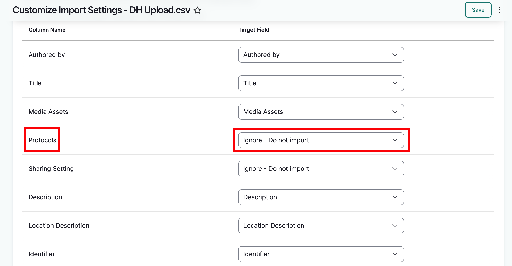
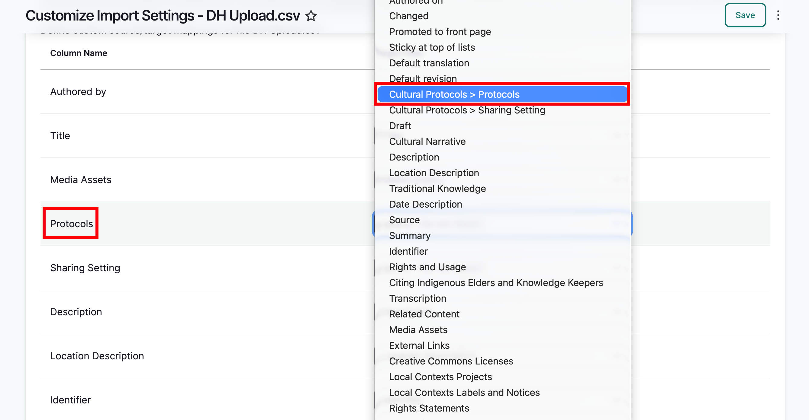
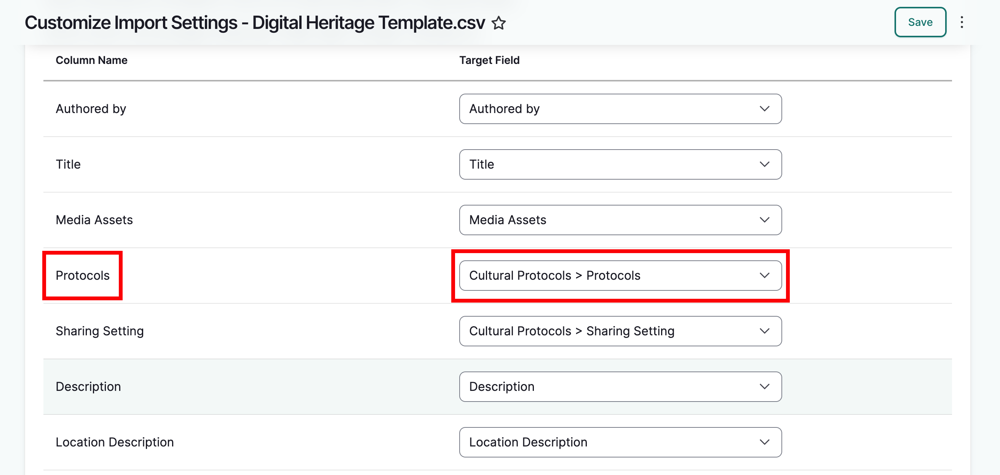
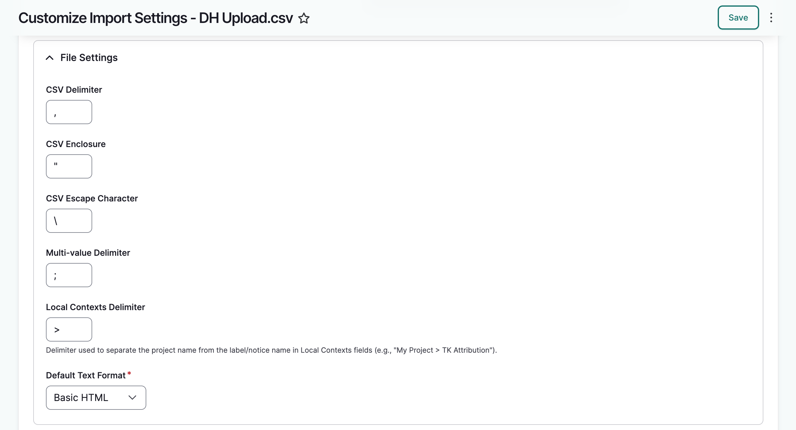
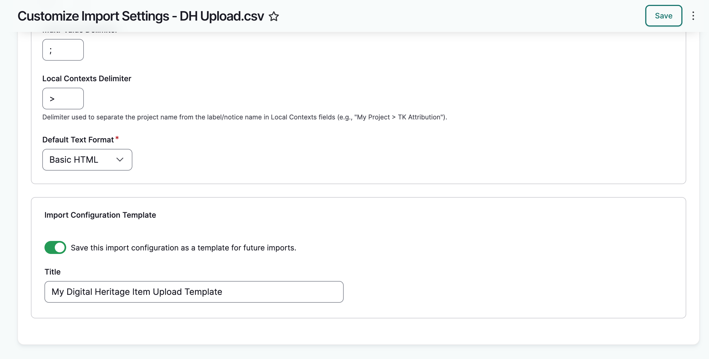

---
tags:
    - roundtrip
---

# Import Templates

!!! roles "User roles" 
    Administrator, Mukurtu manager, Roundtrip manager

An import template is a saved set of column-to-field mappings and file settings that tells Mukurtu how to read a spreadsheet. Templates can be reused across imports, and are specific to a content, media, community, cultural protocol, taxonomy, paragraph, or user account type.

There are three ways you'll work with import templates:

- Prepackaged **default templates** already exists for every importable type.
- You can **create or edit a template in advance**, before you have a file to import.
- You can **choose and customize a template on the fly** while running an import.

## Default import templates

Every importable type ships with a default template that maps every available field for that type by its exact field name (for example, "Digital heritage item - all fields"). These appear in the template list alongside any custom templates you create.

**The default templates are comprehensive and likely cover most use cases.** 

Anyone who can access Roundtrip import tools can select and use a default template. Only Administrators can edit or delete the shipped default directly. Otherwise, customizing a default template creates a new template of your own rather than changing the original.

## Managing templates in advance

To create or edit templates before you have a file ready to import, go to your **Dashboard**, under **Roundtrip**, select **Manage Import Templates**, or go directly to `/admin/import-templates`. This lists every template on your site, including the defaults, with options to edit or delete each one.

Select "Add Import Template" to create a new one from scratch.

1. Enter a **Label** and, optionally, a **Description**.
2. Under **Type**, choose the general category (content, media, community, cultural protocol, taxonomy term, compound type/paragraph, or user account, depending on your permissions), then choose a **Sub-type** if applicable.
3. Since there's no uploaded file to read column headers from, type the source column names you expect to use directly into the **Column Name** fields, and select the matching Mukurtu field for each in **Target Field**. Select "Add mapping" to add more rows.
   - Refer to the metadata field documentation for the type you are importing to ensure you cover the required fields.
4. Set an **Identifier Column** if your spreadsheet won't include an ID, UUID, or unique label/name column to identify rows.
5. Expand **File Settings** to set the delimiter, enclosure, escape character, multi-value delimiter, Local Contexts delimiter, and default text format, if different from the defaults.
6. Select "Save."

This is useful for building a mapping ahead of time, or for standardizing one for your team to reuse, without needing a sample file in hand.

## Configuring a template while running an import

While uploading a spreadsheet during an active import, the file configuration page lists each spreadsheet you've uploaded. The custom configuration dropdown menu lists any templates whose mappings match your spreadsheet's columns, including default and custom templates. If one of those templates is close but not completely correct for the current import, you may want to select a relevant template and edit it on the fly here. You can also create a whole new import template here.

Either way, you can customize your settings by selecting "customize settings."

If you uploaded multiple spreadsheets, each spreadsheet will need to be configured individually following the steps below.

### Import type

1. There are several types of imports. Choose the correct import type. In this example, we are importing digital heritage items, which are a kind of content.

    - This is a required field.

2. Under *import sub-type*, select a sub-type. Because the import type is content, all content types will be listed here. If the import type was media, the sub-type would list all media types, etc. Import type and sub-type determine which fields are used for mapping. 

### Define custom source/target mappings
The column headers in your metadata sheet do not need to match Mukurtu's metadata schema. This next section allows you to map your column headers to Mukurtu. On the left you will see your spreadsheet's column names. To the right are the Mukurtu target fields. Each dropdown menu in the target fields column lists all metadata fields for the content type you are uploading.

Column names that match Mukurtu's metadata schema will map automatically (title and description fields for example). You can select a different field if desired. 

Column names that Mukurtu does not recognize will be labeled "Ignore - Do not Import." 

For each column name you wish to map, open the corresponding menu and select the appropriate Mukurtu metadata field.

!!! tip
    Note that you cannot map two columns to the same field. For example, if you have two columns labeled "source," you cannot select "source" twice as a target field.

### File settings
When your mapping is complete, scroll down to file settings and make sure that the default settings reflect your spreadsheet. The default settings are likely fine, but if you know your sheet is formatted differently, make any necessary changes to ensure your spreadsheet is read correctly.

For example, if you are using "||" as a multi-value delimeter, replace  
";" with "||" in the *multi-value delimeter* field.

### Saving a template
If you will be uploading other sheets that match these settings, you can save this as a template for future uploads, and these configuration steps won't have to be repeated.

To save a template, toggle the "Save this import configuration as a template for future imports" on and give your template a descriptive title. When you are done, select "Save." You will be returned to the file configuration page. 

!!! tip
    If you started from an existing template you have permission to edit, the toggle instead reads "Save the changes to this existing template." Leaving it on will overwrite that template with your changes rather than creating a new one. If you'd rather keep the original template and save your changes separately, give your new version a different label before saving.
