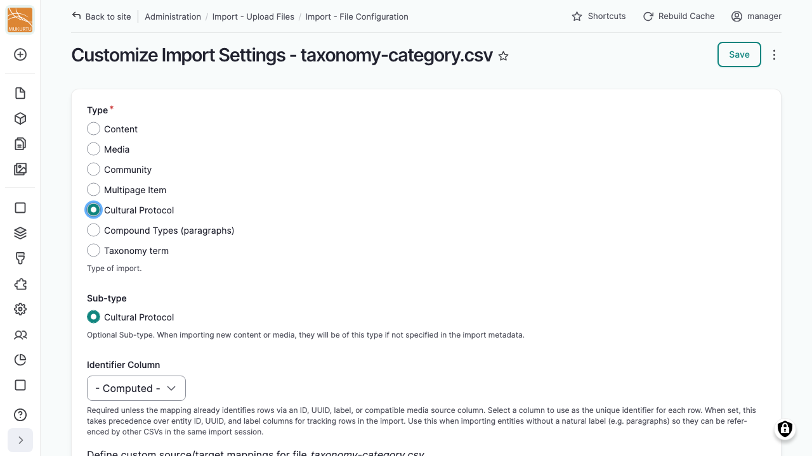

---
tags:
    - roundtrip
    - communities, cultural protocols, and categories
---

# Importing Communities and Cultural Protocols

!!! roles "User roles"
    Administrator, Mukurtu manager, Roundtrip manager

Communities and cultural protocols can be created and updated in bulk the same way as content, through the regular import wizard. See [Importing Content](ImportingContent.md) for the general steps.

## Choose the import type

When configuring your import, select **Community** or **Cultural Protocol** as the import type.

!!! requirement
    Creating a new cultural protocol requires Community Manager access to the community it will belong to, the same as creating one manually. Users without that access won't see **Cultural Protocol** as an available import type.

## Fields

Communities and cultural protocols share most of the same fields:

- *Name*, *Description*: basic identifying information.
- *Sharing Protocol*: the community's or protocol's own access mode.
- *Banner Image*, *Thumbnail Image*: File ID and Alternative text for each.
- *Featured Content*: content featured on the community or protocol page.
- *Membership Display*: whether the member list is shown publicly.
- *Local Contexts API key*, *Local Contexts Description*: for connecting to a Local Contexts Hub project. See [Understanding the Local Contexts Hub](../local-contexts/UnderstandingTheLocalContextsHub.md).
- *Authored by*, *Created*, *Published*, *Locale*, *Default translation*, *ID*, *UUID*: standard metadata and identifier fields, the same as content.

Cultural protocols also have:

- *Communities*: the community or communities the protocol belongs to.
- *Comments Require Approval*, *Comments Status*, *Who can view comments*, *Who can leave comments*: the protocol's comment settings. See the *Comment Settings* section of [Editing Cultural Protocol Settings](../communities-cultural-protocols-categories/EditCulturalProtocolSettings.md#comment-settings).

Community-specific:

- *Community Type*: the community's type taxonomy term.

See [Import Format Information](ImportFormatInformation.md) for the full, current field list.
