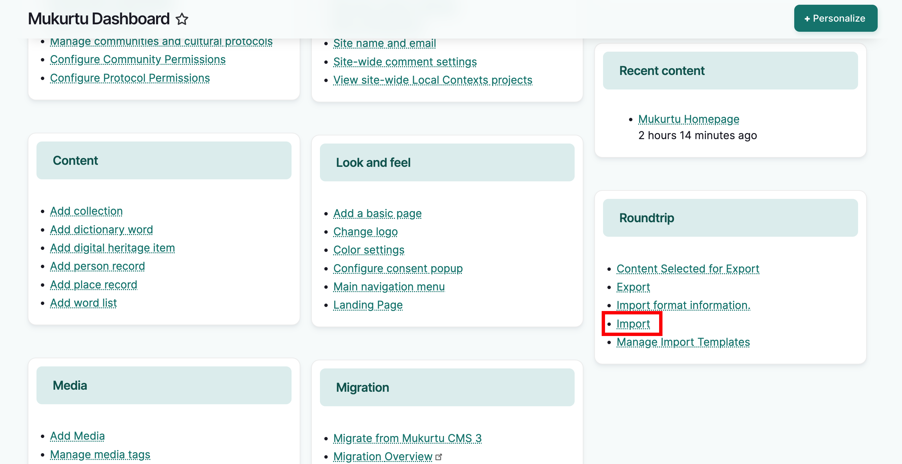
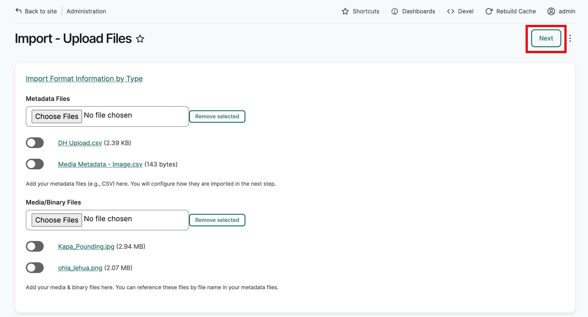
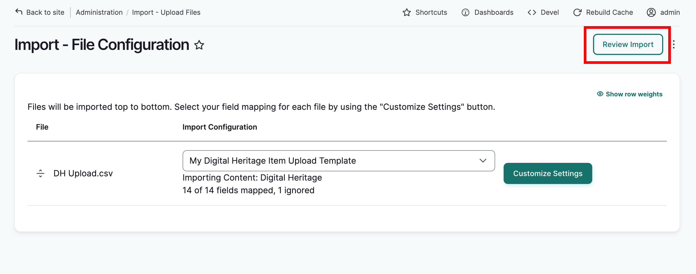
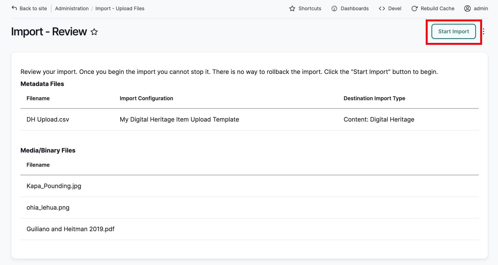
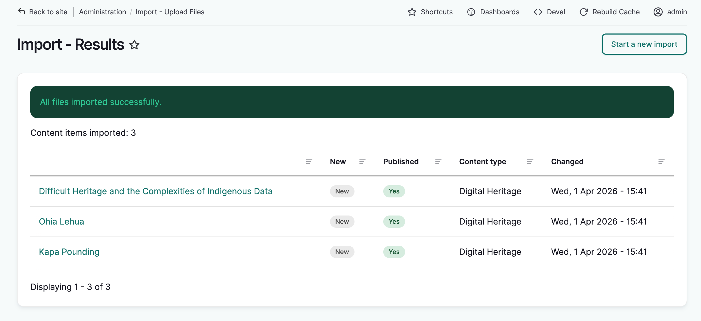
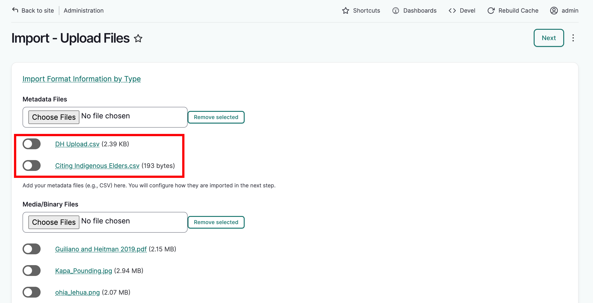
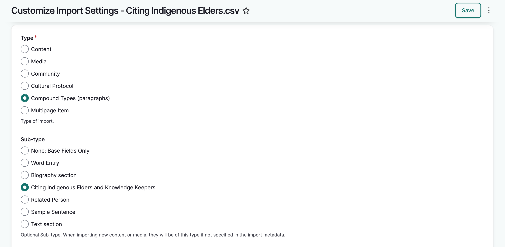
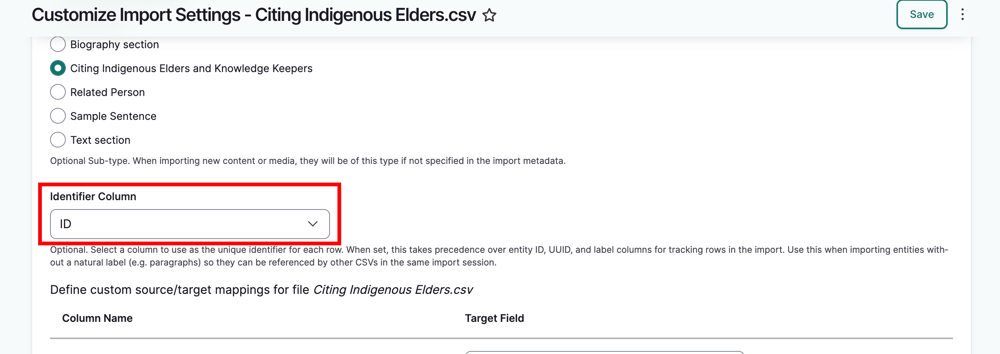
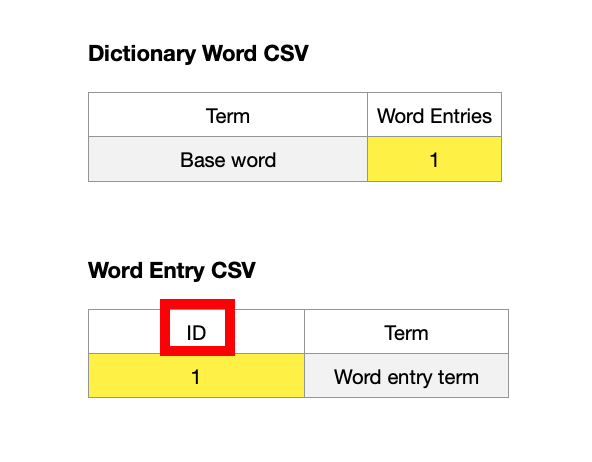

---
tags:
    - roundtrip
---

# Importing Content

!!! Roles "User roles" 
    Administrator, Mukurtu manager, Roundtrip manager

In Mukurtu 3, there were many different starting points for import, depending on the content type or media being imported, or if importing multiple content types/media.

Metadata of a single content type went straight to an upload form with no configuration options, and multiple components required quite complex interrelated spreadsheets and media files properly arranged in zipped folders.

Now there is a more flexible single import start point that can handle more complexity.

This article will walk you through the general steps to import a .csv metadata sheet and accompanying media assets. While the basic steps are the same for each content type, there are differences between them that will not be detailed here. Please refer to the import article for the content type you are importing for more detail:

- [Import Digital Heritage Items](../roundtrip/DHItems.md) 
- [Import Dictionary Words](../roundtrip/Dictionary.md)
- [Import Person records](../roundtrip/PersonRecords.md)
- [Import Place Records](../roundtrip/PlaceRecords.md)
- [Import Word Lists](../roundtrip/WordLists.md)
- [Import Collections](../roundtrip/Collections.md)
- [Import Media](../roundtrip/ImportingNewMedia.md)

!!!Requirement 
    Users must either be a Mukurtu manager or a Mukurtu Roundtrip manager to access roundtrip tools. Mukurtu roundtrip managers will only be able to upload according to their protocol permissions. See [Manage User from a Site-wide role](../users/manage-user-accounts-site-wide.md) for more information.

## Upload content

To import content, go to `/admin/import` or from the dashboard, select **Import**.

The import page has two upload fields. The first field is for .csv sheets only. The second field is for media or binary files that are referenced in the spreadsheet. You can upload multiple files in each field. 

!!! Requirement
    To upload media, you must upload an accompanying metadata sheet that references the media file.

1. Under **metadata files** select "choose files." Select the file(s) you would like to upload.  
2. Under **media/binary files** select "choose files." Select the media file(s) you woud like to upload.

Any combination of CSV sheets and supported media assets can be selected. Successfully selected files should be listed below the appropriate field. When you are done, select "Next" to continue on to the file configuration page.

### Configure import settings

The file configuration page lists each spreadsheet you've uploaded. If your sheet's columns map to a custom configuration you have already saved, that saved configuration will be available in the import configuration drop-down menu. If not, select "customize settings" to map your spreadsheet onto the appropriate metadata fields for the content item.

#### Import type

1. There are several types of imports. In this case, we are importing content. Select **content**. 

    - This is a required field.

2. Under *import sub-type*, select a sub-type. Because the import type is content, all content types will be listed here. If the import type was media, the sub-type would list all media types, etc. The fields used for mapping will be determined by the type and sub-type selections. 

#### Define custom source/target mappings
The column headers in your metadata sheet do not need to match Mukurtu's metadata schema. This next section allows you to map your column headers to Mukurtu. On the left you will see your spreadsheet's column names. To the right are the Mukurtu target fields. Each dropdown menu in the target fields column lists all metadata fields for the content type you are uploading.

Column names that match Mukurtu's metadata schema will map automatically (title and description fields for example). You can select a different field if desired. 

Column names that Mukurtu does not recognize will be labeled "Ignore - Do not Import." 

For each column name you wish to map, open the corresponding menu and select the appropriate Mukurtu metadata field.

!!! Tip
    Note that you cannot map two columns to the same field. For example, if you have two columns labeled "source," you cannot select "source" twice as a target field.

#### File settings
When your mapping is complete, scroll down to file settings and ensure that the default settings reflect your spreadsheet. Make any necessary changes to ensure your spreadsheet is read correctly.

#### Import configuration template
If you will be uploading other sheets that match these settings, you can save this as a template for future uploads, and these configuration steps won't have to be repeated.

To save a template, set the toggle to green and give your template a descriptive title. When you are done, select "Save." You will be returned to the file configuration page. 

### Review and run import
If you saved your template, you will now see it selected in the import configuration dropdown menu with a summary of the content type, number of fields mapped, and number of fields ignored. If you need to make additional changes, select "Customize Settings" to return to the import settings. When you are ready to proceed with the import, select "Review Import."

The import review page lists all included metadata, media files and configurations. If everything looks correct, select "Start Import."

The import will run. When complete, a results page will populate with a success message and a list of items that imported successfully. Select the titles to view each item.

## Upload paragraphs
Most content types include paragraphs, which is a bundle of metadata within a content item that is uploaded in a separate spreadsheet. Each metadata bundle is assigned an ID that is referenced in the base content sheet. 

Content items and their paragraphs can be uploaded together. In this example, DH items are being uploaded with a Citing Indigenous Elders and Knowledge Keepers Paragraph. 

!!! Requirement
    The base content item must be selected before the paragraph so that the system can reference it as the paragraph is imported.

On the file configuration page, you will see two sheets that need to be configured. Follow the [configure import settings](#configure-import-settings) steps for each sheet.

When configuring the paragraph sheet, select **compound types** as the import type, and the appropriate paragraph type as your sub-type.

### Identifier Column
Select the column in your sheet that will serve as the *identifier column*. This tells the system where the word entry IDs are located so that they can be paired with the correct content item.

In this example of a dictionary word and word entry, the ID of the word entry is referenced in the dictionary word. When uploading the word entry sheet, the identifier column should be set to "ID". 

Continue with the mapping and import by following the steps in [Review and run import](#review-and-run-import)

