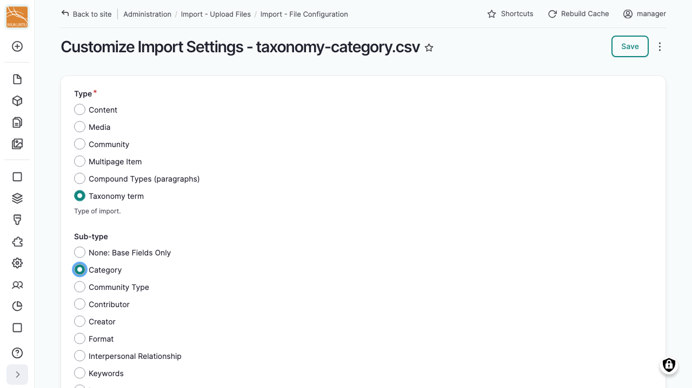

---
tags:
    - roundtrip
    - taxonomies
---

# Importing Taxonomy Terms

!!! roles "User roles"
    Administrator, Mukurtu manager, Roundtrip manager

Taxonomy terms, the vocabularies used for categories, languages, media tags, and other structured lists, are imported the same way as content: through the regular import wizard. See [Importing Content](ImportingContent.md) for the general steps.

## Choose a taxonomy import type

When configuring your import, select **Taxonomy term** as the import type. Under *Sub-type*, select the specific vocabulary you're importing into (Category, Language, Media Tag, Subject, and so on).

!!! tip
    The [CSV Templates](CSVTemplates.md) reference page groups vocabularies into just **Category** and **Other Taxonomies**, since every vocabulary except Category shares identical fields. That grouping is only there to avoid listing the same fields sixteen times — when you configure an actual import, select your real vocabulary from the full list.

## Fields

Every vocabulary shares the same core fields:

- *Term ID*: the term's numeric identifier, assigned by the system.
- *Locale*: the term's language code.
- *Name*: the term's label.
- *Description*: optional text, not normally shown to visitors.
- *Parent*: not currently supported in Mukurtu. Omit this field even if your spreadsheet has a column for it.
- *Default translation*: whether this row is the term's default translation.

Category terms also have a *Thumbnail Image* field (File ID and Alternative text).

See [CSV Templates](CSVTemplates.md) for the full, current field list for any specific vocabulary.
