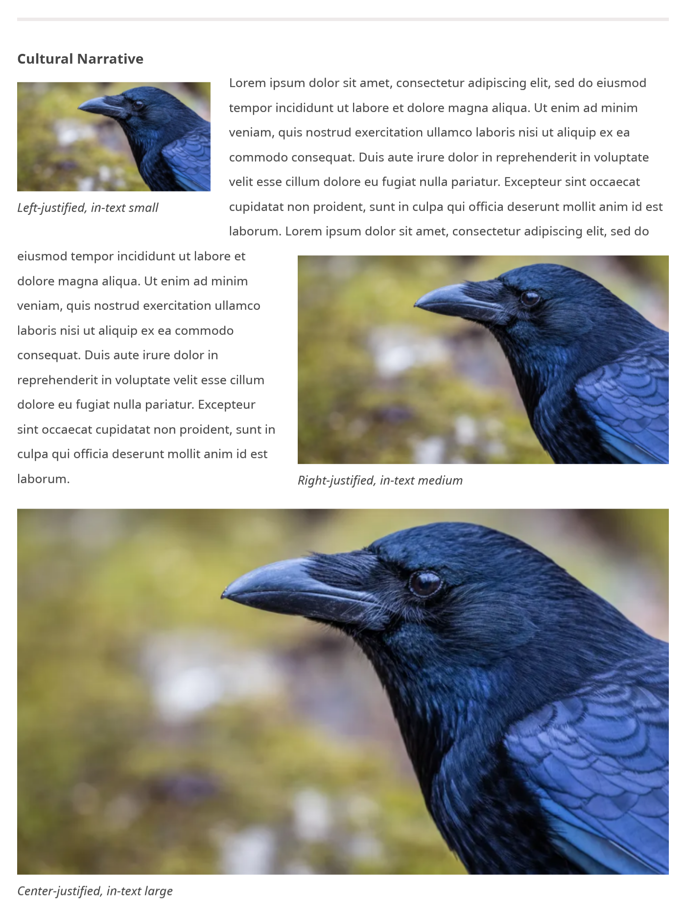

# Add Media to Formatted Text Fields

!!! roles "User roles"
    Administrator, Mukurtu manager, Roundtrip manager

Users can include media assets in formatted text fields such as the Description or Location description fields using the following syntax. The syntax are presented in order of our recommended methods. 

|Syntax|Lookup|Attributes|
|---|---|---|
|`{{media:My Image}}` or `{{media:photo.jpg}}`|Name, then filename fallback|Default view mode|
|`[media name="My Image"]`|Name only|view-mode, align, caption, alt|
|`[media filename="photo.jpg"]`|Filename only|view-mode, align, caption, alt|

## Default formatting syntax

`{{media:My Image}}` or `{{media:photo.jpg}}`

This syntax is recommended and is going to work in almost all cases. Use this unless you know you need specific alignment, captioning, embed size, or full tag control.

## Additional formatting syntax

`[media name="My Image"]` or `[media filename="photo.jpg"]`

Use this syntax if you know that you are going to need more control over alignment, captioning, or embed size.

### HTML tags

Tags can be added to the syntax to specify alignment, add captioning, or adjust the embed size. 

- `align` specifies the media alignment. For example, to align a media asset to the left use `[media name="My Image" align="left"]`.
- `alt` adds alternative text to your media. This is important to add to images for accessibility. To add alternative text, use `[media name="My Image" alt="Include some alternative text for your image here"]`.
- `caption` adds a caption to your media, which can be helpful for adding context or citations to embedded media assets. This is different than alternative text. To add a caption, use `[media name="My Image" caption="This is a caption for this media asset"]`.
- `view-mode` adjusts the embed size. Users can choose from small, medium, and large media view modes. To adjust the size, use `[media name="My Image" view-mode="small"]`.
    - Small embeds are 250px
    - Medium embeds are 480px
    - Large embeds are 900px

To use more than one HTML tags in your syntax, include them after your media name or filename, followed by `tag="text"`. For example, `[media filename="crow1.png" view-mode="small" alt="Here is some alt text" caption="Here is a caption" align="right"]` adjusts the embed size to small, aligns the media asset to the right, and adds the alternative text "Here is some alt text" and the caption "Here is a caption".

This is an example of a Cultural Narrative field with media  featuring `view-mode`, `caption`, `align`, and `alt` tags:

