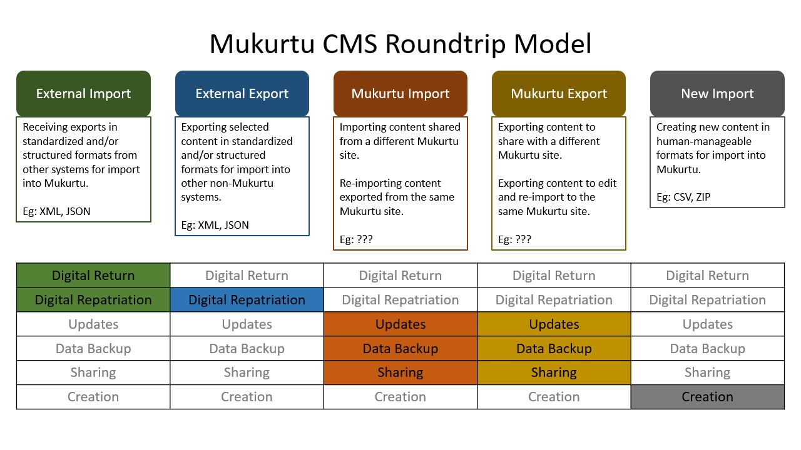
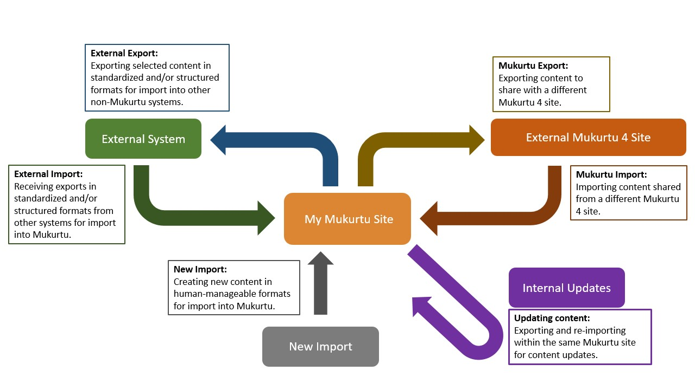

---
tags:
    - roundtrip
---

# Roundtrip Overview

!!! Roles "User roles" 
    Administrator, Mukurtu manager, Roundtrip manager

Roundtrip is the collection of tools we use for import and export of site content. It allows users to bulk import and export content, media, taxonomies, and other metadata. Roundtrip is designed to serve several purposes, including:

- Bulk importing new content.
- Bulk updating existing content.
- Exporting content to share with another site or partner organization.
- Exporting content to facilitate backups or reference.

From Mukurtu 2 onwards we have focused on UTF-8 encoded CSV sheets for import and export. This helps ensure that we avoid proprietary formats and work with the most basic and transportable data formats available. While this creates some complications with using Excel, we have found that it facilitates expanded functionality for users. 

For more information on file formats and spreadsheet options, refer to [Roundtrip Spreadsheets, Formats, and Tools](RoundtripFormatting.md).