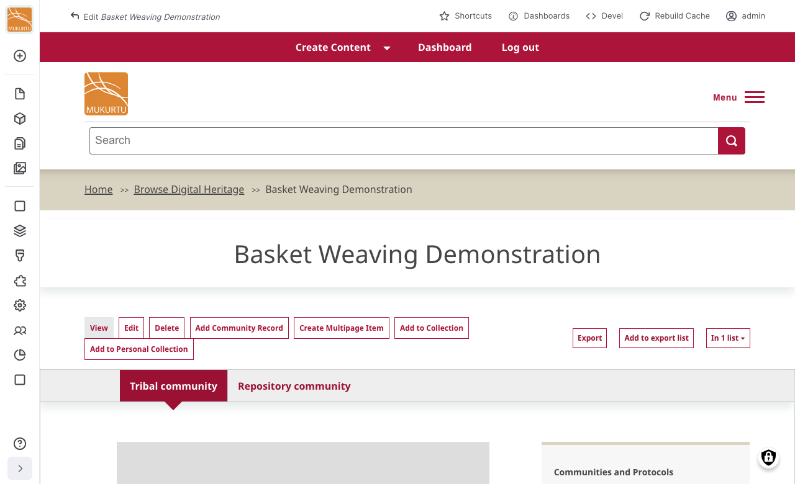
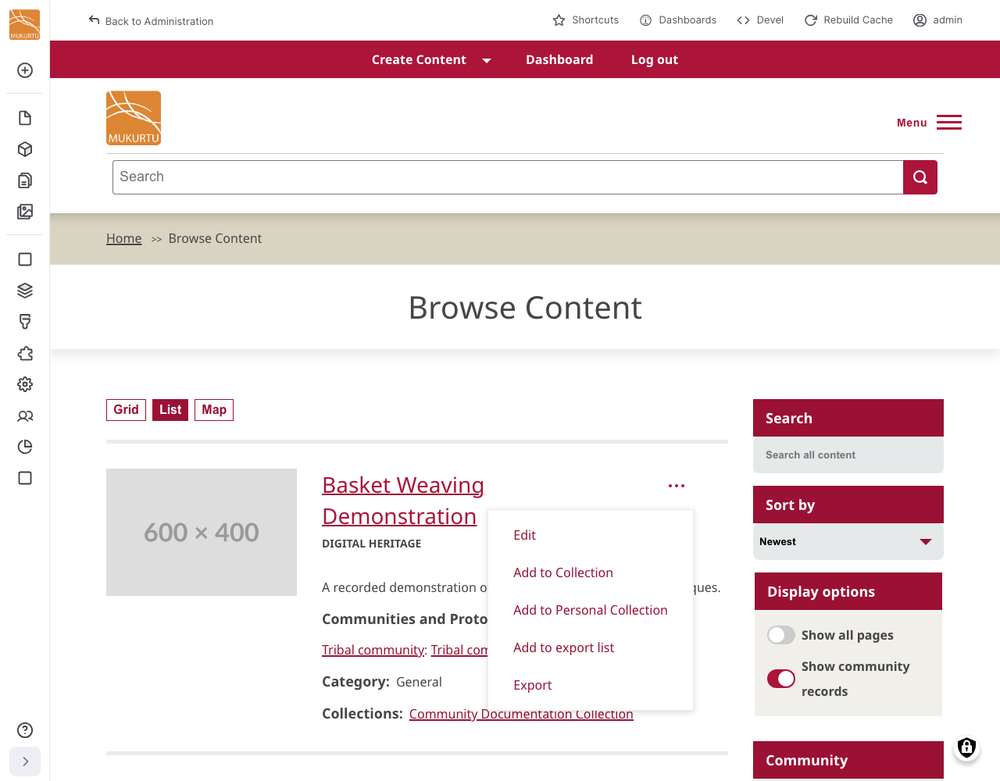
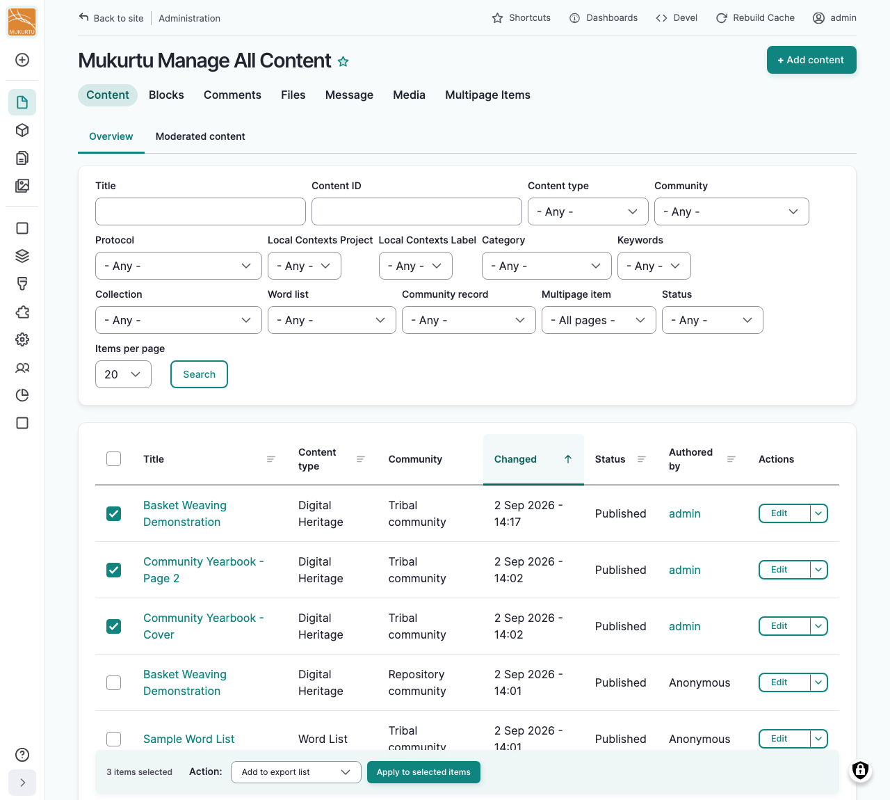
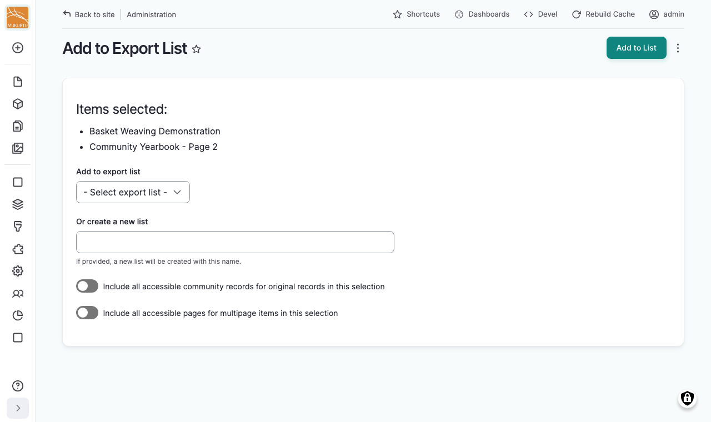
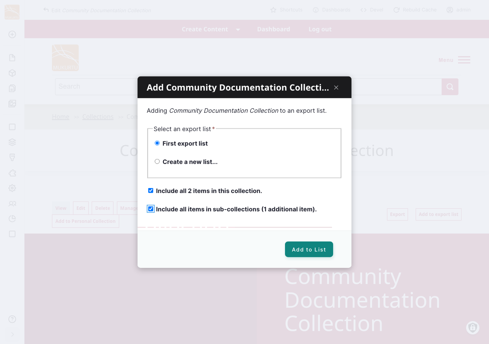
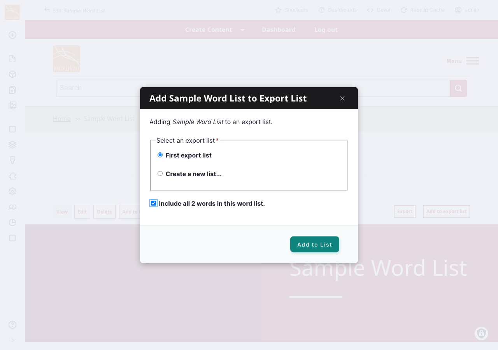
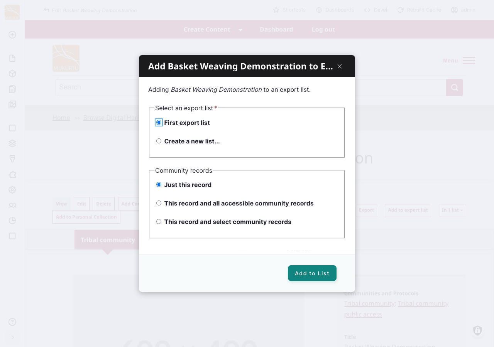
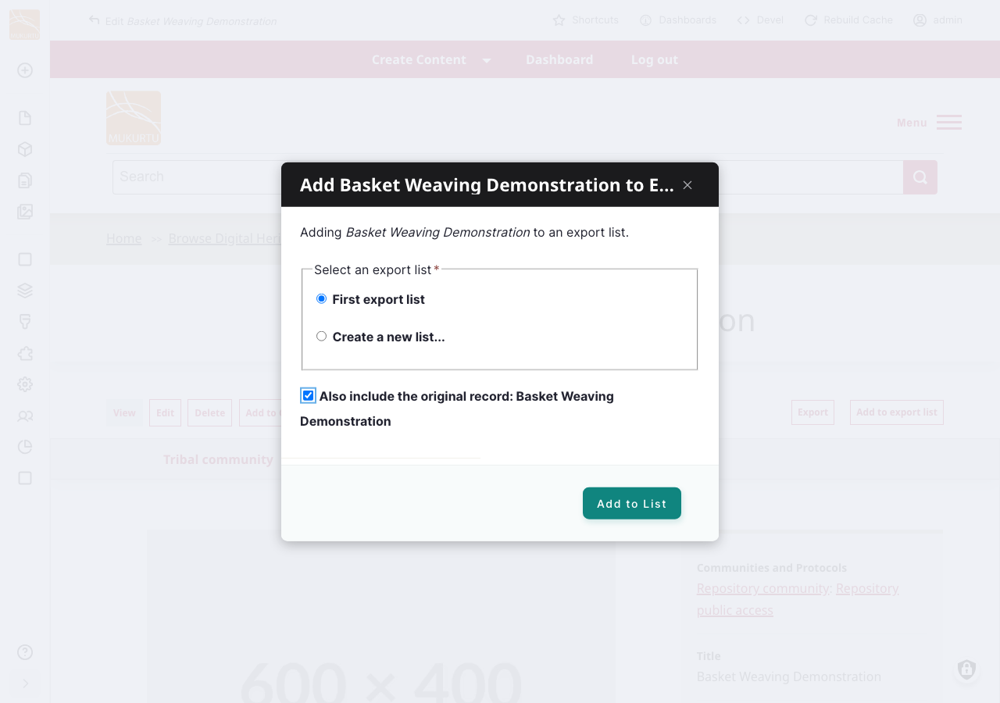
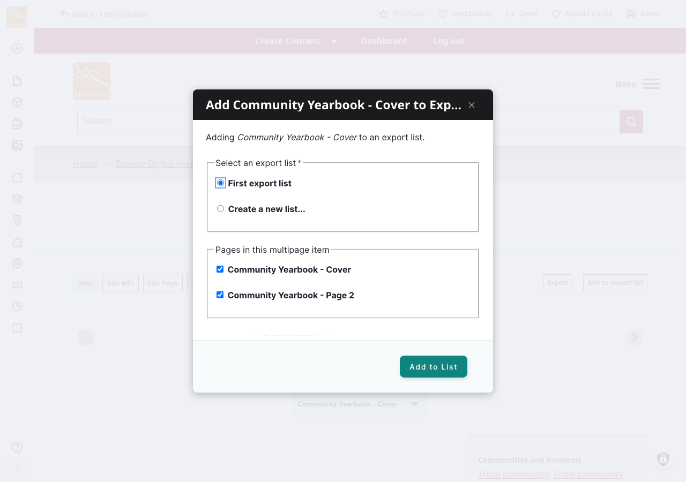
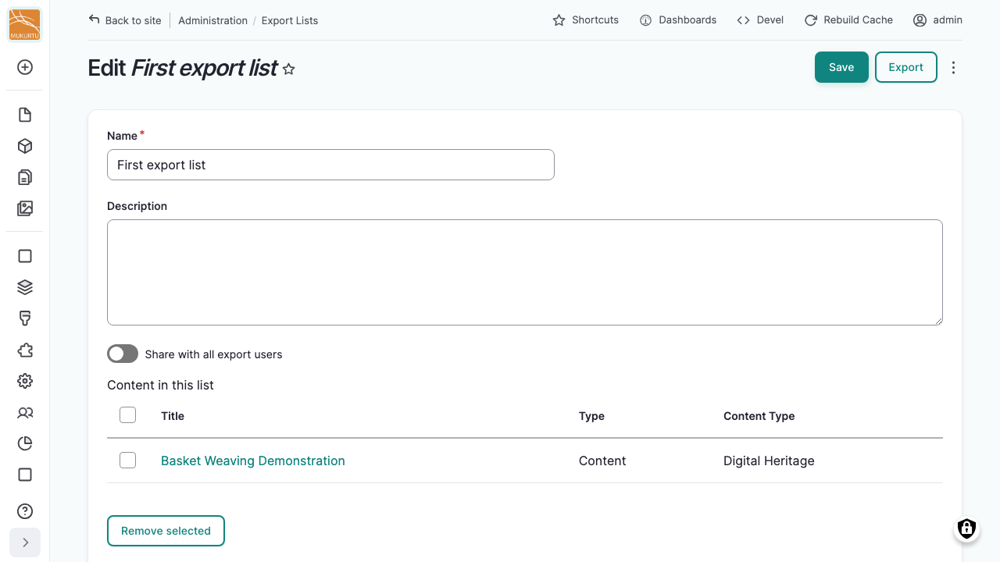

---
tags:
    - roundtrip
---

# Using Export Lists

!!! roles "User roles"
    Administrator, Mukurtu manager, Roundtrip manager

An export list lets you gather content over time into a named, reusable, and shareable group before exporting it, similar to a shopping cart. This article covers adding content to a list and managing your saved lists. See [Exporting Content](ExportingContent.md) for how to run an export from a list once it's ready.

## Add content to an export list

You can add items one at a time from a content page, or select multiple items at once while browsing.

### Add a single item

Start from either the content item itself, or a browse listing without opening it:

- Open the content item, then select "Add to export list".

    

- While browsing, select the "More actions" (**⋯**) menu next to an item, then choose "Add to export list".

    

Either way:

1. Under **Select an export list**, choose an existing list, or select "Create a new list..." and enter a **New list name**.
2. Select "Add to List".

!!! tip
    Depending on the item, you may see additional options here, such as including the other items in a collection or word list, related community records, an original record, or other pages of a multipage item. See [Exporting complex content](#exporting-complex-content) below for what these options do.

### Add multiple items

From your **Dashboard**, under **Content**, select **Manage Content**.

1. Select the checkbox next to each item you want to add.
2. Under **Action**, choose "Add to export list".
3. Select "Apply to selected items".

You'll land on an Add to Export List page listing your selected items, where you choose an existing list under **Add to export list**, or enter a name under **Or create a new list**.

!!! tip
    Two toggles here apply to the whole selection: "Include all accessible community records for original records in this selection" and "Include all accessible pages for multipage items in this selection". See [Exporting complex content](#exporting-complex-content) below for what these include.

## Exporting complex content

Some content is made up of, or connected to, other content: a collection contains items, a word list contains words, an item can have community records built from an original record, and a multipage item is made up of individual pages. When you add one of these to an export list, or include it in an ad hoc export, Mukurtu offers additional options for how much of the connected content to bring along.

### Collections and word lists

When you add a collection or word list, select the checkbox to also include everything inside it:

- For a word list, this includes all of its words.
- For a collection, this includes the items directly in it. If the collection has sub-collections, a second checkbox lets you also include everything in those, recursively.

### Community records and original records

Adding an original record offers three choices for its community records:

- **Just this record**: export only the original record.
- **This record and all accessible community records**: export the original record and every community record you can access.
- **This record and select community records**: choose which specific community records to include.

Adding a community record instead offers a single checkbox to also include the original record it's based on.

See [Understanding Community Records](../digital-heritage-items/UnderstandCommunityRecords.md) for more on how these relate to each other.

### Multipage items

Adding one page of a multipage item shows a checklist of every page in that item, all selected by default. Deselect any pages you don't want included.

See [Multipage Items](../digital-heritage-items/MultipageItems.md) for more on how these are structured.

## Manage your export lists

From your **Dashboard**, under **Roundtrip**, select **Export Lists**.

This page lists every export list you own or that's been shared with you, showing its **Name**, **Description**, number of **Items**, and **Visibility**. Select "Create new export list" to start a new one directly, or use the actions menu next to "Export" to edit or delete a list.

Editing a list lets you change its **Name** and **Description**, toggle **Share with all export users**, and remove items: select the checkbox next to each item to remove, then select "Remove selected".

