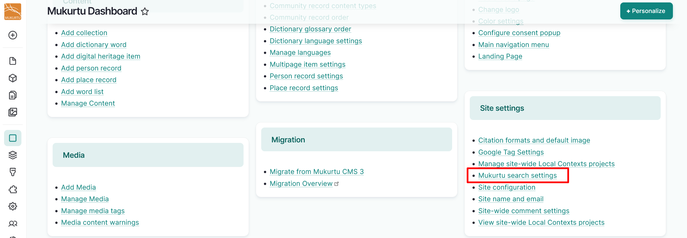
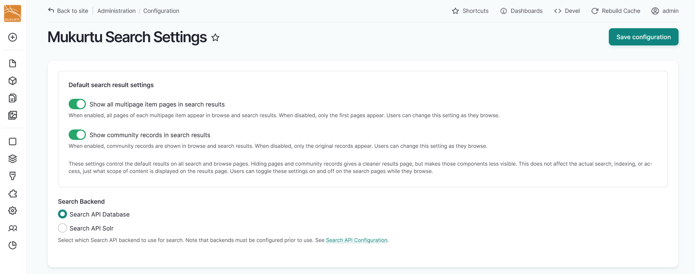

---
tags:
    - search
---
# Configure Search Settings

!!! roles "User roles"

    Administrator, Mukurtu manager

Default search result settings can be configured to show all multipage item pages and community records in search results. While hiding pages and community records can give cleaner search results, it does have the result of making those components less visible. This does not impact the search function, indexing, or access, but affects what scope of content is displayed on the results page. 

Individual users can toggle these settings on and off when they search.

To configure default search settings, navigate to your **Dashboard**.

1. In the **Site Settings** section, select the **Mukurtu Search Settings** link.

    

2. Use the toggle to the left of *Show all multipage item pages in search results* and *Show community records in search results* to select or deselect these settings.

    
    
3. Select the "Save configuration" button to the top right of the screen to save your default search result settings.