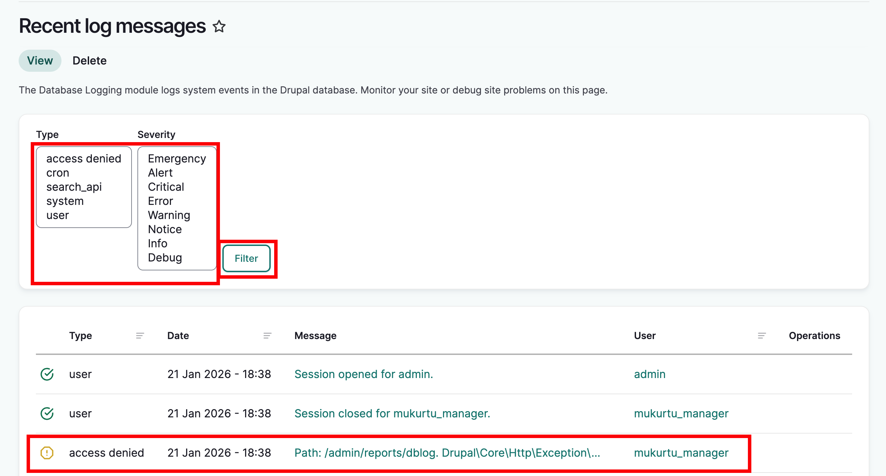
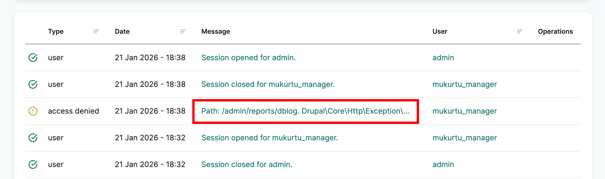
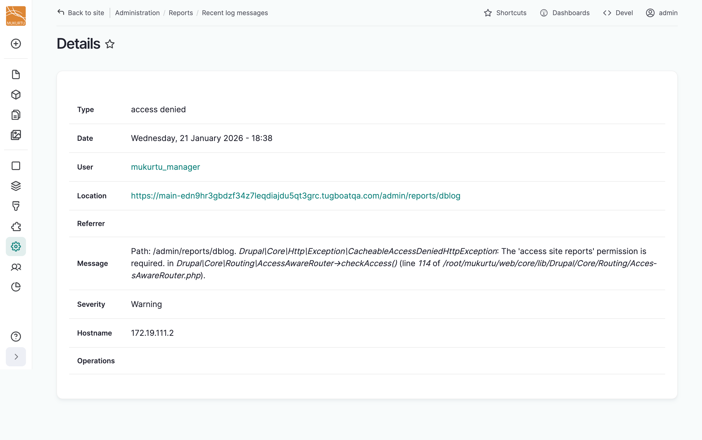

---
tags:
    - site maintenance
---

# Check Error Logs

!!! Roles "User roles" 
    Administrator

A common troubleshooting step is to review site logs when presented with an error message. It’s best to trigger the error and then immediately review the logs.

Trigger the error and then as an administrator go to /admin/reports/dblog (eg: https://myURL.com/admin/reports/dblog)

Not all logs indicate an error. Problematic logs will often be highlighted in red or yellow. You can also filter errors by type and severity by selecting from the type and severity menus at the top of the page and then selecting "Filter."

Click the message preview to view the full message. 

We recommend capturing a screenshot of the full message(s).

