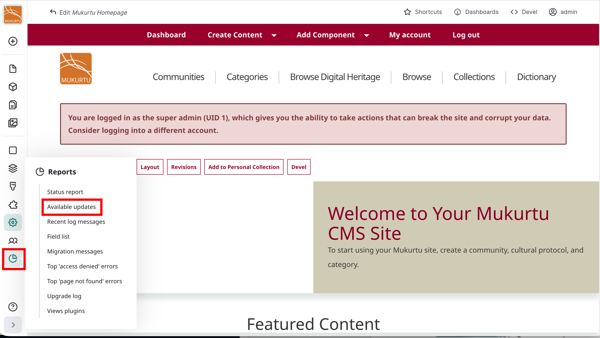
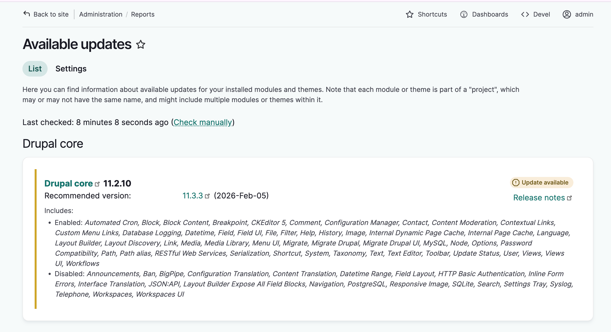
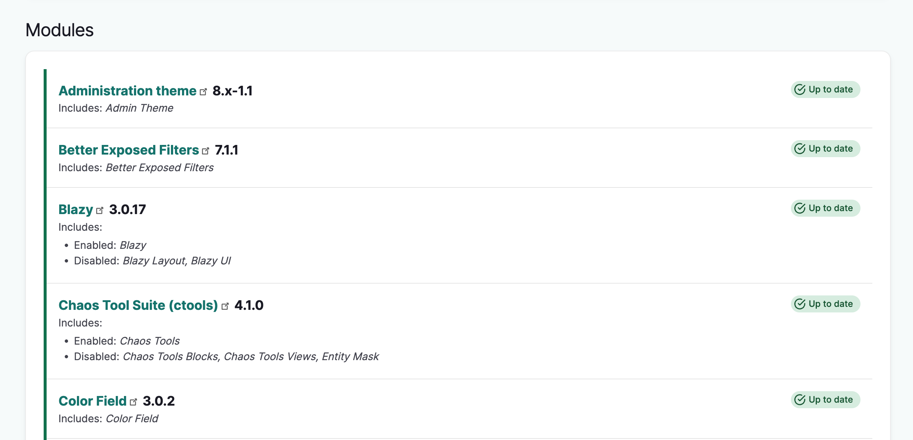
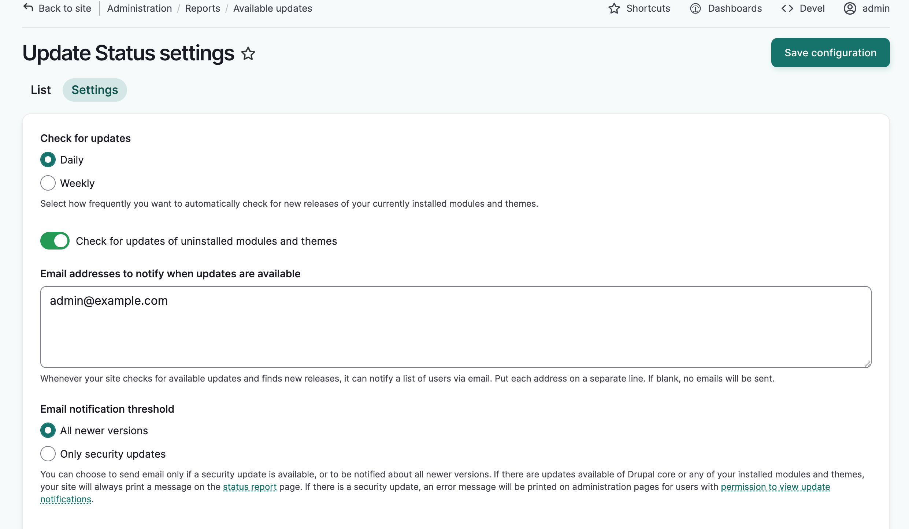

---
tags:
    - site maintenance
---

# Check for Drupal Database and Module Updates

!!! Roles "User roles" 
    Administrator

This article provies instructions for checking for updates within a Mukurtu site and configuring update notifications. For instructions on updating a site, see [Update a Reclaim Hosted Site](../site-maintenance/UpdateAReclaimHostedSite.md) and [Update a Self-Hosted Site](../site-maintenance/UpdateASelfHostedSite.md) 

To check for Drupal database updates and module updates, go to `admin/reports/updates` 

You can also access the udpates page by hovering over the reports menu and selecting "Available Updates"

## List

The available updates page has two tabs. In the list tab, you will see available updates for Drupal Core, followed by a list of installed modules and themes. You can also check for updates manually by selecting the **Check Manually** link. Items in green are up to date. Items in yellow have updates available. Some modules may require a Drupal update before they can be updated.

## Settings

The settings tab has several settings you can configure. You can:

- Select whether you want to check for updates daily or weekly. By default the system will check daily.

- Decide to check for updates on uninstalled modules or themes.

- Add an email address that will be notified when updates are available.

- Decide what you want to receive notifications for: all newer versions or security updates only.

When you've made your selections, select "Save configuration." The page will reload with a success message.