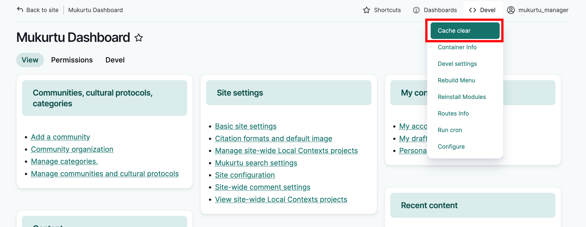
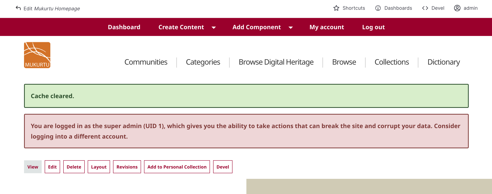

---
tags:
    - site maintenance
---
# Clear Caches

!!! Roles "User roles" 
    Administrator, Mukurtu manager

A common troubleshooting technique is to manually clear Drupal caches. 

As a Drupal administrator, in the Drupal menu bar, hover over the development menu, and click “Cache clear”.

It may take a few minutes to run, and when complete the page will reload and a “Cache cleared” confirmation message will display.

