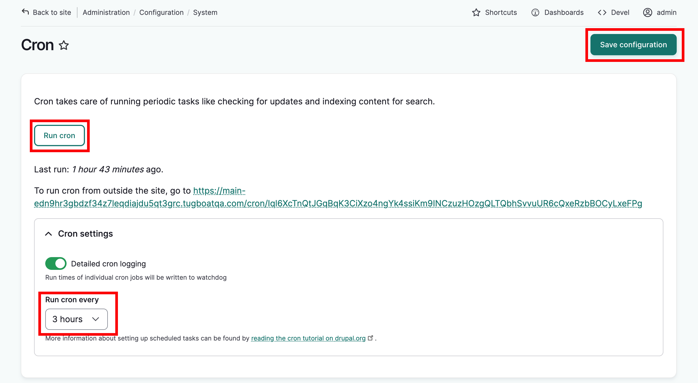

---
tags:
    - site maintenance
---

# Cron Configuration

!!! Roles "User roles" 
    Administrator

Setting up cron is an important step in the installation of the website and assists in the maintenance of the site’s assets for search results, checking for updates to Drupal core and modules, and removing temporary files.

Once your site is installed and configured, as an administrator go to `admin/config/system/cron` and pick a time to run cron, at least once a day. 

You can also run cron manually by selecting "Run cron"

Select "Save configuration." A success message will display.

