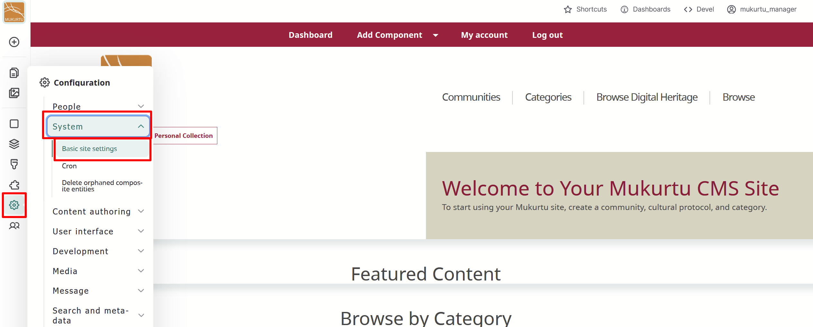
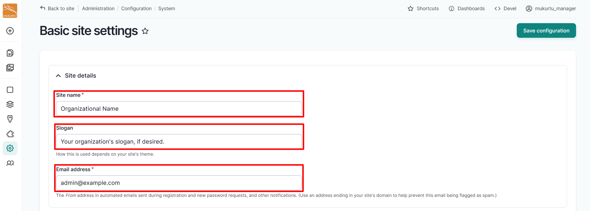
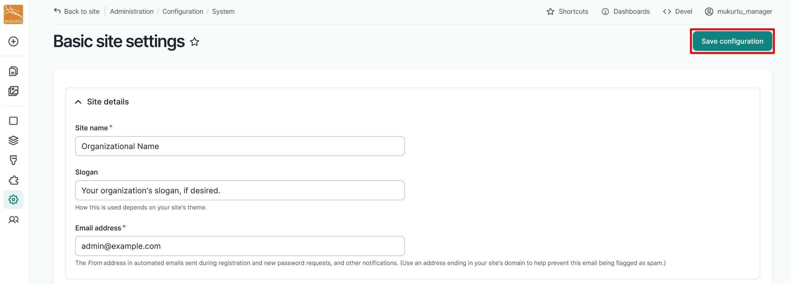

---
tags:
    - getting started
    - site settings
---

# Configure Basic Site Settings

!!! roles "User roles"
    Drupal administrator, Mukurtu manager

You can configure the look and feel of your Mukurtu site to reflect your organization or community. Refer to the sections below for instructions on how to change your site's name, email, and landing page.

These are all located on the **Basic site settings** page. 

From the **Dashboard**, navigate to the **Site settings** section. Select the **Site name and email** link.  You can also access these settings at `/admin/config/system/site-information`.

## Configure site name and email

1. Enter the name of your site in the *Site name* field. 

    - This is a required field.

2. If you wish to include a slogan or short description, enter it in the *Slogan* field. The Mukurtu theme does not use a slogan. Use this field only if you are using a theme or other tool that does.
3. Enter the email address for your site in the *Email address* field. This becomes the From address in automated emails sent during registration and new password requests, as well as other notifications. 

    - This is a required field.

    

4. Select the "Save configuration" button to save your site name and email address.

    