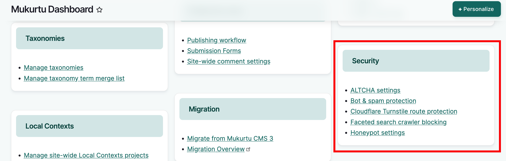
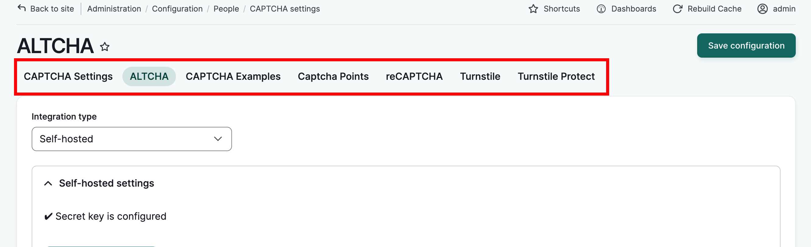

---
tags:
    - site settings
---

# Configure Bot and Spam Protection

!!! Roles "User roles" 
    Administrator, Mukurtu manager

Mukurtu ships with several security modules that can be configured to provide bot protection and spam control. 

By default an ALTCHA checkbox is enabled to provide basic protection, but you can configure any or all of these services, select a default module for all forms, or have certain modules active on certain forms. You can also grant trusted users permissions to automatically bypass security modules. In most cases, configuring just one service will suffice.

The chart below offers a basic comparison of each CAPTCHA service.

|  | Requires Account | Auto-verification | Manual Challenge |
|---|---|---|---|
| ALTCHA |  | x | x |
| ReCAPTCHA | x |  | x |
| Turnstile | x | x |  |

Settings for these modules can be accessed in the **Security** section of the **Dashboard**

Select **ALTCHA settings** in the **Dashboard**. This takes you to the CAPTCHA settings page, where you can configure the security module of your choice. These settings can be accessed by selecting the appropriate tab at the top of the page.

## Configure CAPTCHA settings

The settings on the CAPTCHA Settings tab dictate how the default security module works on your site. You can choose a default challenge type, decide where challenges will appear (and not appear), customize text, determine challenge behavior and enable tracking and logs.

## Configure a security module

### Configure ALTCHA 

 To configure ALTCHA, from the ALTCHA tab, select an integration type. Self-hosted is recommended and selected by default. The other types (Sentinel and Saas) require API keys that require accounts to obtain. 

Generate a key - ALTCHA uses keys to check for bots. This is not the same as an API key. If you've experienced security compromises or change in personnel running the site, you may want to regenerate the key, which can also be done here.

Under **Advanced Settings**, you can turn on auto verification by selecting an event from the dropdown, and tweak challenge complexity and timing.

Under **Widget Settings** you can customize the widget by enabling invisible captcha, adjusting behavior and display.

The **Widget settings** allow you to customize widget appearance and behavior.

### Configure ReCAPTCHA

To configure ReCAPTCHA, in the ReCAPTCHA tab, add your Site Key and Secret key generated from your account. You can then add light customizations to the widget.

### Configure Turnstile

To configure Turnstile, from the Tunstile tab, select a key. If no key exists, select "Create a new Key" linked in the helper text, or append /admin/config/system/keys/add to your URL to create a new key.

Once the key has been added, you can customize the widget.

## Other Security settings

### Bot and Spam Protection

From the **Security** section of the **Dashboard**, select **Bot and Spam** protection. Here you can set the CAPTCHA backend you are using. You can also enable Honeypot spam protection, which will work concurrently with any service.

### Faceted Bot Blocker Settings

Bots often attack facets on browse pages which can bog down or disable your site. Facet bot blocker settings set a limit for facet queries. Requests that hit the limit blocks the query. Select **Faceted search crawler blocking** You can set a request limit here, and add a custom "blocked" message.

### Honeypot Configuration

Select **Honeypot Settings** to configure Honeypot. Here you can choose to apply Honeypot to all forms, log any blocked form submissions, set an element name and timing. If you choose not to use Honeypot universally, you can select specific forms for which Honeypot will be enabled.

