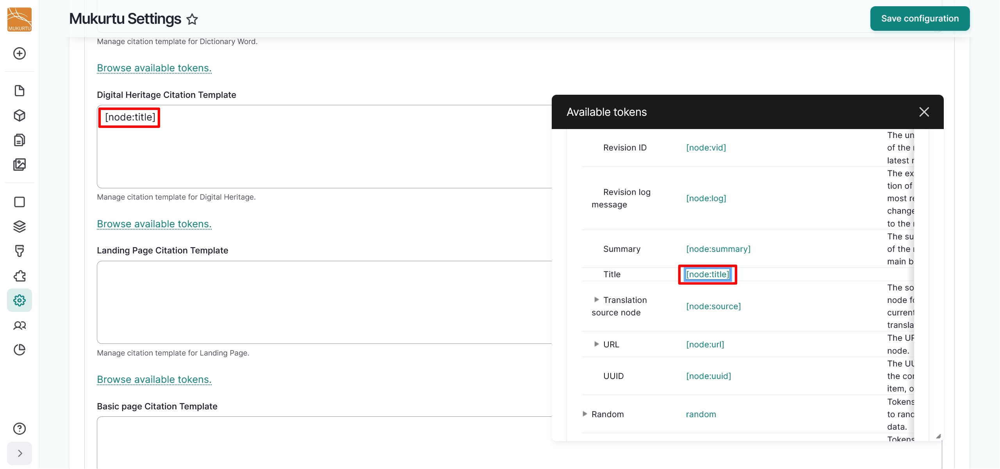
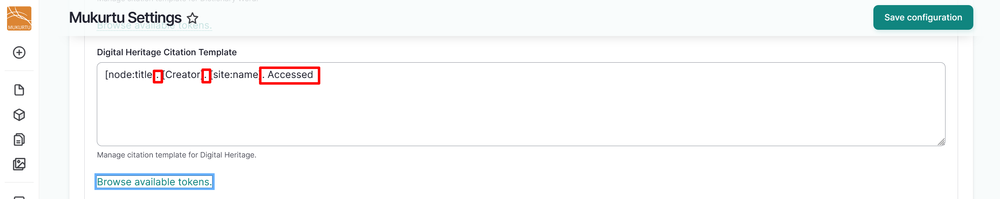

---
tags:
    - site settings
    - documentation
---

# Configure Citation Field Templates

!!! Roles "User roles" 
    Drupal administrator, Mukurtu manager

Mukurtu CMS allows you to configure the citation field templates for all content types using tokens. Tokens act as in-text placeholders with contextual values that allow the content to auto-generate a specific citation. To start configuring your citation templates, navigate to the **Site settings** section of the Dashboard and select the **Citation formats and default image** link, or go directly to `/admin/config/mukurtu/settings`.

1. Navigate to the **Citation Field Templates** section of the page and select the dropdown to open the section.

    

2. We are going to use the Digital Heritage Citation Template as an example, using the sample format `"[Title]". [Creator]. [Site name]. Accessed [Current Date], [URL].`.

3. Select the **Browse available tokens** to browse pre-set tokens.

    
    
    !!! tip
        Tokens are only available for Drupal fields. 

4. To enter your `Title` token, select the `[node:title]` preset token or enter `"[node:title]".` in the text field.

    

5. *Creator* is a Mukurtu-specific field and does not have an associated token. Enter `[Creator].` to indicate that users who wish to cite your digital heritage item should enter the name of the creator. If your community has a preferred naming format, you can specify that.

    ![Screenshot of the citation field with the [Creator] field included.](../_embeds/citation6.png)

6. Select the `[site:name]` token from the preset tokens, or enter `[site:name]` in the text field.
7. Any symbols or text outside of the token brackets will appear as part of your citation. If your citation style includes punctuation or terms such as `Accessed`, you can enter them normally. 

    

8. Select the `[current-date:medium]` token from the preset tokens, or enter `[current-date:medium],` in the text field.
9. Select the `[node:url]` token from the preset tokens, or enter `[node:url].` in the text field.
10. Select the "Save Configuration" button to save your citation template.

    

11. When users browse your site's digital heritage items, the Citation field will populate with the citation template, including the auto-generated title, site name, current date, and URL. 

    

