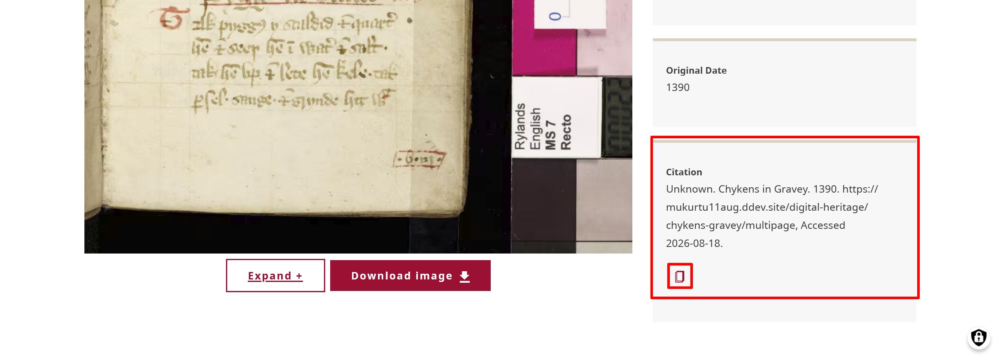
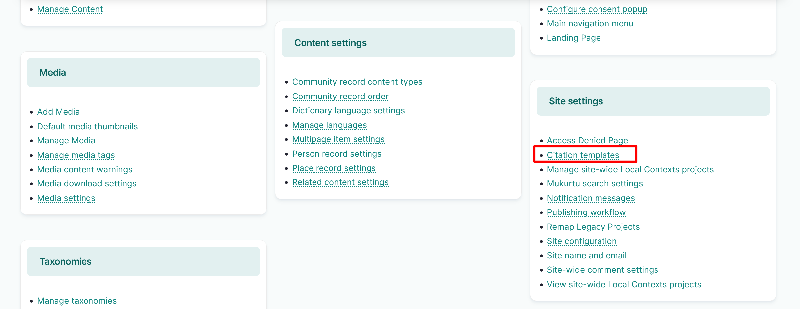
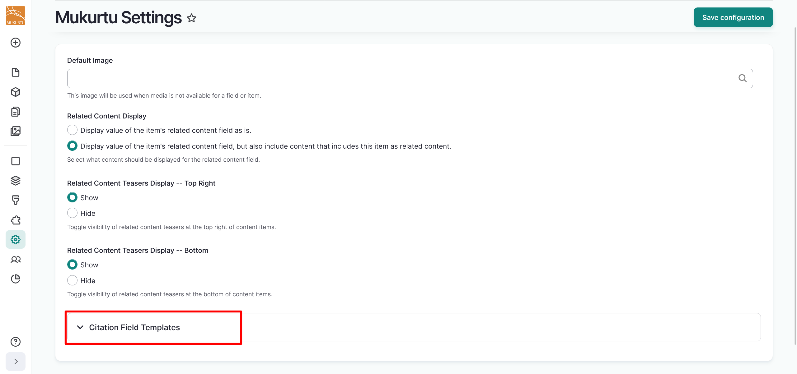
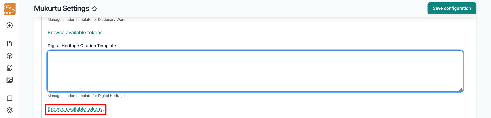
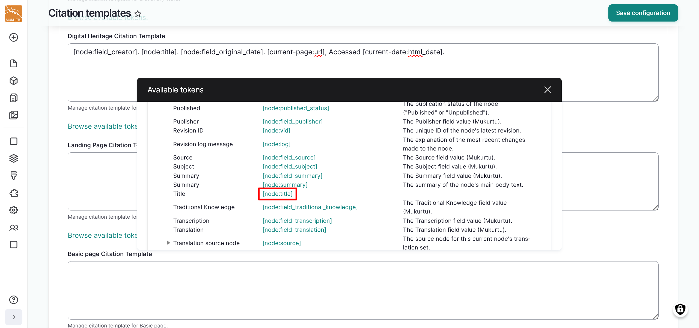
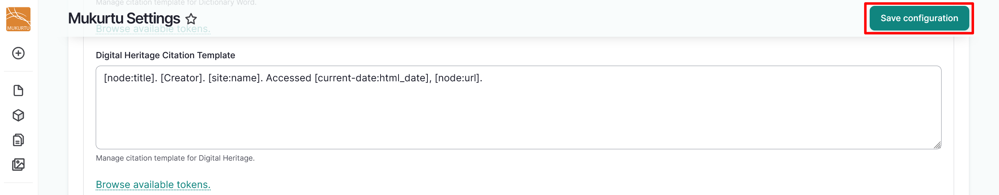
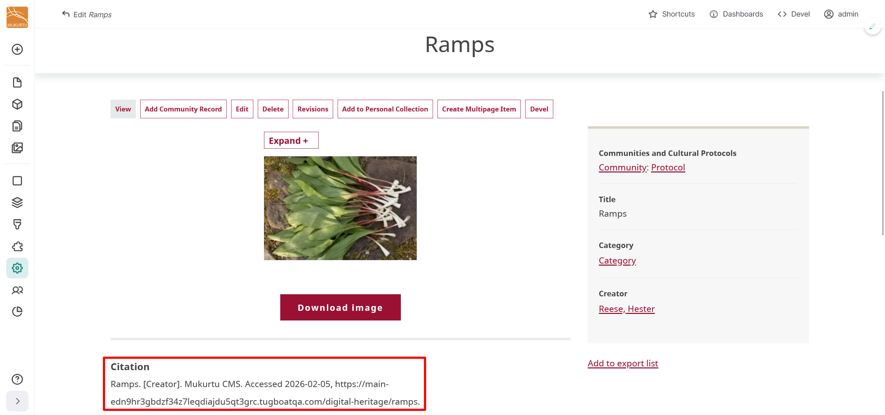

---
tags:
    - site settings
    - documentation
---

# Configure Citation Field Templates

!!! Roles "User roles" 
    Administrator, Mukurtu manager

You can configure citation templates so that your site automatically generates appropriate citations. This makes it easy for users to use the copy button to copy and paste citations that reference site content.

## Configuring templates with tokens

Mukurtu CMS allows you to configure the citation field templates for all content types using tokens. Tokens act as in-text placeholders with contextual values that allow the content to auto-generate a specific citation. 

1. To start configuring your citation templates, navigate to the **Site settings** section of the Dashboard and select the **Citation templates** link, or go directly to `/admin/config/mukurtu/citation-templates`.

    

2. Under any citation template field, select the **Browse available tokens** to browse pre-set tokens. You will generally find your fields under the **Node** section.

    

    
    
3. Select the pre-set tokens you wish to include in your citation. These can include tokens referencing title, creator, date, URL, or other fields.

    

4. Select the "Save Configuration" button to save your citation template.

    

5. When users browse your site's digital heritage items, the Citation field will populate with the citation template, including the auto-generated metadata from the tokens. 

    

## Sample citations

Included below are some example citation formats that you can use for your content. You can create your own citation format or modify these so that they are appropriate for the content on your site. The citation formats that we are basing these examples on are:

- APA: [APA Formatting and Style Guide (7th Edition) from Purdue OWL](https://owl.purdue.edu/owl/research_and_citation/apa_style/apa_formatting_and_style_guide/in_text_citations_the_basics.html)
- Chicago: [The Chicago Manual of Style Online](https://www.chicagomanualofstyle.org/home.html)
- MLA: [MLA General Formatting and Style Guide from Purdue OWL](https://owl.purdue.edu/owl/research_and_citation/mla_style/mla_formatting_and_style_guide/mla_general_format.html)

### Collection

- `[node:title]. [node:field_source]. [site:name], [current-page:url]. Accessed [current-date:html_date].`

### Dictionary words

- `"[node:title]". [node:field_contributor]. In the [site:name] [node:field_dictionary_word_language] Dictionary. [site:name], [current-page:url]. Accessed [current-date:html_date].`

### Digital Heritage items

- `[node:field_creator]. [node:title]. [node:field_original_date]. [site:name], [current-page:url]. Accessed [current-date:html_date].`

### Person records

- `[node:title]. [node:mukurtu_communities]. [site:name], [current-page:url]. Accessed [current-date:html_date].`

### Place records

- `[node:title]. [node:mukurtu_communities]. [site:name], [current-page:url]. Accessed [current-date:html_date].`

### Word lists

- `[node:title]. [site:name], [current-page:url]. Accessed [current-date:html_date].`

### Applicable tokens

If you choose to create your own citation format, some of the tokens you might find helpful include:

- Category: [node:field_category]
- Communities: [node:mukurtu_communities]
- Contributor: [node:field_contributor]
- Creator: [node:field_creator]
- Cultural Protocols: [node:mukurtu_protocols]
- Current Date: [current-date:html_date]
- Current Page URL: [current-page:url]
- Dictionary Language: [node:field_dictionary_word_language]
- Original Date: [node:field_original_date]
- Publisher: [node:field_publisher]
- Source: [node:field_source]
- Title: [node:title]
- Website Name: [site:name]
- Website URL (landing page): [site:url]
