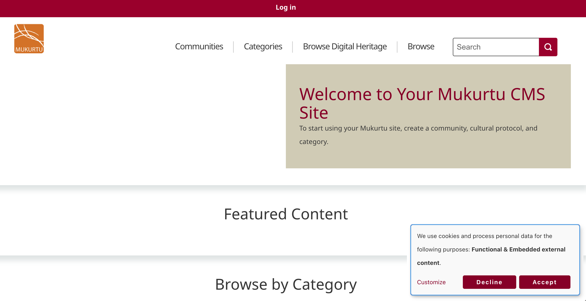
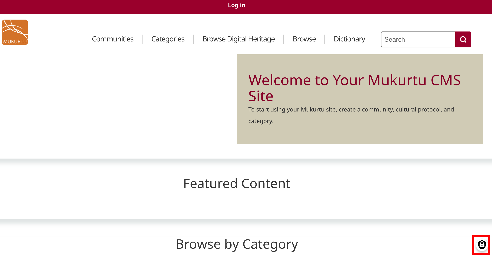
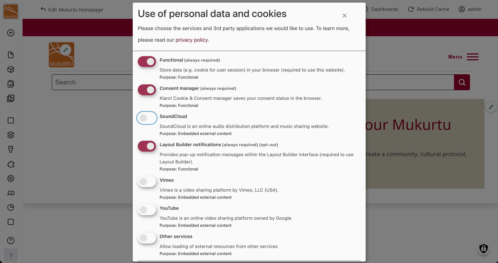
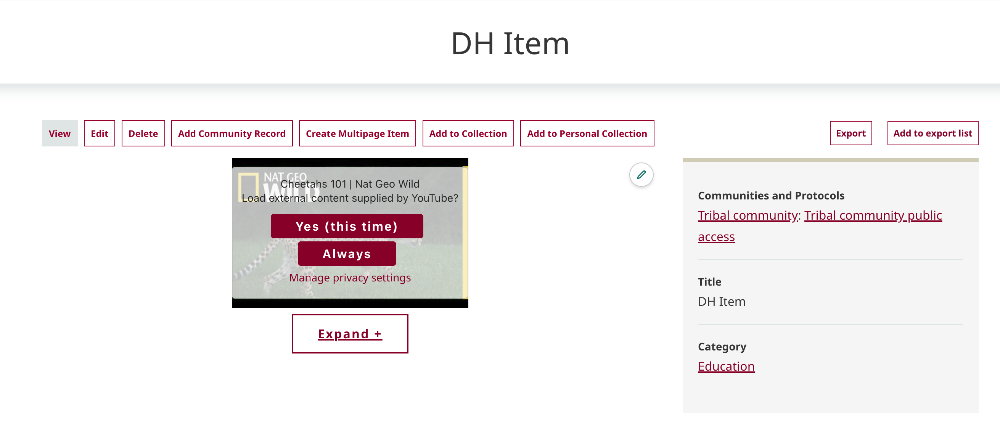
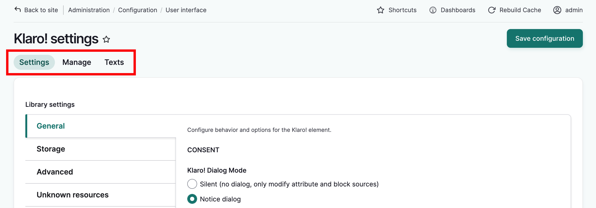
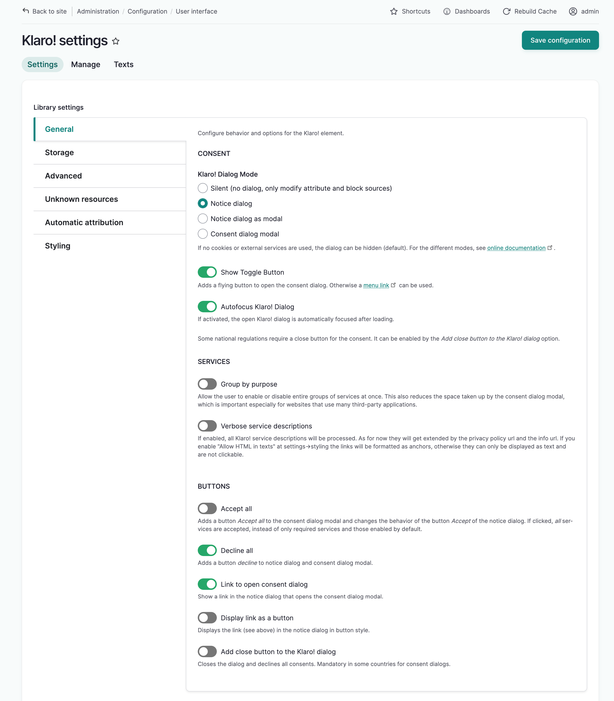
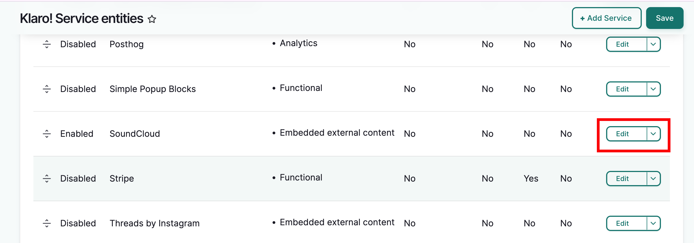
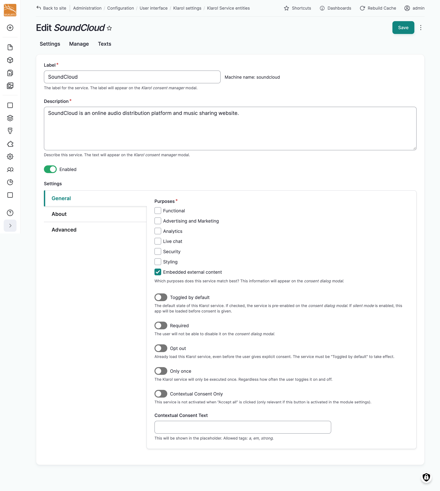
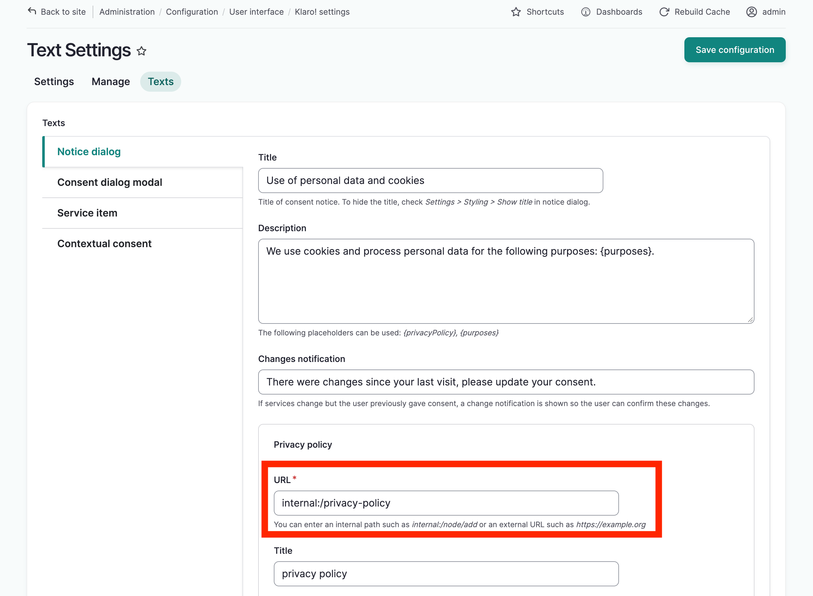

---
tags:
    - site settings
---

# Configure Cookies and Consent Settings

!!! Roles "User roles" 
    Administrator, Mukurtu manager

Mukurtu uses Klaro! to manage cookies and consent settings. This protects visitor data and privacy while they're browsing the site and obtains user consent to serve 3rd party content on the site.

This article will touch on basic settings. For more detail, see [Klaro Cookie and Consent Management](https://www.drupal.org/docs/extending-drupal/contributed-modules/contributed-module-documentation/klaro-cookie-consent-management) Documentation.

## Notice and Consent Dialogs
Klaro! can present two dialogs. The first is a simple notice informing visitors about the use of external services or cookies.

The second is a consent modal that can be accessed via a small lock icon that by default displays in the bottom right corner of all pages. The modal lists 3rd party services and allows users to consent to whichever services they want to use on the site.

 

By default, **Functional**, **Consent Manager** and **Layout Builder notifications** are services that are required for site functioning that cannot be disabled by users.

The other services are disabled by default and can be enabled or disabled according to user preference: **Soundcloud**, **Vimeo**, **Youtube** and **Other Services**. Settings will be saved for that web browser and remembered for subsequent visits. Users can always adjust these settings.

!!! Tip
	Note that "Other Services" is a catch-all for [external embeds](../media/ByTypeMediaUpload/ExternalEmbed.md). There is no way to further differentiate originating sites for external embeds so toggling "Other Services" on means the user is consenting to display and share browse data with all sites serving externally embedded content in a Mukurtu site regardless of where it comess from.

By default, services that are toggled "on" indicate consent and will operate normally.

Disabled services that are toggled "off" revokes constent. When the user encounters these services, an overlay will display requesting the user's consent to interact with the service. 

In the screenshot below, this user has not consented to Youtube videos and must therefore consent to view each Youtube video before it is loaded.

In general, the default settings are sufficient and can be left untouched, but there are some settings you may want to customize. To do so, from the **Dashboard** under **Site Settings** select **Cookie and Consent Settings**.

## Klaro! Settings

Klaro! is managed in three tabs: Settings, Manage and Text

### Settings
Under **Settings**, the **General** tab allows you to control the look and behavior of the notice and consent dialogs. You can add and remove buttons and group services by purpose.

The **Storage** tab offers two storage options for user preferences - cookies or local storage. Cookies are selected by default. You can give the cookie a different name, and set an expiration period.

The **Advanced** tab lets you disable Klaro! on specified sections of the website.

The **Unknown Resources** tab allows you to track log instances when external resources (i.e. external embeds) are requested. You can also block such instances.

The **Styling** tab has additional styling options.

### Manage
The **Manage** tab lists the services Klaro! supports that can be enabled for your site. Select **Edit** to the right of any service to manage its settings: Enable the service, update the label and description, how they're presented in the dialog, how they behave and how consent is managed. Services that are enabled here will display in the Klaro! consent dialog.

. 

### Text

The **Texts** tab allows you to adjust any of the default verbiage used by Klaro! Notably, you can link your privacy policy page in the **Notice Dialogue** tab under **Privacy Policy**. This will display in the consent modal.

