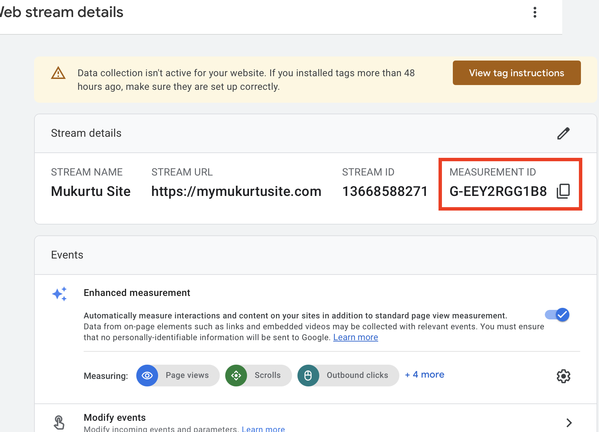
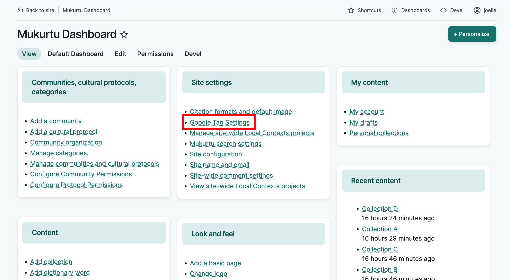
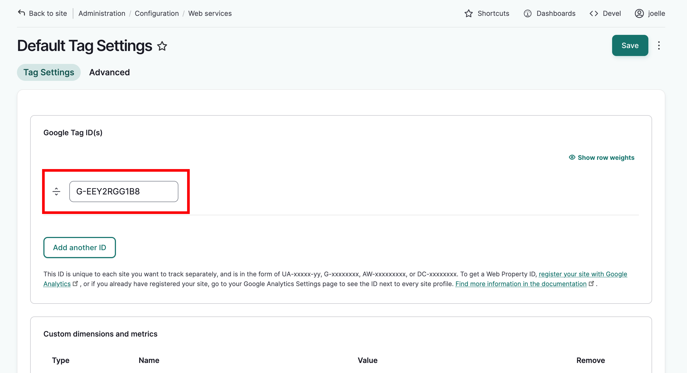
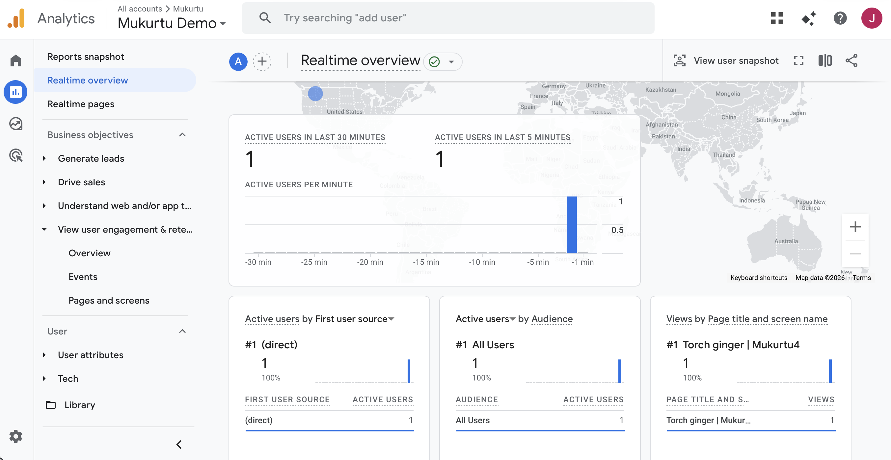

# Configure Google Analytics

Google Tags can be added to generate metrics about visitors to your site. It's free to sign up and generate tags. You will need a Google Account, and a Google Analytics Acount. 

See Google's support article, [Set up Analytics for Website or App](https://support.google.com/analytics/answer/9304153?hl=en) for step by step instructions for creating a Google Tag.

Once you've created your account, property and webstream, you should be able to see the measurement ID you will paste into your Mukurtu site. Copy the measurement ID.

In your Mukurtu site, select Google Tag Settings from the dashboard.

In the Google Tag ID(s) field, add paste your Google Tag ID. They typically come in the form: UA-xxxxx-yy, G-xxxxxxxx, AW-xxxxxxxxx, or DC-xxxxxxxx. You *can* add additional tags by selecting *add another ID* but it's usually not necessary and could result in duplicate metrics. 

Once you've added the ID, you can select *Save* and your analytics data will immediately begin to aggregate at your Google Analytics account. You can test this by clicking around your site, then logging in to your analytics page at [analytics.google.com](http://analytics.google.com) and selecting "Real Time Overview." Your clicks should be visible.

Google Analytics reports provide a wealth of information without any additional configuration. Custom reports can also be configured. We recommend first configuring customized reports there before attempting to use the remaining settings on The Google tag settings page in Mukurtu, as doing so may cause conflicts or redundancies in the data tracking, resulting in lost data.

