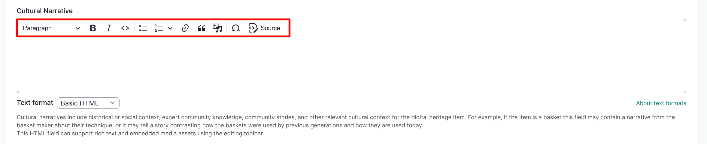
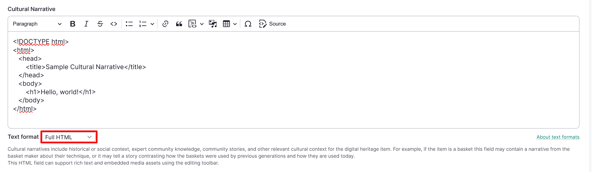

---
tags:
    - content
    - metadata
---

# Understanding Formatted Text Fields

!!! Roles "User roles" 
    Drupal administrator, Mukurtu manager

Formatted text fields are powered by CKEditor 5 and are found in all content types as fields including Description, Cultural Narrative, Biography, and Definition, as well as in taxonomy term descriptions and various other places on the site. They can be formatted as either basic or full HTML, though full HTML access is limited Drupal administrators and Mukurtu Managers for security reasons. 

Basic HTML can be configured by selecting **Basic HTML** from the dropdown menu and using the formatting and media icons to configure your text and media. 

Full HTML can be configured by selecting **Full HTML** from the dropdown menu and inputting your text and media. 

Some of the uses for formatted text fields are in Digital heritage items or Person records. Digital heritage items can contain multiple media assets as metadata in the cultural narrative, traditional knowledge, and description fields. Using embedded video or audio files as descriptive metadata can provide unique cultural context and information for the digital heritage item. In Person records, embedded video can provide a unique biographical sketch of the person. 

More information about using the CKEditor 5 WYSIWYG editor features can be found in their documentation at [ckeditor.com](https://ckeditor.com/docs/ckeditor5/latest/features/index.html#ckeditor-5-wysiwyg-editor-features-and-functions). This includes information about formatting features, advanced content editing, and other features.