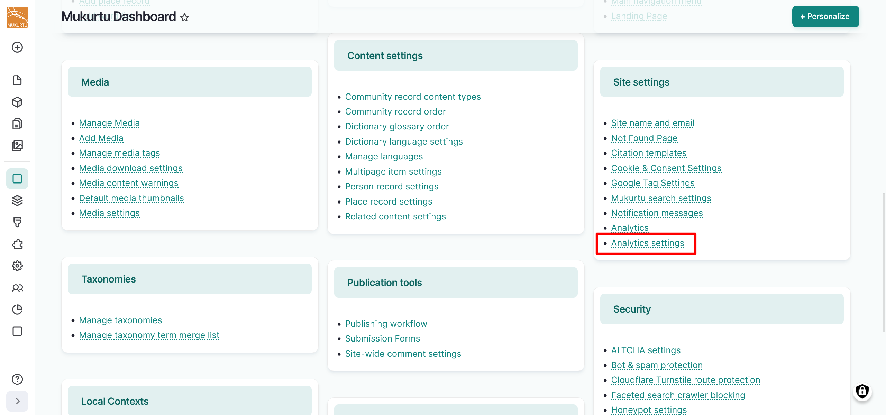
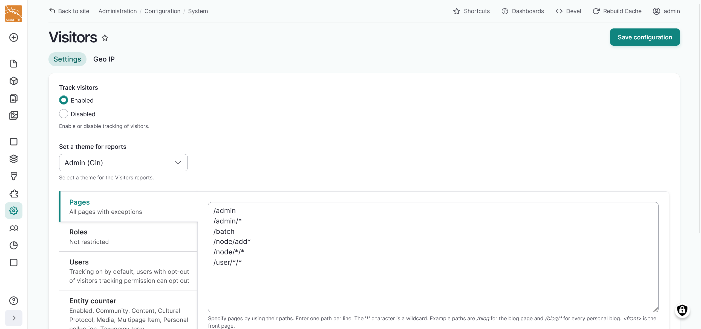
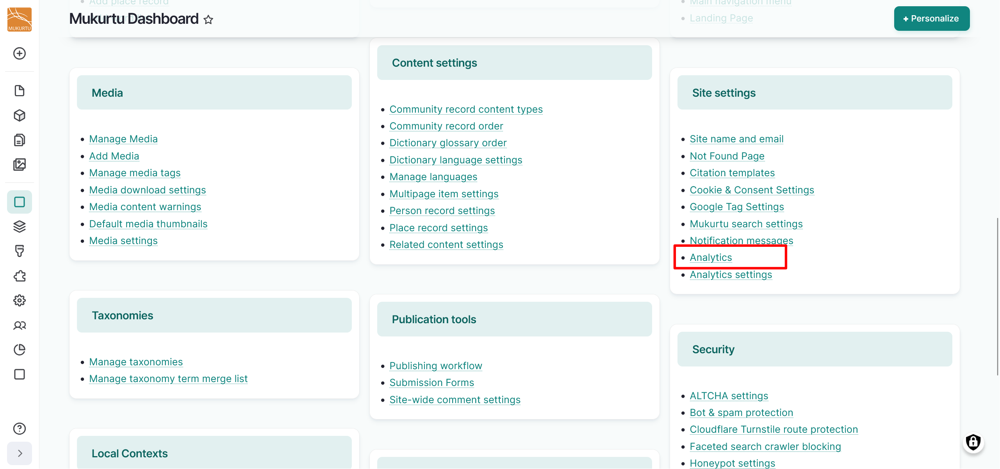

---
tags:
    - site settings
---

# Visitor Analytics 

!!! roles "User roles"
    Administrator, Mukurtu manager

    To enable or disable tracking of visitors using the Mukurtu Visitors module, navigate to your **Dashboard** in the **Site settings** section and select the **Analytics settings** link. 

- Tracking is enabled by default. To disable tracking, select the **Disabled** radio button, then select "Save configuration". 

    

To view analytics provided by the Mukurtu Visitors module, navigate to your **Dashboard** in the **Site settings** section and select the **Analytics** link. 

