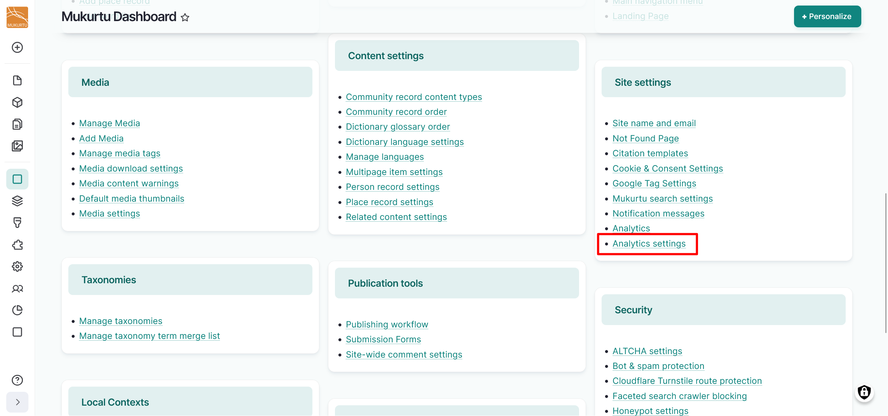
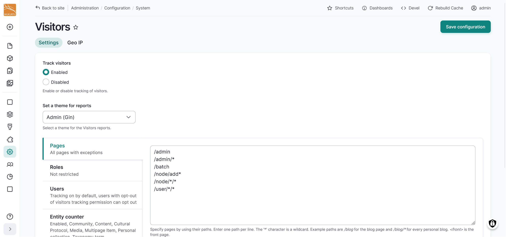
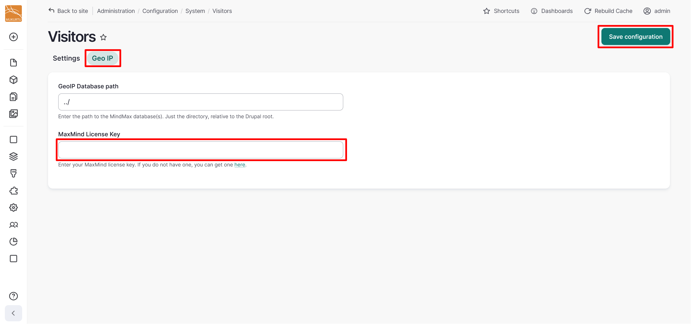
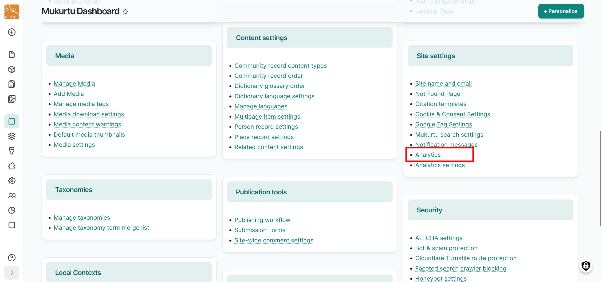
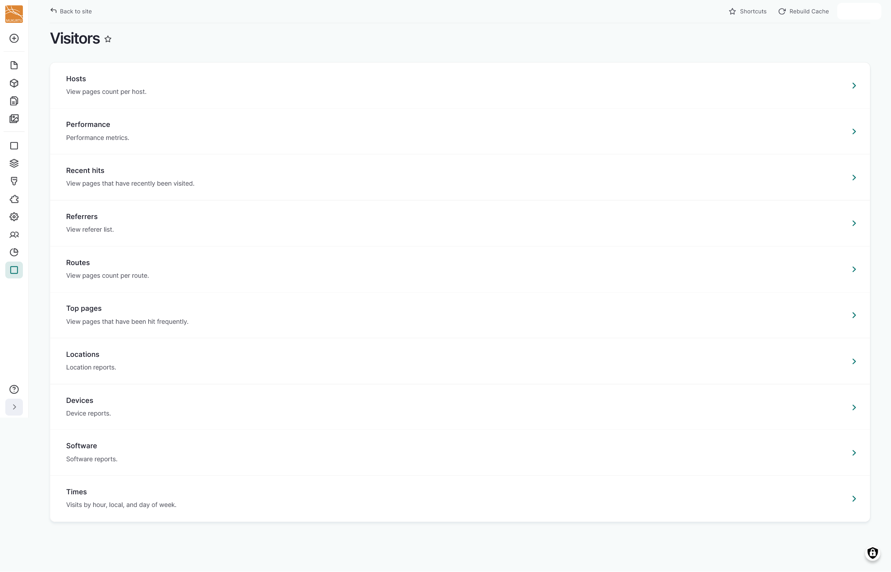
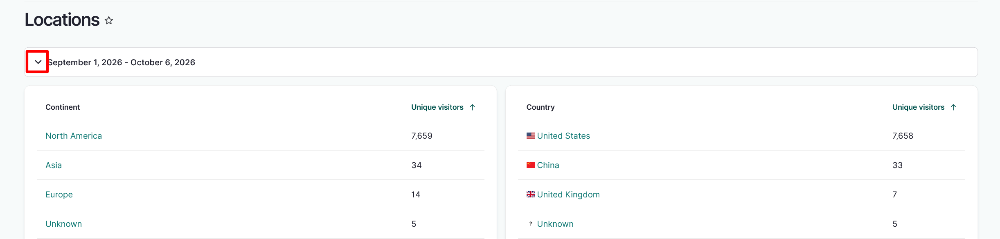
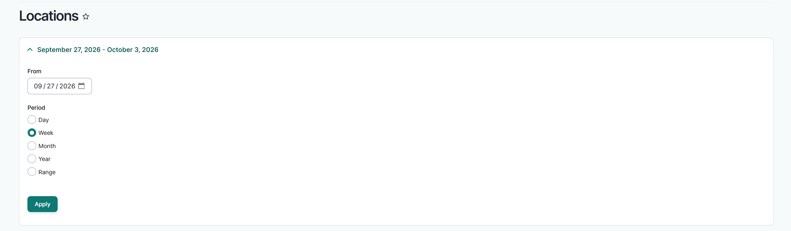
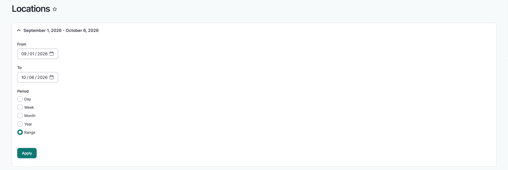
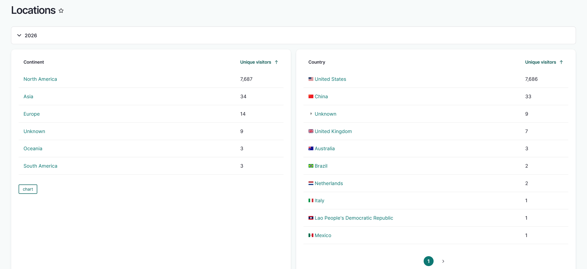
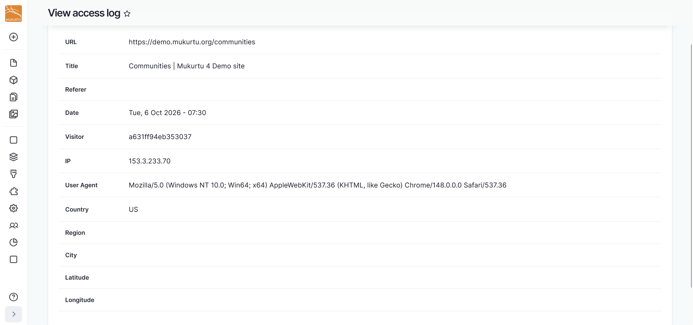

---
tags:
    - site settings
---

# Visitor Analytics 

!!! roles "User roles"
    Administrator, Mukurtu manager

Optionally, administrators and Mukurtu managers may choose to enable site analytics. Mukurtu uses Drupal's built-in Visitors analytics module. This module is fully self-contained within your site, does not require third party API integrations, and allows administrators to have full control over their site's performance and user behavior.

## Configure Visitor Analytics 

1. To enable or disable tracking of visitors using the Mukurtu Visitors module, navigate to your **Dashboard** in the **Site settings** section and select the **Analytics settings** link. 

    

2. Tracking is enabled by default. To disable tracking, select the **Disabled** radio button, then select "Save configuration". 

    

3. You can also use the Visitors Configuration page to configure:

    - Pages - page exceptions
    - Roles - user role tracking for specific roles
    - Users - turn on or off user opt-out customization
    - Entity Counter - which entity types should be tracked
    - Retention - how often retention logs are discarded
    - Miscellaneous - script type (minified versus full)

### Enable GeoIP 

Optionally, users with command line access can enable the Visitor Analytics module's GeoIP function to show city or regional data. Enabling GeoIP requires a free MaxMind GeoLite2 license key. 

1. Get a MaxMind GeoLite2 license key by creating an account at [maxmind.com](https://www.maxmind.com/en/geolite-free-ip-geolocation-data).
2. Navigate to the GeoIP tab of the **Analytics settings** by selecting the tab or by navigating direcly to `admin/config/system/visitors/geoip`. 
3. Enter your key in the *MaxMind License Key* field.
4. Select "Save configuration".

    

5. Open your terminal and run `drush visitors:download:city`.
6. Then run `drush visitors:rebuild:location` to backfill existing analytics records.
7. In your Mukurtu site, clear your cache by selecting the "Rebuild Cache" button in the top right of your screen.

## View Visitor Analytics

To view analytics provided by the Mukurtu Visitors module, navigate to your **Dashboard** in the **Site settings** section and select the **Analytics** link. 

Use the Visitor Analytics page to track pages count per host, performance metrics, recent hits, referrers, pages count per route, top pages, location, devices, and software reports, and visits by the hour or day of the week.

### Specify date or range

You can set a date, week, month, or year to view, or you can select a specific date range. 

1. Specify a period or date range from any link by navigating to the link and expanding the date menu. 
 
    

2. Select your preferred date or range using the radio buttons, then use the *From* date selector field to specify a date. 

    

3. Or to specify a date range, select the **Range** option and use the *From* and *To* fields to specify a date range. 

    

4. Select the "Apply" button. The date or date range will be applied to all of the Visitor analytics views.

### Visitor analytics views

#### Hosts 

Hosts returns information about IP addresses that have visited the site. 

Select the IP address to view a list of URLs that were visited from that IP address, as well as the date and time the URL was visited and a unique visitor ID. 

Select the **Details** link to navigate to the access log.

### Performance

Performance provides a weekly, daily, or hourly breakdown of the following metrics:

- Network
- Server
- Transfer
- DOM Processing
- DOM Complete
- On Load

[Screenshot of the Performance page with the Weekly view selected.](../_embeds/visitors11.png)

### Recent hits

Recent hits provides a breakdown of recent visits to specific pages. Select the **Details** link to view the access log.

### Referrers

Referrers provides a list of the links that visitors followed to navigate to a specific page. Referrers can be filtered by External pages, Internal pages, or All pages. 

### Routes

Routes maps the ways that visitors were directed to specific pages throughout the site. Select the **Details** link to view the access log.

### Top Pages

Top pages provides a list of your site's most recently visited paths and how many unique hits that path had.

### Locations

Locations provides a breakdown of your site's unique visitors by location, including the continent, country, and language. If you have configured [GeoIP](#enable-geoip), more granular regional information such as region and city data will be available. If you have not configured GeoIP, these will be listed as "Unknown, Country".

### Devices

Devices provides a breakdown of your site's unique visitors by device, including whether the site was accessed by desktop or smartphone, as well as the device model, the brand, and the configuration or resolution that the site was displayed. 

### Software

Software provides a breakdown of your site's unique visitors by software, including their operating system, operating system families, browser and browser version, configurations and resolution, and browser engines. Software also includes Cookie and PDF information.

### Times

Times provides a breakdown of daily visits, as well as a comparison of visits by the visitor's local time zone, the site administrator's time zone, and visits based on the day of the week and the month. A record of overall monthly visits is also included. 