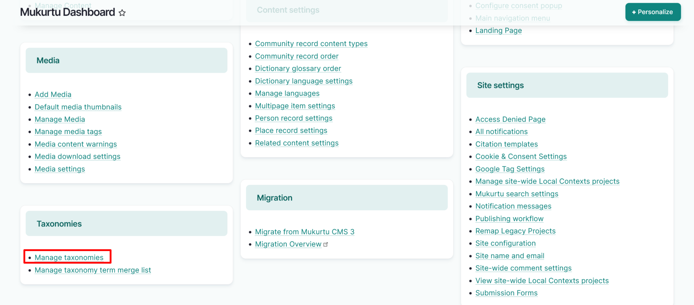
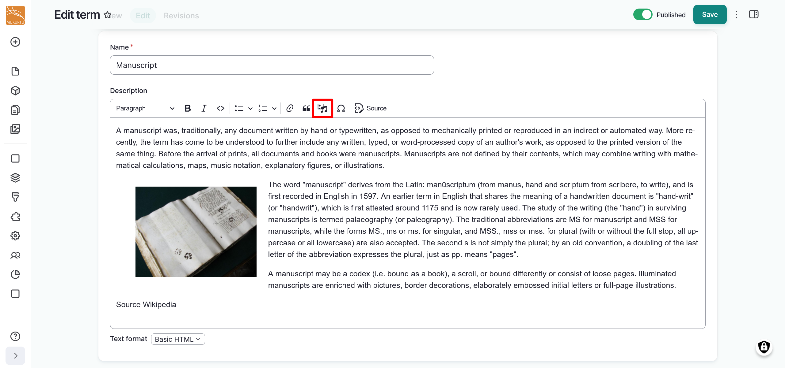
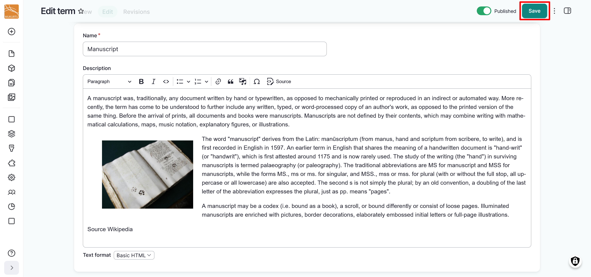

---
tags:
    - taxonomies
---

# Manage Taxonomy Pages

!!! roles "User roles"

    Administrator, Mukurtu manager

Taxonomy terms each link to a taxonomy term page that aggregates all content that uses that taxonomy term. Taxonomy term pages also have an optional full HTML field that can be used to provide richer context for the taxonomy term, including embedded images, video, or other media assets. Taxonomy term pages are created automatically when taxonomy terms are created. 

To edit your taxonomy term page, navigate to the taxonomy term page. From your Dashboard, navigate to Taxonomies and select **Manage taxonomies**. 

1. Select the vocabulary from the taxonomies list.
2. Select the term whose page you want to edit. 

    !!! tip
        You can also select the term from content by browsing to content and selecting the linked term.

3. Use the **Name** field to edit the term itself. This will be applied to any content using the term.

    

4. Use the **Description** field to provide a description for your taxonomy term. Select the "Add media" icon to embed images, video, audio, or other media assets.

    

5. Select "Save" to save your taxonomy term page.

    

