---
tags:
    - taxonomies
    - categories
---

# Managing Taxonomies

!!! roles "User roles"

    Administrator, Mukurtu manager

There may be a need to manage or clean up taxonomy terms. Most commonly this happens when users mis-enter a term (eg: typing "baskey" when they meant "basket"), or enter a similar term (eg: "basket" instead of "baskets"), though there are many other situations where this may be necessary.

## Accessing a taxonomy

1. All taxonomies can be accessed at `/admin/structure/taxonomy`

    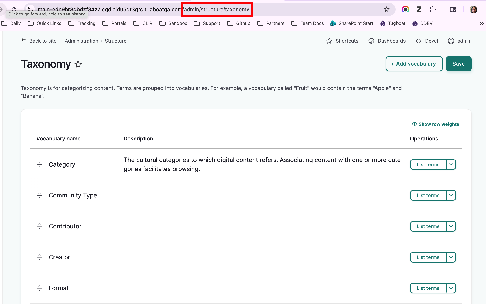

2. Alternatively, from the dashboard, scroll down to the **Taxonomies** section and select "Manage Taxonomies."

    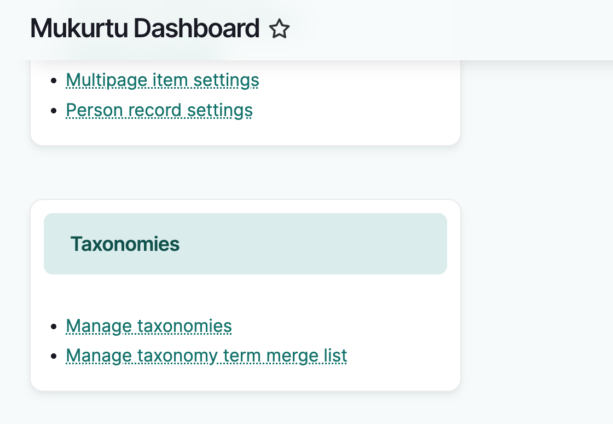

3. To view the terms in a taxonomy, from the far right of the row select "List terms". From here, you can edit individual terms, or merge terms to together.
   
    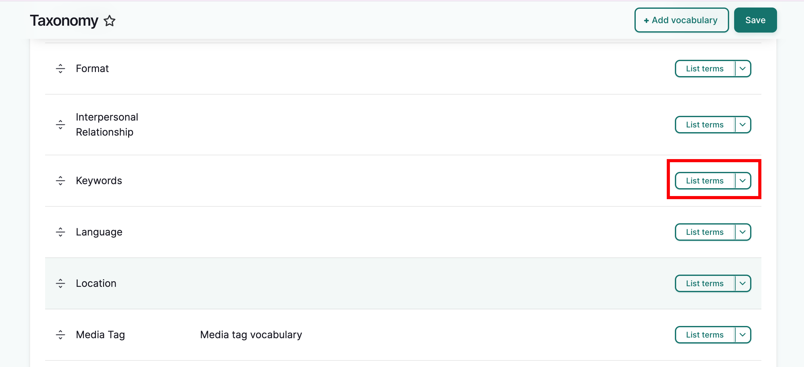

Here are some terms created in the *keyword* taxonomy

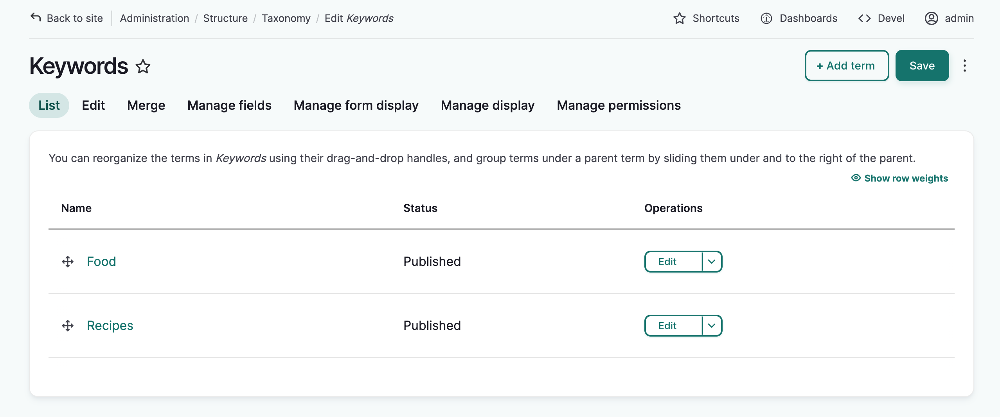

## Add a taxonomy term

1. To add a new term, select "Add Term"

    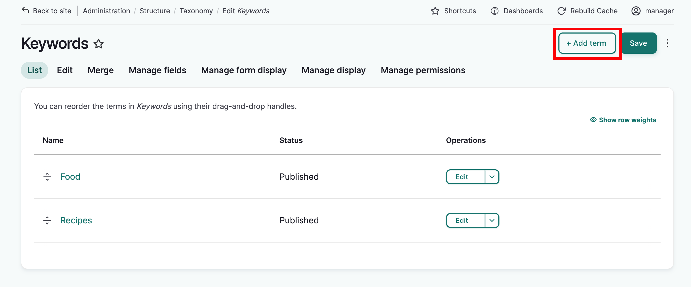

2. Add the term you would like to use, any additional metadata as needed, and select "Save."

    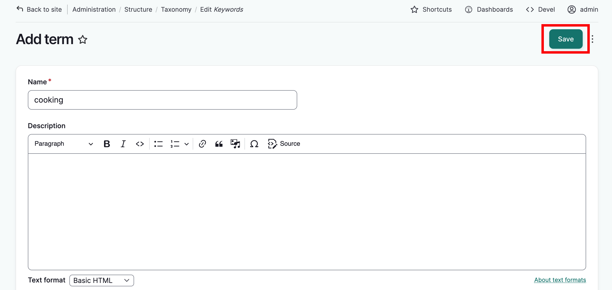

3. A page will reload and a success message will be displayed

    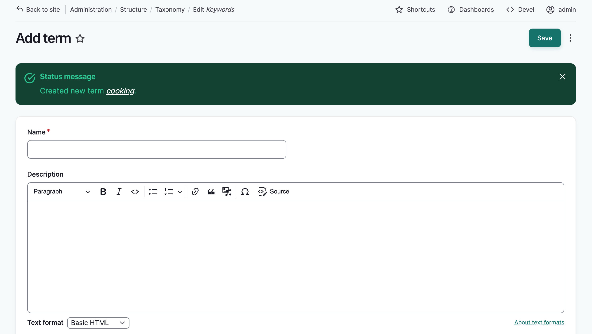

## Edit taxonomy terms

There are several reasons you may want to edit a taxonomy term. Eg: spelling errors, updating terms.

!!! tip

    When a taxonomy term is edited, those edits apply to all content using the term. There is no need to manually edit each piece of content.

1. Identify the relevant term from the appropriate taxonomy list. From the far right of its row select "Edit".

    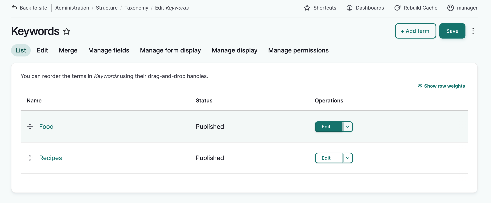

2. From here you can edit the term name, and any other fields as necessary. When done, select "Save" at the top of the page.

    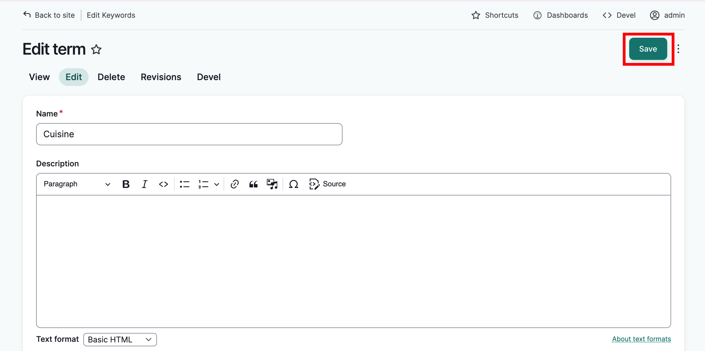

4. The taxonomy list will load and a confirmation message is displayed.

    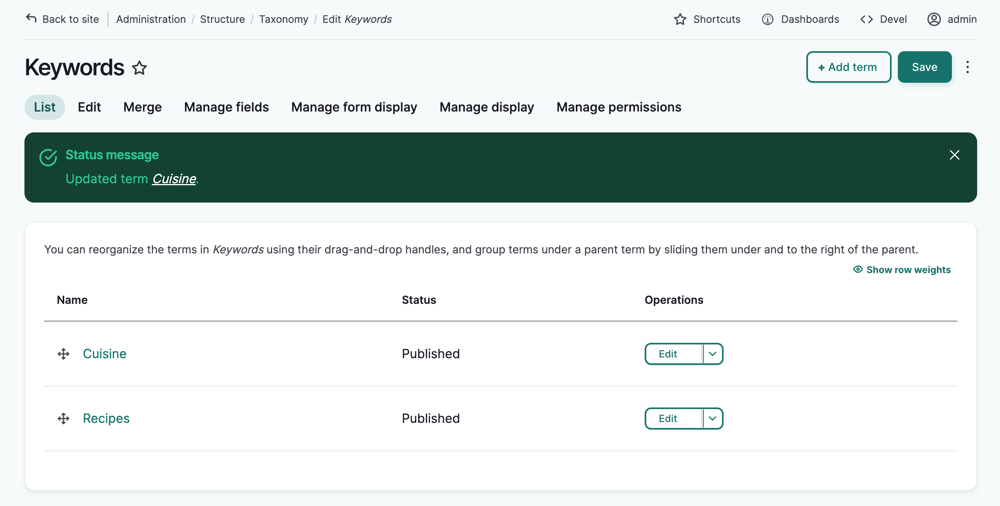

## Delete taxonomy terms

There are several reasons you may want to delete a taxonomy term. For example, you entered a term in the wrong field, or simply choose to no longer use that term.

!!! warning

    If you delete a term, it will be removed from all content where it is used.

1. Identify the relevant term from the appropriate taxonomy list. From the far right of its row, select "Delete" from the dropdown menu.

    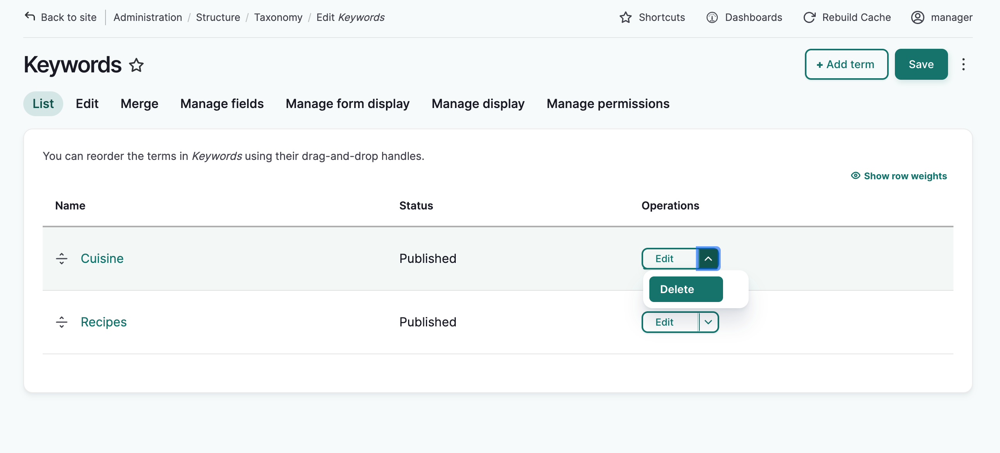

2. From the warning message select "Delete".

    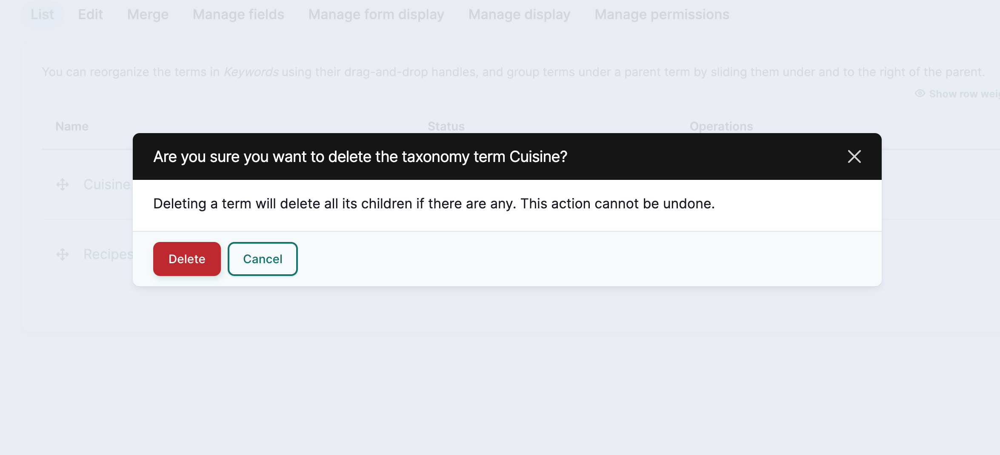

3. The term is deleted and a confirmation message is displayed.

    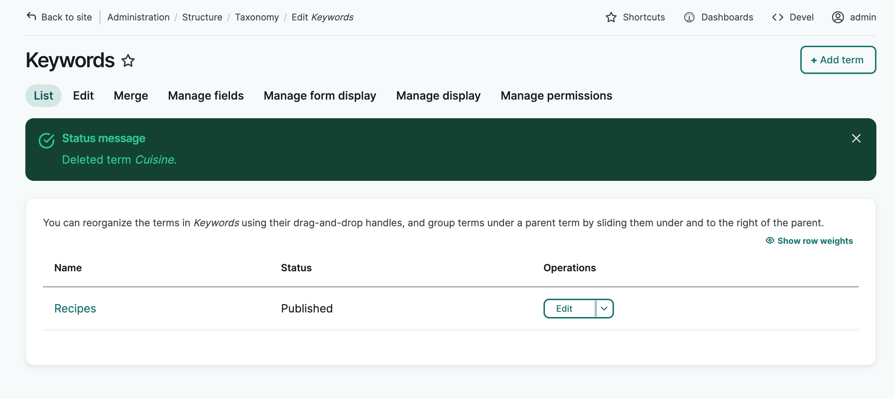

## Merge taxonomy terms

You may want to merge multiple taxonomy terms together. For example, different users have used "baskets" and "basket making" as *keywords*, and you want to combine them into a more general "basketry" term.

!!! tip

    When a taxonomy term is edited, those edits apply to all content using the term. There is no need to manually edit each piece of content.

1. From the appropriate taxonomy list, below the taxonomy name, select "Merge".

    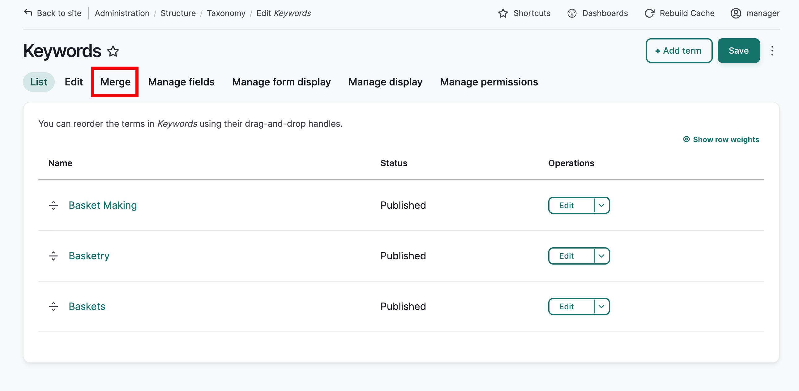

2. To choose the terms you want to merge together, use the checkboxes to select them. Select "Next" at the top of the page.
    - To merge multiple terms into a new target term, select all terms to merge here. The new target term will be created on the next page.
    - To merge one or more terms into another existing target term, select them here. The target term will be selected on the next page, do not select it now.

    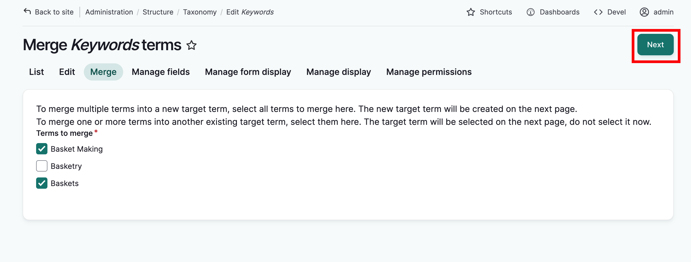

3. Either enter a new target term or select an existing target term. Select "Merge terms" at the bottom of the page.
    - To merge the selected terms into a new target term, enter it in the "New term" field.
    - To merge the selected term(s) into an existing target term, select it from the "Existing term" list.   

    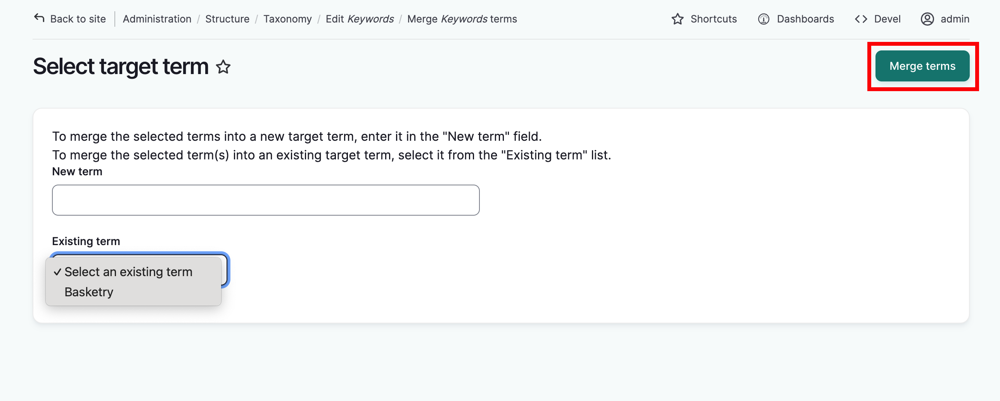

4. A confirmation message will be displayed. If the information is correct, select "Confirm merge" at the top of the page.

    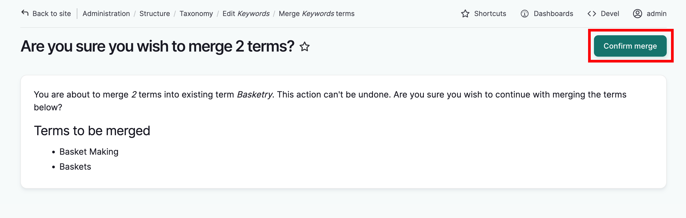

5. The taxonomy list will load and a confirmation message will display.

    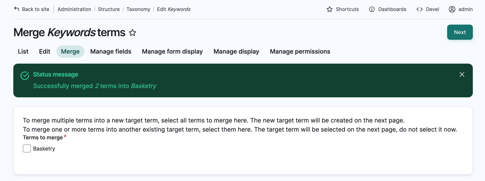

## Taxonomy term merge management

When taxonomy terms are merged, the system keeps a record of the merges, generates rules, and automatically applies those merge rules if those same terms are entered again later. This is done with the "Term Merge Manager" module.

For example:

1. You merge the *keywords* "baskets" and "basket making" into a more general "basketry" term.
2. The system generates two rules from this:
    - "Baskets" should always be replaced with "basketry", and
    - "Basket making" should always be replaced with "basketry".
3. The next time a user enters "baskets" or "basket making" into a *keywords* field, the system automatically replaces them with the term "basketry".

These rules can be edited and removed if needed. For example, you may decide in the future that you DO want "basketry" and "baskets" to be separate *keywords*. 

1. As an administrator, you can manage these rules at `admin/structure/term_merge_from`

Alternatively, select the **Structure** menu in the left hand sidebar menu and select **Term Merge from list** near the bottom of the menu. 

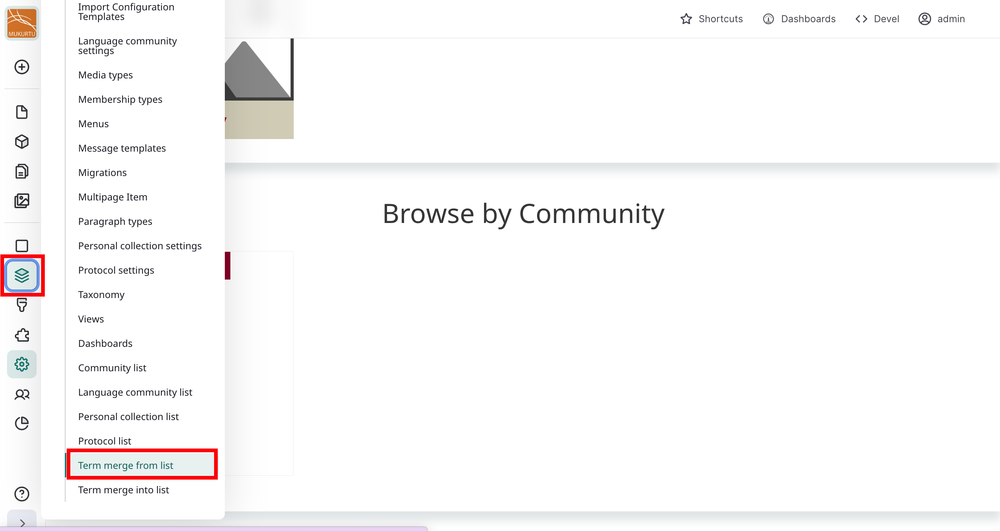    

This can also be accessed through the dashboard in the **Taxonomies** section.
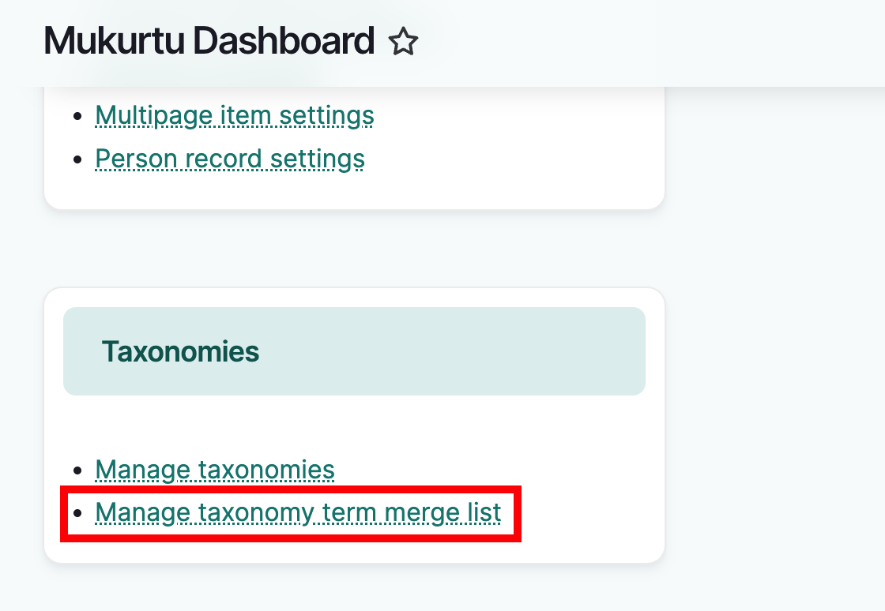

In the "Name" column is a list of terms that will automatically be replaced when used in content. In this example, "Basket making" and "Baskets" will be changed to "Basketry" when used.

2. To allow for "baskets" to be a separate keyword again, identify the "Baskets" rule and select "delete".

    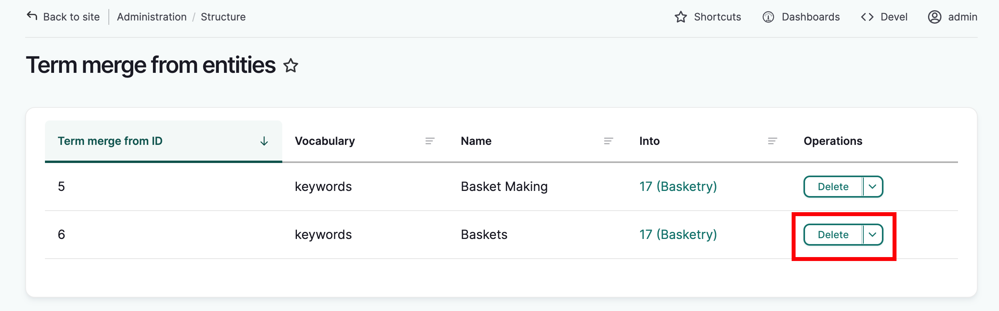

2. Select "Delete" again on the confirmation message. 

3. "Baskets" can now be used as a keyword in content and will not be replaced by "Basketry."

    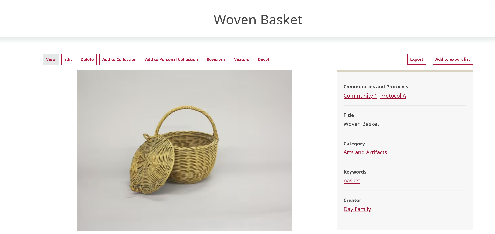

