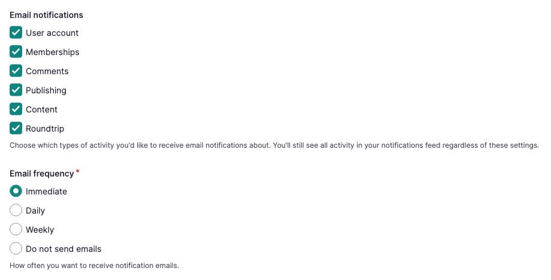

---
tags:
- users
- account management
- notifications
---

# Manage Email Notification Preferences

!!! Roles "User roles"
    Authenticated user

Mukurtu keeps a running record of activity related to your account and content in your [notifications feed](ViewNotifications.md), and can also send you an email whenever certain activities happen. You can manage your account's email notification preferences to choose which activities trigger an email, and how often those emails arrive.

1. From your Dashboard, in the **My account** section, select **Manage my account**. 

2. Scroll to the *Email notifications* field. Select the checkboxes for any types of activity you'd like to be emailed about:

    - **User account** – account registration, approval, blocking, and deletion
    - **Memberships** – being added to or removed from a community or cultural protocol
    - **Comments** – comments posted on your content, including comments pending review
    - **Publishing** – content submitted for review, published, returned to draft, or archived
    - **Content** – content created or deleted
    - **Roundtrip** – batch import reports

!!! tip
    Users will receive notifications and emails based on their permissions, responsibilities, and site settings. For example, only community managers and protocol stewards will receive "Memberships" notifications.

    Clearing a checkbox only stops emails for that activity type. You'll still see all activity in your [notifications feed](ViewNotifications.md) regardless of these settings.

    

3. Use the *Email frequency* field to choose how often you receive these emails:

    - **Immediate** – send each email as soon as the activity happens
    - **Daily** – combine the day's emails into a single daily digest
    - **Weekly** – combine the week's emails into a single weekly digest
    - **Do not send emails** – don't send any notification emails

4. Select the "Save" button.

