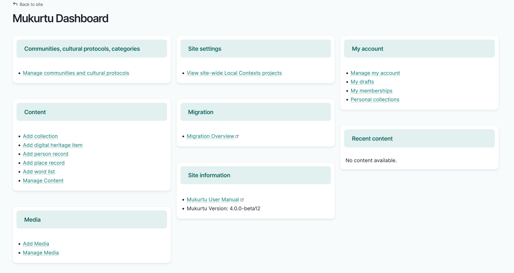

---
tags:
- users
- getting started
---

# Understanding the Dashboard

!!! Roles "User roles" 
    Authenticated user

All authenticated users have access to the Mukurtu Dashboard. To access your Dashboard, select the **Dashboard** link in your menu.

The Mukurtu Dashboard allows users to:

- Manage your account
- View your community and protocol memberships
- Access your personal collections
- View recent content 

Users who have been assigned specific user roles may have additional Dashboard options. For instance, Protocol stewards are able to access links to manage their protocol and create digital heritage items and other content.

