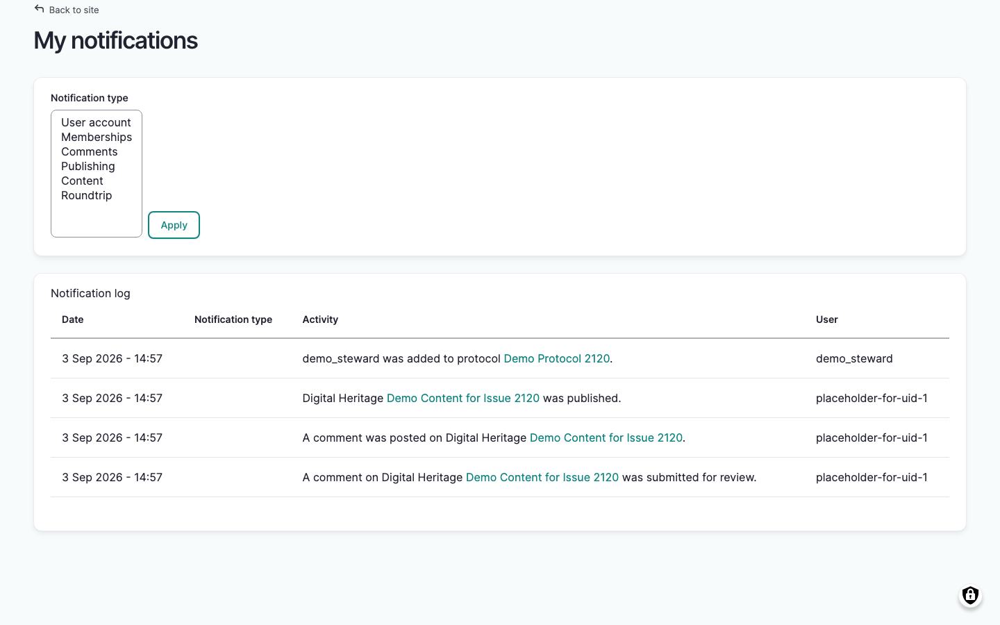
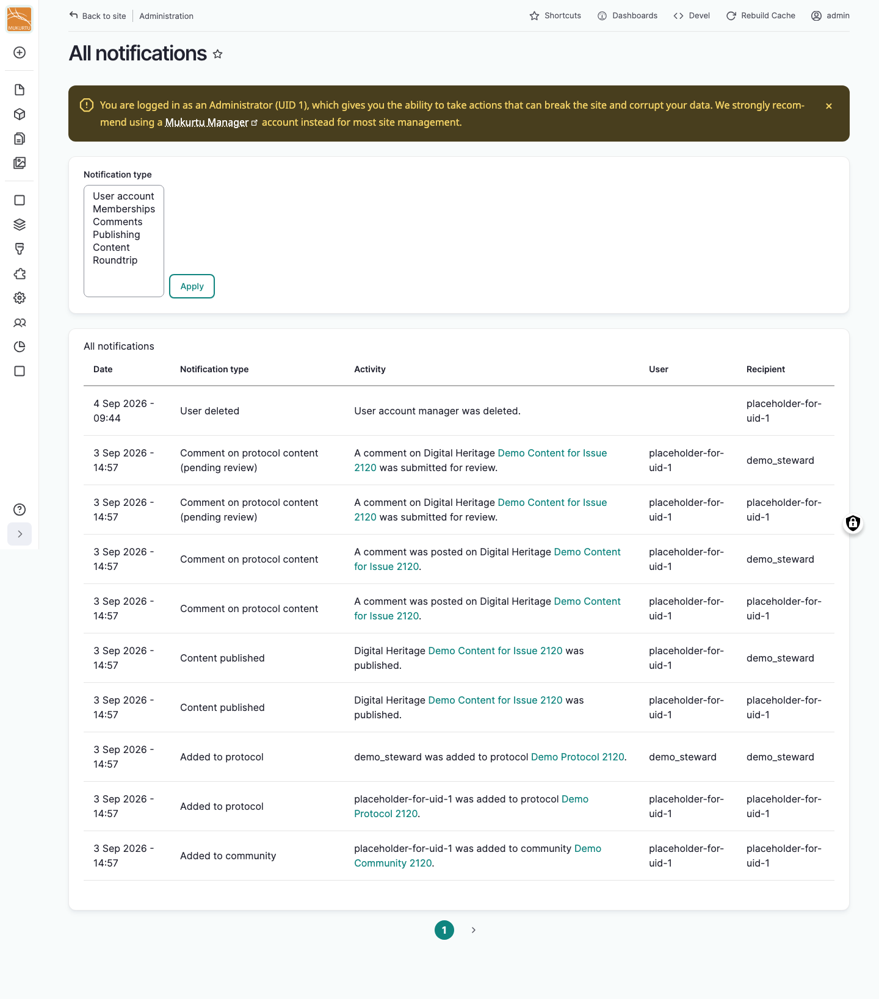

---
tags:
- users
- notifications
---

# View Notifications

!!! Roles "User roles"
    Authenticated user

Mukurtu keeps a running log of notable activity in your notifications feed. This feed always shows every type of activity, regardless of your [email notification preferences](ManageEmailNotificationPreferences.md) — those settings only control which activities also send you an email.

## Your notifications

From your Dashboard, in the **Notifications & Review** section, select **My notifications**. You can also go directly to `/notifications`.

Your notifications feed lists activity related to your account and your content:

- **Date** – when the activity happened
- **Notification type** – the specific type of activity, for example "Content published" or "Added to community"
- **Activity** – a description of what happened, with links to the relevant content, community, or cultural protocol
- **User** – who performed the activity

Use the *Notification type* filter to narrow the list to one or more categories, then select the "Apply" button.

Your notifications feed is a permanent record. There's no way to mark items as read or delete them.

## All notifications

!!! Roles "User roles"
    Administrator, Mukurtu manager

Administrators and Mukurtu managers can view a combined log of every notification generated across the site. From your Dashboard, in the **Notifications & Review** section, select **All notifications**. You can also go directly to `/admin/notifications`.

This page includes the same *Date*, *Notification type*, *Activity*, and *User* columns as your personal notifications feed, plus a *Recipient* column showing who each notification was sent to. Like the personal feed, this is a permanent, read-only log.
