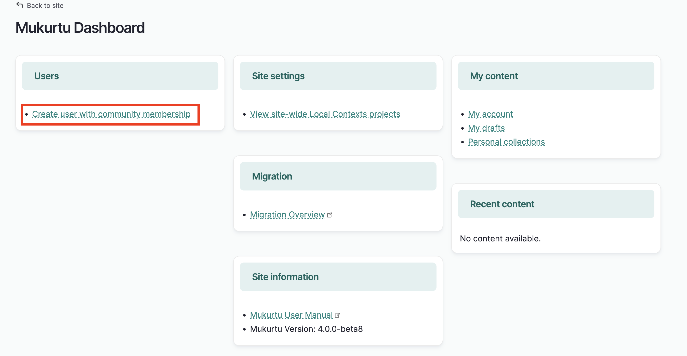
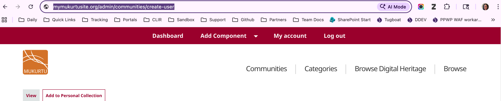
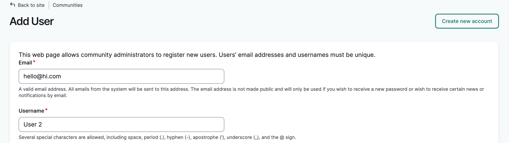
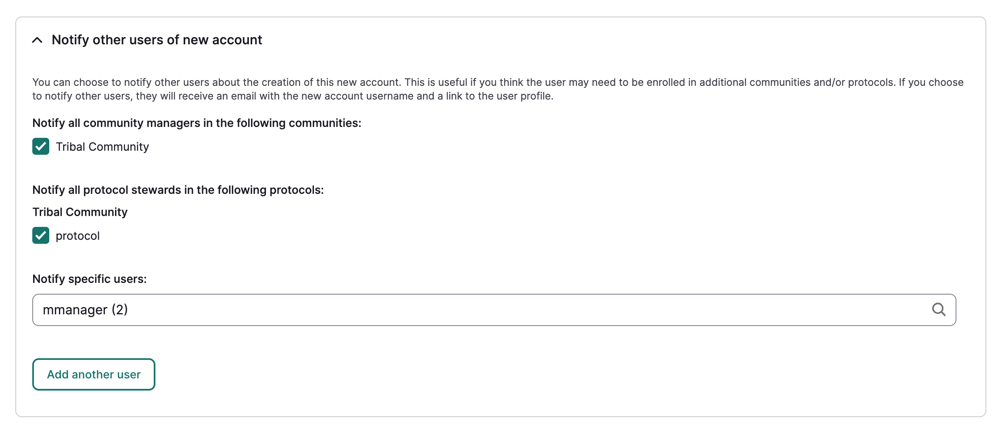
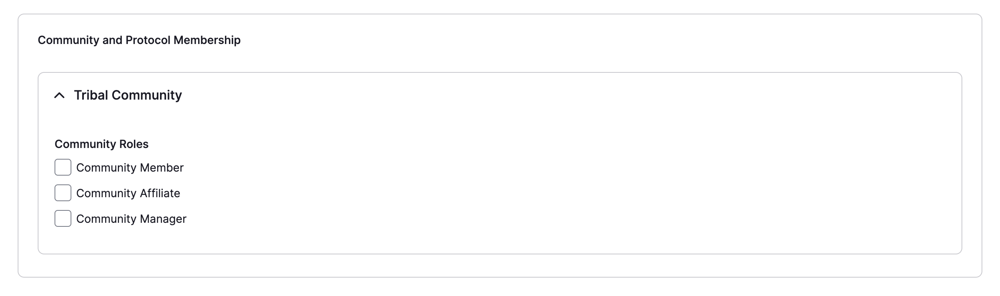
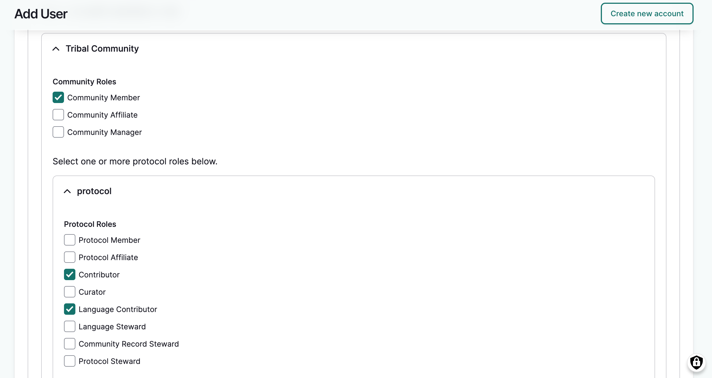
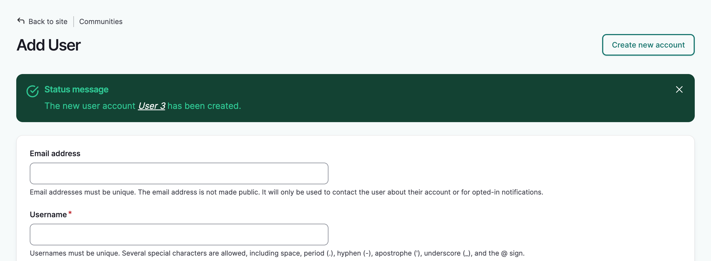

---
tags:
- users
- account management
- getting started
- communities, cultural protocols, and categories
---
# Create User Accounts as a Community Manager

Administrators, Mukurtu managers, and community managers are able to create new user accounts. This article walks you through creating a user account as a community manager. To create user accounts as an administrator or Mukurtu manager, see [Create User Accounts from a Site-Wide Role](../users/creating-account-site-wide.md).

There are two ways to access the new user form as a community manager:

1. From the dashboard, select **Create user with community membership**.

    

2. Or by going directly to `admin/communities/create-user` (e.g. `mymukurtusite.org/admin/communities/create-user`).

    

3. Once the form is open, add the user's email address and username. 

    

4. Add an optional password and display name. Leave blank to allow the user to set their own password and display name.

5. Select the status:
    - **Active** if you want the user to be able to login right away.
    - **Pending** use this status to create the account without activating it. The user will not be able to login. This is helpful if additional set up is required.
    - **Blocked** this status also prevents users from logging in, but is typically used when the user has taken inappropriate action that warrants a temporary loss of access. As we are creating a new user, this status is generally not necessary.

6. You may choose to notify other community managers and protocol stewards within the community about the new user. You can also use the **Notify specific users** field to notify specific administrators, Mukurtu managers, community managers and protocol stewards.

    

7. A list of communities that you manage will appear at the bottom of the form. Select the appropriate role(s) for each community the user will be added to.

    

5. When you are finished, select "Create new account."

6. If you are also a protocol steward for protocols within the community, the protocols you steward will be exposed once you assign community roles. Select the appropriate roles for each community and protocol and select "Create new account."

    

The form will re-load and a success message will be displayed. The user account will be created with the user enrolled in the selected community(ies) with their specified user role(s). You can fill and submit the form as many times as needed.

