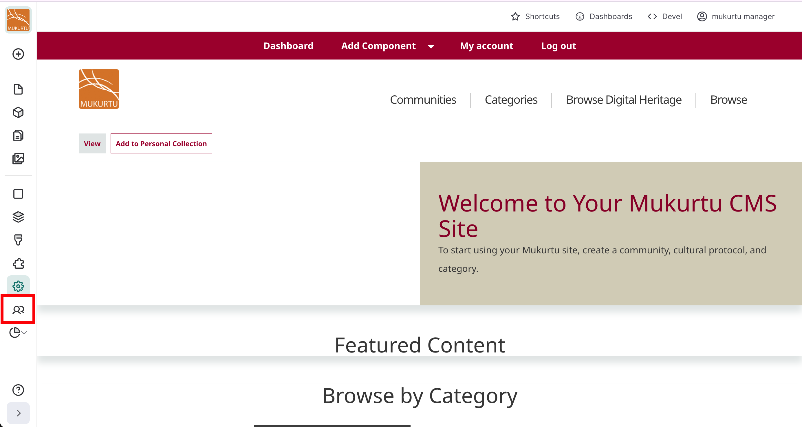
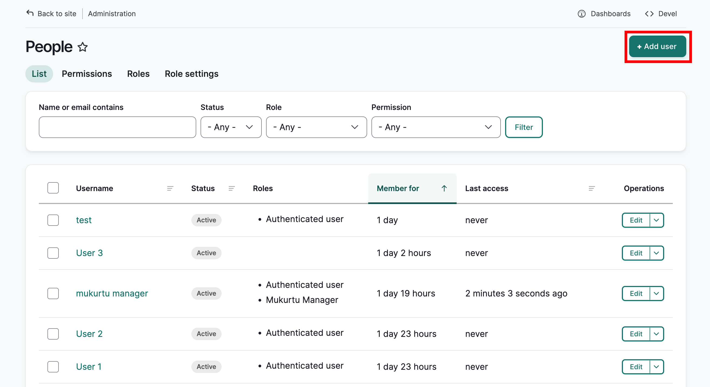
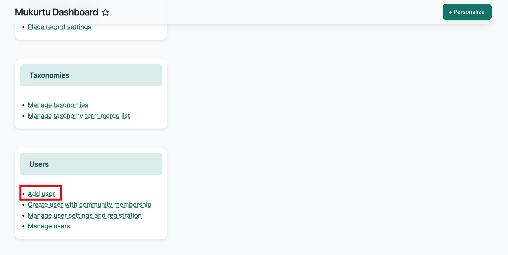
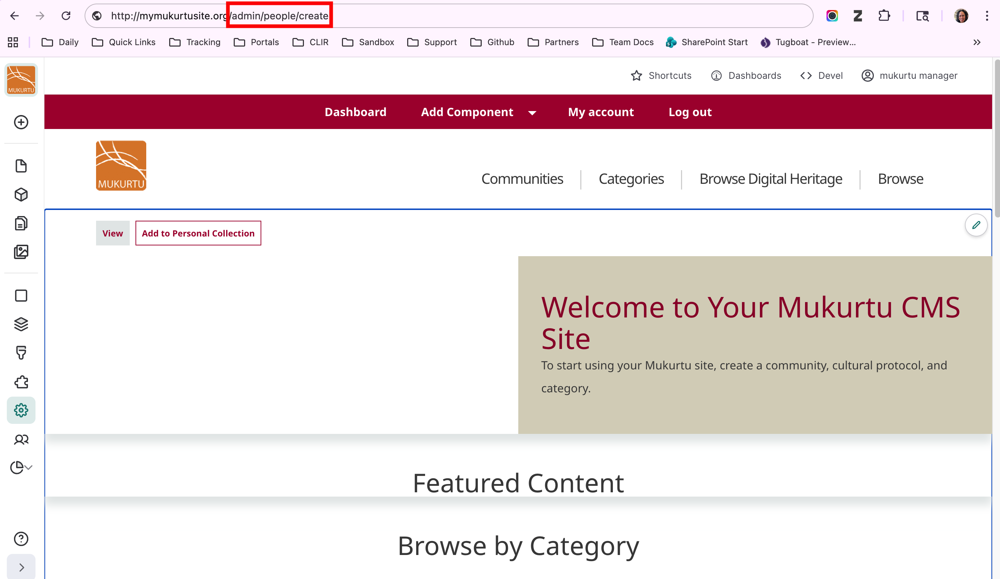
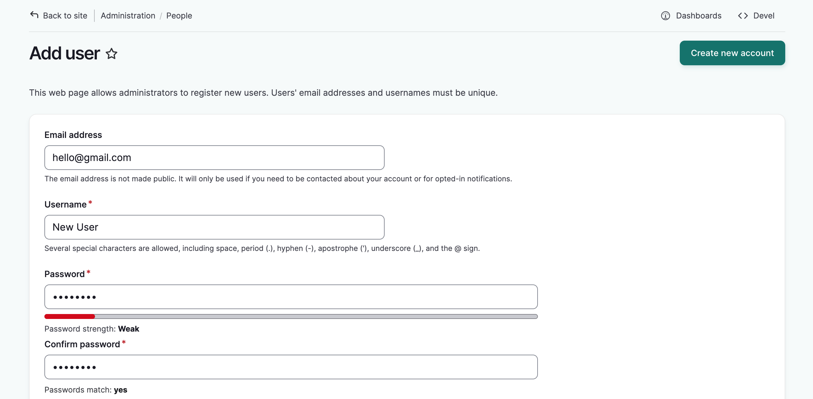
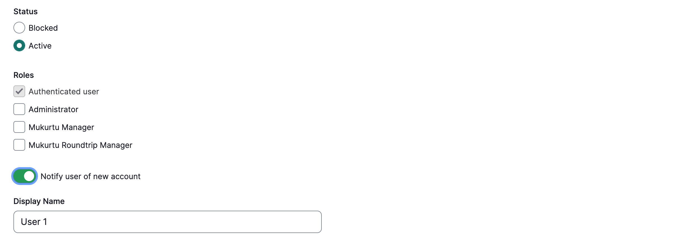
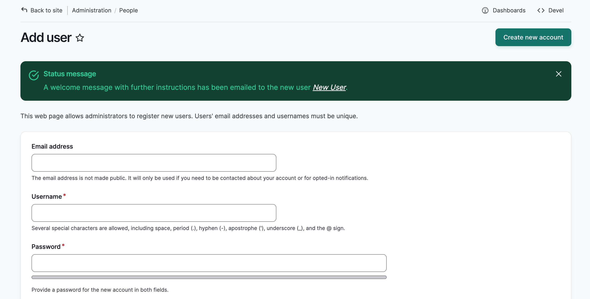

---
tags:
- users
- account management
- getting started
---

# Create User Accounts from a Site-Wide Role

!!! Roles "User roles" 
    Administrator, Mukurtu manager

This article covers creating a user account from a site-wide role such as an administrator or Mukurtu manager. For information on creating a user account as a community manager, see [Create User Accounts as a Community Manager](../users/create-user-accounts-community-manager.md).

## Create a new user account

There are three ways to access the the add user form to create a new user account:

Method 1: Select the **People** icon from the left-hand menu, then select **Add User** in the top right-hand corner.

Method 2: In the **Add component** drop down menu, select **+ User**  to open the add user form.

Method 3: Append `/admin/people/create` to your URL in your browser's address bar.

### Fill out the add user form

Once the form is open, fill out the form.

1. Add the userʻs email address. 

2. Add a username for the user.

3. Add a generic password. The user will be prompted to change their password when they first log in.

    

4. Select the appropriate status. 

- Active members can act as normal, based on their user role and permissions.
- Blocked members cannot log in to the site. They are typically blocked for two reasons:

    1. When a user submits an account request, their account is created and their status is set to "Blocked" until the Mukurtu manager approves the account and changes their status to "Active".
    2. When a user takes inappropriate actions that warrant a temporary loss of access to the site. To access the site again, their status must be changed to "Active."

5. Select a site-wide role for the user. By default, all users are assigned the authenticated user role, and this is the correct setting for the majority of users. This role allows them to view public material and save content to their own personal collections. The administrator and Mukurtu manager roles are for users who manage the site and therefore have additional access to controls and settings. The Mukurtu Roundtrip manager role can be assigned to users who need access to roundtrip (import/export) tools. Assign these roles with extreme caution.

    !!! tip
	    For detailed information about user account requests, see [Request an Account](request-an-account.md).

    !!! tip
	    For more information on user roles, see [User Roles](user-role-types.md)

6. To notify the user of their new account, set the toggle to green. This is optional.

7. You can add an optional display name that differs from their username. This will display if the user leaves comments on content. 

    

9. Select "Create new account" to create the user account. The form will reload and a success message will be displayed.

    

!!! Tip
    Users will be able to edit these settings when they log in.

